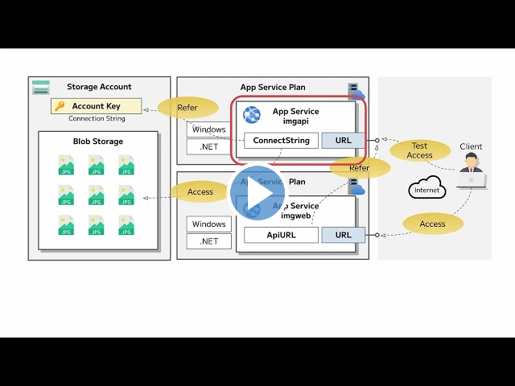

---
lab:
  az204Title: 'Lab 01: Build a web application on Azure platform as a service offerings'
  az204Module: 'Learning Path 01: Implement Azure App Service Web Apps'
---

# 實驗 01：在 Azure 平台上組建 Web 應用程式作為服務供應項目

## Microsoft Azure 使用者介面

基於 Microsoft 雲端工具的動態性質，您可能會遇到在本訓練內容開發後變更的 Azure UI。 因此，實驗指示可能無法正確對應實驗步驟。

當社群提醒 Microsoft 需要做修改時，我們會更新此訓練課程。 然而，雲端更新經常發生，所以您可能會在此訓練內容更新前遇到 UI 的變更。 **如果發生這種情況，請適應變更，然後視需要在實驗中調整。**

## 指示

### 在您開始使用 Intune 之前

#### 登入實驗室環境

使用下列認證登入您的 Windows 10 虛擬機器 (VM)：

- 使用者名稱：`Admin`
- 密碼：`Pa55w.rd`

> **注意**：您的講師會提供連線至虛擬實驗室環境的指示。

#### 檢閱已安裝的應用程式

尋找 Windows 10 桌面上的工作列。 工作列包含此次實驗中會用到的應用程式圖示，包括：

- Microsoft Edge
- 檔案總管
- Windows 終端機
- Visual Studio Code

## 實驗情境

在本實驗中，您將探索如何使用 PaaS 模型在 Azure 上建立 Web 應用程式。 建立 Web 應用程式之後，您將了解如何使用 Apache Kudu zip 部署選項上傳現有的 Web 應用程式檔案。 然後，您將檢視及測試新部署的 Web 應用程式。

<em>在這個 **[影片連結](https://youtu.be/EiSEcU9qjfo)** 上按一下滑鼠右鍵，然後選取 [在新索引標籤/新視窗中開啟連結]，以觀看這段影片。</em>



## 架構圖


### 練習 1：使用 Azure 儲存體及 Azure App Service 的 Web Apps 功能組建後端 API

#### 工作 1：開啟 Azure 入口網站

1. 在工作列上，選取 **Microsoft Edge** 圖示。

1. 在瀏覽器視窗中，瀏覽至 Azure 入口網站 (`https://portal.azure.com`)，然後登入您在此實驗要用的帳戶。

   > **注意**：如果這是您第一次登入 Azure 入口網站，系統會提供入口網站的導覽。 如果您想要跳過導覽，請選取 [稍後再說] 開始使用入口網站。

#### 工作 2：建立儲存體帳戶

1. 在 Azure 入口網站中，使用 [搜尋資源、服務和文件] 文字輸入框，搜尋**儲存體帳戶**，然後在結果清單中選取 [儲存體帳戶]。

1. 在 [儲存體帳戶] **** 刀鋒視窗上，選取 [+ 建立]。

1. 在 [建立儲存體帳戶] **** 刀鋒視窗的 [基本] 索引標籤上，執行下列動作，然後選取 [檢閱]：

   | 設定                           | 動作                                                                   |
   | --------------------------------- | ------------------------------------------------------------------------ |
   | [訂閱] 下拉式清單   | 保留預設值                                                 |
   | [資源群組] 區段        | 選取 [新建]，輸入 **ManagedPlatform**，然後選取 [確定] |
   | [儲存體帳戶名稱] 文字輸入框 | 輸入 **imgstor** _[您的名稱]_                                            |
   | [區域] 下拉式清單         | 選取 **(美國) 美國東部**                                                  |
   | [效能] 區段           | 選取 [標準] 選項                                           |
   | [備援] 下拉式清單     | 選取 [本地備援儲存體 (LRS)]                               |

   下列螢幕擷取畫面顯示 [建立儲存體帳戶] 窗格 [基本] 索引標籤上的設定。

   ![[建立儲存體帳戶] 窗格](./media/l01_create_a_storage_account.png)

1. 在 [檢閱] 索引標籤上，檢閱您在先前步驟中選取的選項。

1. 選取 [建立]，使用您指定的設定來建立儲存體帳戶。

   > **注意**：等候建立工作完成，再繼續進行實驗。

1. 在 [概觀] 窗格上，選取 [前往資源] 按鈕，即可瀏覽至新建的 [儲存體帳戶] 窗格。

1. 在 [儲存體帳戶] **** 刀鋒視窗的 [安全性 + 網路] **** 區段中，選取 [存取金鑰]。

1. 在 [ **存取金鑰** ] 刀鋒視窗上，檢閱任一個密鑰（使用 **[顯示**] 按鈕），然後將其中一 **個 連線 字串** 方塊的值複製到剪貼簿。

   > **注意**：無論您選擇哪個連接字串都不會有影響。 它們是可互換的。

1. 開啟記事本，然後將複製的連接字串值貼到記事本。 您會在稍後的實驗中用到此值。

#### 工作 3：上傳範例 Blob

1. 在 [儲存體帳戶] 窗格上的 [資料儲存體] 區段中，選取 [容器] 連結。

1. 在 [容器] 窗格上，選取 [+ 容器]。

1. 在 [新增容器] 視窗中，執行下列動作：

   | 設定                      | 動作                                                               |
   | ---------------------------- | -------------------------------------------------------------------- |
   | [名稱] 文字輸入框            | 輸入 **images**                                                     |
   | **匿名存取層級** 清單 | 保留 **[私人] （沒有匿名存取權），** 然後選取 [ **建立]** |

1. 在 [影像] 窗格上，選取新建立的 [影像] 容器。

1. 在 [影像] 窗格上，選取 [上傳]。

1. 在 [Upload blob] 視窗中，執行下列動作：

   | 設定                                        | 動作                                                                                                                            |
   | ---------------------------------------------- | --------------------------------------------------------------------------------------------------------------------------------- |
   | [檔案] 區段                              | 選取 [瀏覽檔案] 或使用拖放功能                                                                      |
   | [檔案總管] 視窗                       | 瀏覽至 **Allfiles (F):\\Allfiles\\Labs\\01\\Starter\\Images**，選取 **grilledcheese.jpg** 檔案，然後選取 [開啟] |
   | [如果檔案已存在即覆寫檔案] 核取方塊 | 確定已選取核取方塊，然後選取 [上傳]                                                                 |

   > **注意**：等候 blob 上傳後，再繼續實驗。

#### 工作 4：建立 Web 應用程式

1. 在 Azure 入口網站的 [瀏覽] 窗格上，選取 [建立資源]。

1. 在 [建立資源] 窗格的 [搜尋服務和市集] 文字輸入框中，輸入 **Web 應用程式**，然後選取 [輸入]。

1. 在 [市集] 搜尋結果窗格上，選取 [Web 應用程式] 結果。

1. 在 [Web 應用程式]**** 刀鋒視窗上，選取 [建立]****。

1. 在 [建立 Web 應用程式] 刀鋒視窗的 [基本] 索引標籤上，執行下列動作，然後選取 [監視]   索引標籤：

   | 設定 | 動作 |
   | --- | --- |
   | [訂閱] 下拉式清單    | 保留預設值 |
   | [資源群組] 區段         | 選取 **ManagedPlatform** |
   | [名稱] 文字輸入框                  | 輸入 **imgapi** _[您的名稱]_ |
   | [發佈] 區段                | 選取 [程式碼]  |
   | [執行階段堆疊] 下拉式清單   | 選取 **.NET 6 (LTS)** |
   | [作業系統] 區段       | 選取 [Windows]  |
   | [區域] 下拉式清單          | 選取 [美國東部] 區域  |
   | [Windows 方案 (美國東部)] 區段 | 選取 [新建]，在 [名稱] 文字輸入框中輸入值 **ManagedPlan**，然後選取 [確定] |
   | [定價方案] 區段 | 選取 [標準 S1]。 |

   下列螢幕擷取畫面顯示 [建立 Web 應用程式] 窗格上的設定。

   ![[建立 Web 應用程式] 窗格](./media/l01_create_a_web_app.png)

1. 在 [監視] 索引標籤的 [啟用 Application Insights] 區段中，選取 [否]，然後選取 [檢閱 + 建立]。

1. 在 [檢閱 + 建立] 索引標籤上，檢閱在先前步驟中選取的選項。

1. 選取 [建立]，使用您指定的設定建立 Web 應用程式。

   > **注意**：等候 Web 應用程式建立完成，再繼續使用此實驗室。

1. 在 [概觀] 刀鋒視窗上，選取 [前往資源] 按鈕，即可瀏覽至新建的 Web 應用程式刀鋒視窗。

#### 工作 5：設定 Web 應用程式

1. 在 [App Service] 窗格上的 [設定] 區段中，選取 [設定] 連結。

1. 在 [設定] 區段中執行下列動作，選取 [儲存]，再選取 [繼續]。

   | 設定                                        | 動作                                                                                                                  |
   | ---------------------------------------------- | ----------------------------------------------------------------------------------------------------------------------- |
   | [應用程式設定] 索引標籤                   | 選取 [新增應用程式設定]                                                                                      |
   | [新增/編輯應用程式設定] 快顯對話方塊 | 在 [名稱] 文字輸入框中，輸入 **StorageConnectionString**                                                             |
   | [值] 文字輸入框                             | 貼上您先前複製到記事本的儲存體連接字串                                               |
   | [部署位置設定] 核取方塊          | 保留預設值，然後選取 [確定] 來關閉快顯對話方塊，並返回 [設定] 區段 |
      | 選取頂端功能表中的 [**儲存]**           | 這會儲存您剛才輸入的組態值 |

   等候應用程式設定儲存完成，再繼續進行實驗。

1. 在 [設定] 區段中的 [App Service] 刀鋒視窗上，選取 [屬性] 連結以檢視 App Services 的詳細資訊。

1. 若要取得 App Service 的 URL，請移至 [概觀] 連結，從 [預設網域] 區段複製值，然後將它貼到 [記事本]。 在 [記事本] 中於網域名稱前面加上 `https://`。 您會在稍後的實驗中用到此值。

   > **注意**：此時，此 URL 上的網頁伺服器會傳回預留位置網頁。 您尚未將任何程式碼部署到 Web 應用程式。 您稍後會在此實驗中，將程式碼部署至 Web 應用程式。

#### 工作 6：將 `ASP.NET` Web 應用程式部署至 Web Apps

1. 在工作列上，選取 **Visual Studio Code** 圖示。

1. 在 [檔案]**** 功能表上，選取 [開啟資料夾]****。

1. 在[檔案總管] 視窗中，瀏覽至 **Allfiles (F):\\Allfiles\\Labs\\01\\Starter\\API**，然後選取 [選取資料夾]。

   > **注意**：若有新增必要的資產來建置和偵錯，並執行還原命令以解決未解析的相依性等任何提示，請加以忽略。

1. 在 [Visual Studio Code] 視窗的 [Explorer] **** 窗格上，展開 [控制器] **** 資料夾，然後選取 **ImagesController.cs** 檔案，以在編輯器中開啟檔案。

1. 在編輯器中，在 **ImagesController** 類別的第 26 行中，觀察 **GetCloudBlobContainer** 方法和用來擷取容器的程式碼。

1. 在 **ImagesController** 類別的第 36 行中，觀察 **Get** 方法和用來從**影像**容器非同步擷取所有 Blob 的程式碼。

1. 在第 68 行的 **ImagesController** 類別中，觀察 **Post** 方法，以及用來將上傳影像保存至 儲存體 的程式代碼。

1. 在工作列上，選取 **Windows 終端機**圖示。

1. 在開啟的命令提示字元中，輸入下列命令，然後選取 [輸入] 來登入 Azure 命令列介面 (CLI)：

   ```
   az login
   ```

1. 在 **Microsoft Edge** 瀏覽器視窗中，輸入 Microsoft 帳戶的電子郵件地址和密碼，然後選取 [登入]。

1. 返回目前開啟的 Windows 終端機 [命令提示字元] 視窗。 等候登入流程完成。

1. 在命令提示字元中，輸入下列命令，然後選取 [輸入] 來列出 **ManagedPlatform** 資源群組中的所有應用程式：

   ```
   az webapp list --resource-group ManagedPlatform
   ```

1. 輸入下列命令，然後選取 [輸入]，尋找具有 **imgapi\*** 前置詞的應用程式：

   ```
   az webapp list --resource-group ManagedPlatform --query "[?starts_with(name, 'imgapi')]"
   ```

1. 輸入下列命令，然後選取 [輸入]，僅轉譯具有 **imgapi\*** 前置詞的單一應用程式名稱：

   ```
   az webapp list --resource-group ManagedPlatform --query "[?starts_with(name, 'imgapi')].{Name:name}" --output tsv
   ```

1. 輸入下列命令，然後選取 [輸入]，將目前的目錄變更為包含實驗檔案的 **Allfiles (F):\\Allfiles\\Labs\\01\\Starter\\API** 目錄：

   ```
   cd F:\Allfiles\Labs\01\Starter\API\
   ```

1. 輸入下列命令，然後選取 [輸入]，將 **api.zip** 檔案部署到您先前在此實驗室中建立的 Web 應用程式：

   ```
   az webapp deployment source config-zip --resource-group ManagedPlatform --src api.zip --name <name-of-your-api-app>
   ```

   > **注意**：將 _\<name-of-your-api-app\>_ 預留位置取代為您先前在此實驗中建立的 Web 應用程式名稱。 您剛在先前的步驟中查詢過此應用程式的名稱。

   等候部署完成，再繼續進行實驗。

1. 在 Azure 入口網站的 [瀏覽] 窗格上，選取 [資源群組] 連結。

1. 在 [資源群組] 窗格上，選取之前在此實驗室中建立的 [ManagedPlatform] 資源群組。

1. 在 [ManagedPlatform] 刀鋒視窗上，選取您先前在此實驗中建立的 **imgapi** _[您的名稱]_ Web 應用程式。

1. 從 [App Service] 窗格選取 [導覽] 。

   > **注意**：**Browse** 命令會對網站的根目錄執行 GET 要求，這會傳回 JavaScript 物件標記法 (JSON) 陣列。 此陣列應包含您儲存體帳戶中單一上傳影像的 URL。

1. 返回包含 Azure 入口網站的瀏覽器視窗。

1. 關閉目前執行的 Visual Studio Code 和 Windows 終端機應用程式。

#### 檢閱

在此練習中，您在 Azure 中建立了 Web 應用程式，然後使用 Azure CLI 和 Apache Kudu ZIP 檔案部署公用程式，將 `ASP.NET` Web 應用程式部署到 Web Apps。

### 練習 2：使用 Azure Web Apps 組建前端 Web 應用程式

#### 工作 1：建立 Web 應用程式

1. 在 Azure 入口網站的 [導覽]  窗格上，選取 [建立資源]。

1. 在 [建立資源] 窗格的 [搜尋服務和市集] 文字輸入框中，輸入 **Web 應用程式**，然後選取 [輸入]。

1. 在 [市集] 搜尋結果窗格上，選取 [Web 應用程式]。

1. 在 [Web 應用程式]**** 刀鋒視窗上，選取 [建立]****。

1. 在 [建立 Web 應用程式] 刀鋒視窗的 [基本] 索引標籤上，執行下列動作，然後選取 [監視]   索引標籤：

   | 設定                            | 動作                        |
   | ---------------------------------- | ----------------------------- |
   | [訂閱] 下拉式清單    | 保留預設值      |
   | [資源群組] 區段         | 選取 **ManagedPlatform**    |
   | [名稱] 文字輸入框                  | 輸入 **imgweb** _[您的名稱]_  |
   | [發佈] 區段                | 選取 [程式碼]               |
   | [執行階段堆疊] 下拉式清單   | 選取 **.NET 6 (LTS)**       |
   | [作業系統] 區段       | 選取 [Windows]            |
   | [區域] 下拉式清單          | 選取 [美國東部] 區域 |
   | [Windows 方案 (美國東部)] 區段 | 選取 **ManagedPlan (S1)**   |

下列螢幕擷取畫面顯示 [建立 Web 應用程式] 窗格上的設定。

![[建立 Web 應用程式] 窗格](./media/l01_create_a_front_end_web_app.png)

1. 在 [監視] 索引標籤的 [啟用 Application Insights] 區段中，選取 [否]，然後選取 [檢閱 + 建立]。

1. 在 [檢閱 + 建立] 索引標籤上，檢閱在先前步驟中選取的選項。

1. 選取 [建立]，使用您指定的設定建立 Web 應用程式。

   > **注意**：等候建立工作完成，再繼續進行實驗。

1. 在 [概觀] 刀鋒視窗上，選取 [前往資源] 按鈕，即可瀏覽至新建的 Web 應用程式刀鋒視窗。

#### 工作 2：設定 Web 應用程式

1. 在 [App Service] 窗格上的 [設定] 區段中，選取 [設定] 連結。

1. 在 [設定] 區段中執行下列動作，選取 [儲存]，再選取 [繼續]：

   | 設定    | 動作 |
   | --- |--- |
   | [應用程式設定] 索引標籤  | 選取 **[新增應用程式設定]** |
   | [新增/編輯應用程式設定] 快顯對話方塊 | 在 [名稱] 文字輸入框中，輸入 **ApiUrl** |
   | [值] 文字輸入框 | 輸入您先前在此實驗中複製的 Web 應用程式 URL。 **注意**：請務必將 **https://** 等通訊協定包含在 URL 中，其為您複製到此應用程式設定中 [值] 文字輸入框的 URL |
   | [部署位置設定] 核取方塊  | 保留預設值，然後選取 [確定]  |
   | 選取頂端功能表中的 [**儲存]**   | 這會儲存您剛才輸入的組態值 |

   > **注意**：等候應用程式設定儲存完成，再繼續進行實驗。

#### 工作 3：將 `ASP.NET` Web 應用程式部署至 Web Apps

1. 在工作列上，選取 **Visual Studio Code** 圖示。

1. 在 [檔案]**** 功能表上，選取 [開啟資料夾]****。

1. 在[檔案總管] 視窗中，瀏覽至 **Allfiles (F):\\Allfiles\\Labs\\01\\Starter\\Web**，然後選取 [選取資料夾]。

   > **注意**：若有新增必要的資產來建置和偵錯，並執行還原命令以解決未解析的相依性等任何提示，請加以忽略。

1. 在 [Visual Studio Code] 視窗的 [Explorer] **** 窗格上，展開 [頁面] **** 資料夾，然後選取 **Index.cshtml.cs** 檔案以在編輯器中開啟檔案。

1. 在編輯器中，在 **IndexModel** 類別的第 30 行中，觀察 **OnGetAsync** 方法及用來從 API 擷取影像清單的程式碼。

1. 在 **IndexModel** 類別的第 41 行中，觀察 **OnPostAsync** 方法及用來將已上傳影像串流至後端 API 的程式碼。

1. 在工作列上，選取 **Windows 終端機**圖示。

1. 在開啟命令提示字元中，輸入下列命令，然後選取 [輸入] 來登入 Azure CLI：

   ```
   az login
   ```

1. 在 **Microsoft Edge** 瀏覽器視窗中，輸入 Microsoft 帳戶的電子郵件地址和密碼，然後選取 [登入]。

1. 返回目前開啟的 Windows 終端機 [命令提示字元] 視窗。 等候登入流程完成。

1. 輸入下列命令，然後選取 [輸入] 來列出 **ManagedPlatform** 資源群組中的所有應用程式：

   ```
   az webapp list --resource-group ManagedPlatform
   ```

1. 輸入下列命令，然後選取 [輸入]，尋找擁有 **imgweb\*** 前置詞的應用程式：

   ```
   az webapp list --resource-group ManagedPlatform --query "[?starts_with(name, 'imgweb')]"
   ```

1. 輸入下列命令，然後選取 [輸入]，僅轉譯擁有 **imgweb\*** 前置詞的單一應用程式名稱：

   ```
   az webapp list --resource-group ManagedPlatform --query "[?starts_with(name, 'imgweb')].{Name:name}" --output tsv
   ```

1. 輸入下列命令，然後選取 [輸入]，將目前的目錄變更為包含實驗室檔案的 **Allfiles (F):\\Allfiles\\Labs\\01\\Starter\\Web** 目錄：

   ```
   cd F:\Allfiles\Labs\01\Starter\Web\
   ```

1. 輸入下列命令，然後選取 [輸入]，將 **web.zip** 部署到您先前在此實驗室中建立的 Web 應用程式：

   ```
   az webapp deployment source config-zip --resource-group ManagedPlatform --src web.zip --name <name-of-your-web-app>
   ```

   > **注意**：將 _\<name-of-your-web-app\>_ 預留位置取代為您先前在此實驗中建立的 Web 應用程式名稱。 您剛在先前的步驟中查詢過此應用程式的名稱。

   等候部署完成，再繼續進行實驗。

1. 在 Azure 入口網站的 [導覽]  窗格上，選取 [資源群組]。

1. 在 [資源群組] 窗格上，選取之前在此實驗室中建立的 [ManagedPlatform] 資源群組。

1. 在 [ManagedPlatform] 刀鋒視窗上，選取您先前在此實驗中建立的 **imgweb** _[您的名稱]_ Web 應用程式。

1. 在 [App Service] 窗格上，選取 [導覽] 。

1. 觀察資源庫中的影像清單。 資源庫應會列出先前在實驗中上傳至儲存體的單一影像。

1. 在 [Contoso 相片圖庫] 網頁的 [上傳新影像] 區段中，執行下列動作：

   a. 選取 [瀏覽]。

   b. 在 **[檔案總管]** 視窗中，流覽至 **Allfiles （F）：\\Allfiles\\Labs\\01\\入門\\映射**，選取 **banhmi.jpg** 檔案，然後選取 [**開啟**]。

   c. 選取 [上傳] 。

1. 請觀察資源庫影像清單已更新了您的新影像。

   > **注意**：在極少數情況下，您可能需要重新整理瀏覽器視窗來擷取新的影像。

1. 返回包含 Azure 入口網站的瀏覽器視窗。

1. 關閉目前執行的 Visual Studio Code 和 Windows 終端機應用程式。

#### 檢閱

在此練習中，您建立了 Azure Web 應用程式，並將現有的 Web 應用程式程式碼部署至雲端中的資源。
