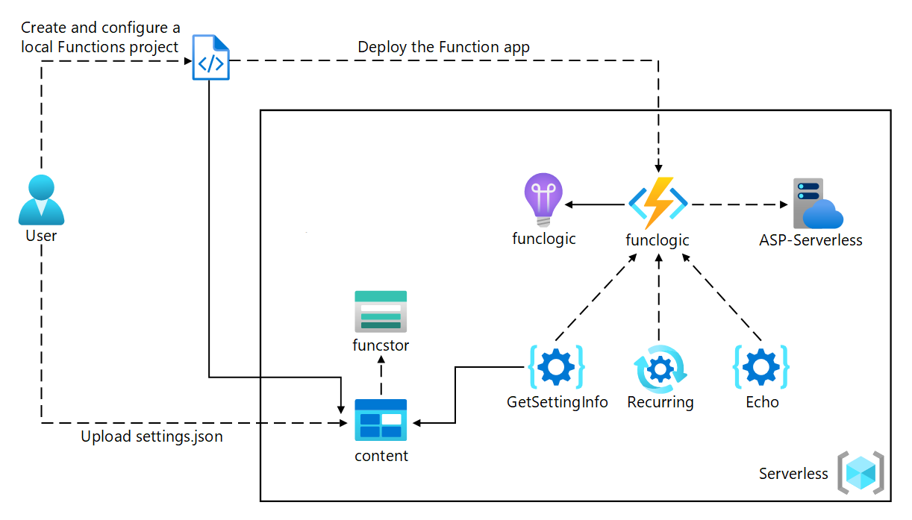

---
lab:
  az204Title: 'Lab 02: Implement task processing logic by using Azure Functions'
  az204Module: 'Learning Path 02: Implement Azure Functions'
---

# 實驗室 02：使用 Azure Functions 實作工作處理邏輯

## Microsoft Azure 使用者介面

基於 Microsoft 雲端工具的動態性質，您可能會遇到在本訓練內容開發後變更的 Azure UI。 因此，實驗指示可能無法正確對應實驗步驟。

當社群提醒 Microsoft 需要做修改時，我們會更新此訓練課程。 然而，雲端更新經常發生，所以您可能會在此訓練內容更新前遇到 UI 的變更。 **如果發生這種情況，請適應變更，然後視需要在實驗中調整。**

## 指示

### 在您開始使用 Intune 之前

#### 登入實驗室環境

使用下列認證登入您的 Windows 11 虛擬機器 (VM)：

- 使用者名稱：`Admin`
- 密碼：`Pa55w.rd`

> **注意**：您的講師會提供連線至虛擬實驗室環境的指示。

#### 檢閱已安裝的應用程式

尋找 Windows 11 桌面上的工作列。 工作列包含此次實驗中會用到的應用程式圖示，包括：

- Microsoft Edge
- 檔案總管
- 終端機
- Visual Studio Code

## 實驗情境

在本實驗中，您將示範如何建立簡單的 Azure 函式，以使用 HTTP POST 命令來回應已輸入並傳送至函式的文字。 這會說明如何透過 HTTP 觸發函式。 

此外，您將示範如何執行 Azure 函式，方法是將它設定為依固定排程執行。 函式會在每次觸發排程時，將訊息寫入記錄。

最後，您將示範 Azure 函式如何連線到其他 Azure 資源，例如儲存體帳戶。 函式會連線到您建立的儲存體帳戶，並傳回 Azure 儲存體帳戶中儲存的檔案內容。

<em>在這個 **[影片連結](https://youtu.be/-3tneDvkYDo)** 上按一下滑鼠右鍵，然後選取 [在新索引標籤/新視窗中開啟連結]，以觀看這段影片。</em>

 

### 架構圖



### 練習 1：建立 Azure 資源

#### 工作 1：開啟 Azure 入口網站

1. 在工作列上，選取 **Microsoft Edge** 圖示。
1. 在瀏覽器視窗中，瀏覽至 Azure 入口網站 (`https://portal.azure.com`)，然後登入您在此實驗要用的帳戶。

    > **注意**：如果這是您第一次登入 Azure 入口網站，系統會提供入口網站的導覽。 如果您想要跳過導覽，請選取 [開始使用] 即可開始使用入口網站。

#### 工作 2：建立 Azure 儲存體帳戶

1. 在 Azure 入口網站中，使用 [搜尋資源、服務和文件] 文字輸入框，搜尋**儲存體帳戶**，然後在結果清單中選取 [儲存體帳戶]。

1. 在 [儲存體帳戶] **** 刀鋒視窗上，選取 [+ 建立]。

1. 在 [建立儲存體帳戶] 刀鋒視窗的 [基本] 索引標籤上，執行下列動作，然後選取 [檢閱]：

    | 設定 | 動作 |
    | -- | -- |
    | [訂閱] 下拉式清單 | 保留預設值 |
    | [資源群組] 區段 | 選取 [新建]，輸入 **Serverless**，然後選取 [確定] |
    | [儲存體帳戶名稱] 文字輸入框 | 輸入 **funcstor** _[您的名稱]_ |
    | [區域] 下拉式清單 | 選取 **(美國) 美國東部** |
    | [效能] 區段 | 選取 [標準] 選項 |
    | [備援] 下拉式清單 | 選取 [本地備援儲存體 (LRS)] |

    下列螢幕擷取畫面顯示 [建立儲存體帳戶] 窗格中的設定。

    ![顯示 [建立儲存體帳戶] 窗格中設定的螢幕擷取畫面](./media/l02_create_a_storage_account.png)

1. 在 [檢閱] 索引標籤上，檢閱您在先前步驟中選取的選項。

1. 選取 [建立]，使用您指定的設定來建立儲存體帳戶。

    > **注意**：等候建立工作完成，再繼續進行實驗。

1. 在 [概觀] 窗格上，選取 [前往資源] 按鈕，即可瀏覽至新建的 [儲存體帳戶] 窗格。

1. 在 [儲存體帳戶] **** 刀鋒視窗的 [安全性 + 網路] **** 區段中，選取 [存取金鑰]。

1. 在 [存取金鑰] **** 刀鋒視窗上，選取 [顯示金鑰]。

1. 在 [存取金鑰] **** 刀鋒視窗上，檢閱任意一個 連接字串** (使用 [顯示]**** 按鈕)，然後在記事本中記錄任一 [連接字串]******  方塊的值。 **金鑰**是平台管理的加密金鑰，**不**用於此實驗室。

   > **注意**：無論您選擇哪個連接字串都不會有影響。 它們是可互換的。

1. 開啟記事本，然後將複製的連接字串值貼到記事本。 您會在稍後的實驗中用到此值。

#### 工作 3：建立函數應用程式

1. 在 Azure 入口網站的 [瀏覽] 窗格上，選取 [建立資源] 連結。

1. 在 [建立資源] 窗格上的 [搜尋服務和市集] 文字輸入框中，輸入 **Function** 再選取 [輸入]。

1. 在 [市集] 搜尋結果窗格上，選取 [函數應用程式] 結果。

1. 在 [函數應用程式] 窗格上，選取 [建立]。

1. 在 [建立函數應用程式]**** 刀鋒視窗上，請確保 [使用量]**** 是所選的主控方案，然後按一下 [選取]****。

1. 在 [建立函數應用程式 (使用量)]**** 刀鋒視窗的 [基本]**** 索引標籤上，執行下列動作，然後選取 [下一步：**儲存體]**

    | 設定 | 動作 |
    | -- | -- |
    | [訂閱] 下拉式清單 | 保留預設值 |
    | [資源群組] 區段 | 選取 [無伺服器] |
    | [函數應用程式名稱] 文字輸入框 | 輸入 **funclogic** _[您的名稱]_ |
    | [執行階段堆疊] 下拉式清單 | 選取 **.NET** |
    | [版本] 下拉式清單 | 選取 **8 (LTS)，隔離的背景工作模型 ** |
    | [區域] 下拉式清單 | 選取 [美國東部] 區域 |
    | [作業系統] 選項 | 選取 [Linux] |

    下列螢幕擷取畫面顯示 [建立函數應用程式] 窗格上的設定。

    ![顯示 [建立函數應用程式] 窗格上設定的螢幕擷取畫面](./media/l02_create_a_function_app.png)

1. 在 [儲存體] 索引標籤上執行下列動作，然後選取 [檢閱 + 建立]：

    | 設定 | 動作 |
    | -- | -- |
    | [儲存體帳戶] 下拉式清單 | 選取 **funcstor** _[您的名稱]_ 儲存體帳戶 |

1. 在 [檢閱 + 建立] 索引標籤上，檢閱在先前步驟中選取的選項。

1. 選取 [建立]，使用您指定的設定來建立函數應用程式。

    > **注意**：等候建立工作完成，再繼續進行實驗。

#### 檢閱

在此練習中，您建立了要在此實驗中使用的所有資源。

### 練習 2：設定本機 Azure Functions 專案

#### 工作 1：初始化函式專案

1. 在工作列上，選取 [終端]**** 圖示。

1. 執行下列命令，將目前目錄變更為 **Allfiles (F):\\Allfiles\\Labs\\02\\Starter\\func** 空白目錄：

    ```powershell
    cd F:\Allfiles\Labs\02\Starter\func
    ```

    > **注意**：在 Windows Explorer 中，從 **F:\\Allfiles\\Labs\\02\\Starter\\func\\.gitignore** 檔案中移除 [唯讀] 屬性。

1. 執行下列命令，使用 **Azure Functions Core Tools** 透過 **dotnet-isolated** 執行階段在目前的目錄中建立新的本機 Azure Functions 專案：

    ```powershell
    func init --worker-runtime dotnet-isolated --target-framework net8.0 --force
    ```

    > **注意**：您可以使用 **Azure Functions Core Tools** 檢閱文件以 [建立新專案][azure-functions-core-tools-new-project]。
    
1. 關閉 [終端]**** 應用程式。

#### 工作 2：設定連接字串

1. 在 [開始] 畫面上選取 [Visual Studio Code] 圖格。
1. 在 [檔案]**** 功能表上，選取 [開啟資料夾]****。
1. 在開啟的 [檔案總管] 視窗中，瀏覽至 **Allfiles (F):\\Allfiles\\Labs\\02\\Starter\\func**，然後選取 [選取資料夾]。
1. 在 [Visual Studio Code] 視窗的 [Explorer] 窗格上，開啟 **local.settings.json** 檔案。
1. 觀察 **AzureWebJobsStorage** 目前的設定值：

    ```json
    "AzureWebJobsStorage": "UseDevelopmentStorage=true",
    ```

1. 變更 **AzureWebJobsStorage** 元素的值，將其設為您稍早在此實驗中記錄的儲存體帳戶**連接字串**。
1. 開啟 **local.settings.json** 檔案。

#### 工作 3：組建並驗證專案

1. 在工作列上，選取 [終端]**** 圖示。
1. 執行下列命令，將目前目錄變更為 **Allfiles (F):\\Allfiles\\Labs\\02\\Starter\\func** 目錄：

    ```powershell
    cd F:\Allfiles\Labs\02\Starter\func
    ```

1. 執行下列命令來 **[建置]** .NET 專案：

    ```powershell
    dotnet build
    ```

#### 檢閱

在本練習中，您建立了將用來開發 Azure Functions 的本機專案。

### 練習 3：建立由 HTTP 要求所觸發的函數

#### 工作 1：建立 HTTP 觸發函數

1. 在工作列上，選取 [終端]**** 圖示。
1. 執行下列命令，將目前目錄變更為 **Allfiles (F):\\Allfiles\\Labs\\02\\Starter\\func** 目錄：

    ```powershell
    cd F:\Allfiles\Labs\02\Starter\func
    ```

1. 執行下列命令，使用 **Azure Functions Core Tools** 透過 **HTTP trigger**範本來建立名為 **Echo** 的新函數：

    ```powershell
    func new --template "HTTP trigger" --name "Echo"
    ```

    > **注意**：您可以使用 **Azure Functions Core Tools** 檢閱文件以 [建立新函式][azure-functions-core-tools-new-function]。

1. 關閉目前執行中的 [終端]**** 應用程式。

#### 工作 2：寫入 HTTP 觸發的函數程式碼

1. 在 [開始] 畫面上選取 [Visual Studio Code] 圖格。
1. 在 [檔案]**** 功能表上，選取 [開啟資料夾]****。
1. 在開啟的 [檔案總管] 視窗中，瀏覽至 **Allfiles (F):\\Allfiles\\Labs\\02\\Starter\\func**，然後選取 [選取資料夾]。
1. 在 [Visual Studio Code] 視窗的 [Explorer] 窗格中，開啟 **Echo.cs** 檔案。

1. 刪除 **Echo.cs** 檔案內的所有內容，然後新增下列程式碼。 它定義了名為「Echo」的 HTTP 觸發的函數，該函數接收 POST 要求並傳回要求本文。 ILogger 介面也用於記錄資訊。 此函式可用來測試 HTTP 要求和回應。

    ```csharp
    using System.Net;
    using Microsoft.Azure.Functions.Worker;
    using Microsoft.Azure.Functions.Worker.Http;
    using Microsoft.Extensions.Logging;
    
    namespace func
    {
        public class Echo
        {
            private readonly ILogger _logger;

            public Echo(ILoggerFactory loggerFactory)
            {
                _logger = loggerFactory.CreateLogger<Echo>();
            }

            [Function("Echo")]
            public HttpResponseData Run([HttpTrigger(AuthorizationLevel.Function, "get", "post")] HttpRequestData req)
            {
                _logger.LogInformation("C# HTTP trigger function processed a request.");

                var response = req.CreateResponse(HttpStatusCode.OK);
                response.Headers.Add("Content-Type", "text/plain; charset=utf-8");

                StreamReader reader = new StreamReader(req.Body);
                string requestBody = reader.ReadToEnd();
                response.WriteString(requestBody);

                return response;
            }
        }
    }
    ```

1. 選取 [儲存] 即可將您的變更儲存至 **Echo.cs** 檔案。

#### 工作 3：使用 curl 來測試 HTTP 觸發的函數

1. 在工作列上，選取 [終端]**** 圖示。
1. 執行下列命令，將目前目錄變更為 **Allfiles (F):\\Allfiles\\Labs\\02\\Starter\\func** 目錄：

    ```powershell
    cd F:\Allfiles\Labs\02\Starter\func
    ```

1. 執行下列命令以執行函數應用程式專案：

    ```powershell
    func start --build
    ```

    > **注意**：您可以使用 [Azure Functions Core Tools](https://docs.microsoft.com/azure/azure-functions/functions-develop-local) 檢閱文件以**在本機啟動函數應用程式專案**。
    
1. 在實驗用的電腦上，啟動**命令提示字元**。

1. 執行以下命令以針對 `http://localhost:7071/api/echo` 執行 **POST** REST API 呼叫，其中 HTTP 要求本文設定為數值 **3**：

   ```cmd
   curl -X POST -i http://localhost:7071/api/echo -d 3
   ```

1. 執行以下命令以測試針對 `http://localhost:7071/api/echo` 的 **POST** REST API 呼叫，其中 HTTP 要求本文設定為數值 **5**：

   ```cmd
   curl -X POST -i http://localhost:7071/api/echo -d 5
   ```

1. 執行以下命令以測試針對 `http://localhost:7071/api/echo` 的 **POST** REST API 呼叫，其中 HTTP 要求本文設定為字串值 **Hello**：

   ```cmd
   curl -X POST -i http://localhost:7071/api/echo -d "Hello"
   ```

1. 執行以下命令以測試針對 `http://localhost:7071/api/echo` 的 **POST** REST API 呼叫，其中 HTTP 要求本文設定為 JavaScript 物件標記法 (JSON) 值 **{"msg":"Successful"}**:

   ```cmd
   curl -X POST -i http://localhost:7071/api/echo -d "{"msg": "Successful"}"
   ```

1. 關閉**終端**應用程式和**命令提示字元**應用程式的所有目前執行的執行個體。

#### 檢閱

在此練習中，您建立了基本函數，該函數可回應透過 HTTP POST 要求傳送的內容。

### 練習 4：建立會依排程觸發的函數

#### 工作 1：建立排程觸發的函數

1. 在工作列上，選取 [終端]**** 圖示。
1. 執行下列命令，將目前目錄變更為 **Allfiles (F):\\Allfiles\\Labs\\02\\Starter\\func** 目錄：

    ```powershell
    cd F:\Allfiles\Labs\02\Starter\func
    ```

1. 在終端内，執行下列命令以使用 **Azure Functions Core Tools** 與**計時器觸發程序**範本，建立名稱為 **Recurring** 的新函數：

    ```powershell
    func new --template "Timer trigger" --name "Recurring"
    ```

    > **注意**：您可以使用 **Azure Functions Core Tools** 檢閱文件以 [建立新函式][azure-functions-core-tools-new-function]。
    
1. 關閉目前執行中的 [終端]**** 應用程式。

#### 工作 2：觀察函數程式碼

1. 在 [開始] 畫面上選取 [Visual Studio Code] 圖格。
1. 在 [檔案]**** 功能表上，選取 [開啟資料夾]****。
1. 在開啟的 [檔案總管] 視窗中，瀏覽至 **Allfiles (F):\\Allfiles\\Labs\\02\\Starter\\func**，然後選取 [選取資料夾]。
1. 在 [Visual Studio Code] 視窗的 [Explorer] 窗格中，開啟 **Recurring.cs** 檔案。
1. 在程式碼編輯器中觀察實際情況：

    ```csharp
    using System;
    using Microsoft.Azure.Functions.Worker;
    using Microsoft.Extensions.Logging;

    namespace func
    {
        public class Recurring
        {
            private readonly ILogger _logger;

            public Recurring(ILoggerFactory loggerFactory)
            {
                _logger = loggerFactory.CreateLogger<Recurring>();
            }

            [Function("Recurring")]
            public void Run([TimerTrigger("0 */5 * * * *")] TimerInfo myTimer)
            {
                _logger.LogInformation($"C# Timer trigger function executed at: {DateTime.Now}");

                if (myTimer.ScheduleStatus is not null)
                {
                    _logger.LogInformation($"Next timer schedule at: {myTimer.ScheduleStatus.Next}");
                }
            }
        }
    }
    ```

1. 在第 17 行中，將 `"0 */5 * * * *"` 取代為 `"0 */1 * * * *"`，將重複頻率間隔設定為 1 分鐘，而不是 5 分鐘，並儲存變更。

#### 工作 3：觀察函數執行狀況

1. 在工作列上，選取 [終端]**** 圖示。
1. 執行下列命令，將目前目錄變更為 **Allfiles (F):\\Allfiles\\Labs\\02\\Starter\\func** 目錄：

    ```powershell
    cd F:\Allfiles\Labs\02\Starter\func
    ```

1. 在終端内，執行以下命令以執行函數應用程式專案：

    ```powershell
    func start --build
    ```

    > **注意**：您可以使用 **Azure Functions Core Tools** 檢閱文件以 [在本機啟動函數應用程式專案][azure-functions-core-tools-start-function]。
    
1. 觀察大約每一分鐘發生一次的函數執行。 每個函數執行時都應將簡單的訊息轉譯至記錄。
1. 關閉目前執行中的 [終端]**** 應用程式。
1. 關閉 Visual Studio Code 視窗。

#### 檢閱

在此練習中，您建立了根據固定排程自動執行的函數。

### 練習 5：建立與其他服務整合的函數

#### 工作 1：將範例內容上傳至 Azure Blob 儲存體

1. 在 Azure 入口網站的 [瀏覽] 窗格上，選取 [資源群組] 連結。
1. 在 [資源群組] 窗格上，選取之前在此實驗中建立的 [Serverless] 資源群組。
1. 在 [Serverless] 窗格上，選取您先前在此實驗中建立的 **funcstor**[您的名稱] 儲存體帳戶。
1. 在 [儲存體帳戶] 窗格的 [資料儲存體] 區段中，選取 [容器] 連結。
1. 在 [容器] 區段中選取 [+ 容器]。
1. 在 [新增容器] 快顯視窗中執行下列動作，然後選取 [建立]：

    | 設定 | 動作 |
    | -- | -- |
    | [名稱] 文字輸入框  | 輸入 **content** |

1. 返回 [容器] 區段，然後選取最近建立的**content**容器。
1. 在 [容器] 窗格上，選取 [上傳]。
1. 在 [上傳 blob] 視窗中，執行下列動作，然後選取 [上傳]：

    | 設定 | 動作 |
    | -- | -- |
    | [檔案] 區段  | 選取 [瀏覽檔案] 或使用拖放功能 |
    | [檔案總管] 視窗  | 瀏覽至 **Allfiles (F):\\Allfiles\\Labs\\02\\Starter**，選取 **settings.json** 檔案，然後選取 [開啟] |
    | [如果檔案已存在即覆寫檔案] 核取方塊 | 請務必選取此核取方塊 |

      > **注意**：等候 blob 上傳後，再繼續實驗。

#### 工作 2：建立 HTTP 觸發函式

1. 在工作列上，選取 [終端]**** 圖示。
1. 執行下列命令，將目前目錄變更為 **Allfiles (F):\\Allfiles\\Labs\\02\\Starter\\func** 目錄：

    ```powershell
    cd F:\Allfiles\Labs\02\Starter\func
    ```

1. 在終端内，執行下列命令，使用 **Azure Functions Core Tools** 與 **HTTP 觸發程序**範本，建立名稱為 **GetSettingInfo** 的新函數：

    ```powershell
    func new --template "HTTP trigger" --name "GetSettingInfo"
    ```

    > **注意**：您可以使用 **Azure Functions Core Tools** 檢閱文件以 [建立新函式][azure-functions-core-tools-new-function]。
1. 關閉目前執行中的 [終端]**** 應用程式。

#### 工作 3：註冊 Azure 儲存體 Blob 延伸模組

1. 在工作列上，選取 [終端]**** 圖示。
1. 執行下列命令，將目前目錄變更為 **Allfiles (F):\\Allfiles\\Labs\\02\\Starter\\func** 目錄：

    ```powershell
    cd F:\Allfiles\Labs\02\Starter\func
    ```

1. 在終端内，執行以下命令以註冊 [Microsoft.Azure.Functions.Worker.Extensions.Storage](https://www.nuget.org/packages/Microsoft.Azure.Functions.Worker.Extensions.Storage/6.2.0) 延伸模組：

    ```powershell
    dotnet add package Microsoft.Azure.Functions.Worker.Extensions.Storage --version 6.2.0
    ```

#### 工作 4：使用 blob 輸入寫入 HTTP 觸發的函數程式碼

1. 在 [開始] 畫面上選取 [Visual Studio Code] 圖格。
1. 在 [檔案]**** 功能表上，選取 [開啟資料夾]****。
1. 在開啟的 [檔案總管] 視窗中，瀏覽至 **Allfiles (F):\\Allfiles\\Labs\\02\\Starter\\func**，然後選取 [選取資料夾]。
1. 在 [Visual Studio Code] 視窗的 [Explorer] 窗格中，開啟 **GetSettingInfo.cs** 檔案。
1. 將從第 17 行開始的函數 **GetSettingInfo** 的自動產生程式碼的內容取代為以下程式碼：

    ```csharp
            [Function("GetSettingInfo")]
            public HttpResponseData Run([HttpTrigger(AuthorizationLevel.Function, "get", "post")] HttpRequestData req, 
                [BlobInput("content/settings.json", Connection = "AzureWebJobsStorage")] string blobContent
                )
            {
                _logger.LogInformation("C# HTTP trigger function processed a request.");
                _logger.LogInformation($"{blobContent}");

                var response = req.CreateResponse(HttpStatusCode.OK);
                response.Headers.Add("Content-Type", "text/plain; charset=utf-8");
                response.WriteString($"{blobContent}");

                return response;
            }
    ```

1. 檢閱結果碼，其應包括以下內容 (此程式碼傳回 Azure Blob 儲存體容器中 JSON 檔案的內容，以回應 HTTP GET 要求)：

    ```csharp
    using System.Net;
    using Microsoft.Azure.Functions.Worker;
    using Microsoft.Azure.Functions.Worker.Http;
    using Microsoft.Extensions.Logging;

    namespace func
    {
        public class GetSettingInfo
        {
            private readonly ILogger _logger;

            public GetSettingInfo(ILoggerFactory loggerFactory)
            {
                _logger = loggerFactory.CreateLogger<GetSettingInfo>();
            }

            [Function("GetSettingInfo")]
            public HttpResponseData Run([HttpTrigger(AuthorizationLevel.Function, "get", "post")] HttpRequestData req,
                [BlobInput("content/settings.json", Connection = "AzureWebJobsStorage")] string blobContent
                )
            {
                _logger.LogInformation("C# HTTP trigger function processed a request.");
                _logger.LogInformation($"{blobContent}");

                var response = req.CreateResponse(HttpStatusCode.OK);
                response.Headers.Add("Content-Type", "text/plain; charset=utf-8");
                response.WriteString($"{blobContent}");

                return response;
            }
        }
    }
    ```

1. 選取 [儲存] 即可將您的變更儲存至 **GetSettingInfo.cs** 檔案。


#### 工作 5：使用 curl 測試函數

1. 在工作列上，選取 [終端]**** 圖示。
1. 在終端内，執行以下命令以執行函數應用程式專案：

    ```powershell
    func start --build
    ```

    > **注意**：您可以使用 **Azure Functions Core Tools** 檢閱文件以 [在本機啟動函數應用程式專案][azure-functions-core-tools-start-function]。

1. 在實驗用的電腦上，啟動**命令提示字元**。

1. 執行以下命令以針對 `http://localhost:7071/api/GetSettingInfo` 測試 **GET** REST API 呼叫：

   ```cmd
   curl -X GET -i http://localhost:7071/api/GetSettingInfo
   ```

1. 觀察函數應用程式回應的 JSON 內容，現在應該包含：

    ```json
    {
        "version": "0.2.4",
        "root": "/usr/libexec/mews_principal/",
        "device": {
            "id": "21e46d2b2b926cba031a23c6919"
        },
        "notifications": {
            "email": "joseph.price@contoso.com",
            "phone": "(425) 555-0162 x4151"
        }
    }
    ```

1. 關閉**終端**應用程式和**命令提示字元**應用程式的所有目前執行的執行個體。

#### 檢閱

在本練習中，您建立了函數，其從儲存體帳戶傳回 JSON 檔案的內容。

### 練習 6：將本機函數專案部署至 Azure Functions 應用程式

#### 工作 1：使用 Azure Functions Core Tools 進行部署

1. 在工作列上，選取 [終端]**** 圖示。
1. 執行下列命令，將目前目錄變更為 **Allfiles (F):\\Allfiles\\Labs\\02\\Starter\\func** 目錄：

    ```powershell
    cd F:\Allfiles\Labs\02\Starter\func
    ```

1. 從命令提示字元中，執行下列命令以登入 Azure 命令列介面 (CLI)：

    ```powershell
    az login
    ```

1. 在 **Microsoft Edge** 瀏覽器視窗中，輸入您在此實驗中使用的 Microsoft 或 Azure Active Directory 帳戶名稱和密碼，然後選取 [登入]。
1. 傳回目前開啟的 [終端]**** 視窗。 等候登入流程完成。
1. 在終端内，執行下列命令以發佈函數應用程式專案 (將 `<function-app-name>` 預留位置取代為您稍早在本實驗中建立的函數應用程式名稱)：

    ```powershell
    func azure functionapp publish <function-app-name> --dotnet-version 8.0
    ```

    > **注意**：例如，如果您的**函數應用程式名稱**是 **funclogicstudent**，您的命令會是 ``func azure functionapp publish funclogicstudent``。 您可以使用 **Azure Functions Core Tools** 檢閱文件以 [發佈本機函數應用程式專案][azure-functions-core-tools-publish-azure]。

1. 等候部署完成，再繼續進行實驗。
1. 關閉目前執行中的 [終端]**** 應用程式。

#### 工作 2：驗證部署

1. 在工作列上選取 **Microsoft Edge** 圖示，然後選取可顯示 Azure 入口網站的索引標籤。
2. 在 Azure 入口網站的 [瀏覽] 窗格上，選取 [資源群組] 連結。
3. 在 [資源群組] 窗格上，選取之前在此實驗中建立的 [Serverless] 資源群組。
4. 在 [Serverless] 窗格上，選取您先前在此實驗中建立的 **funcstor**[您的名稱] 函數應用程式。
5. 在函數應用程式的 [概觀]**** 刀鋒視窗上，選取 [函數]**** 窗格。
6. 在 [函數] 窗格上選取現有的 **GetSettingInfo** 函數。
7. 在 [函數] 窗格中，選取 [開發人員] 區段中的 [程式碼 + 測試] 選項。
8. 在函數編輯器中選取 [測試/執行]。
9. 在自動顯示的窗格中，選取 [HTTP 方法] 下拉式清單的 **GET**。
10. 選取 [執行] 以測試函數。
11. 在 [HTTP 回應內容] 中，檢閱測試回合的結果。 JSON 內容現在應該包含下列程式碼：

    ```json
    {
        "version": "0.2.4",
        "root": "/usr/libexec/mews_principal/",
        "device": {
            "id": "21e46d2b2b926cba031a23c6919"
        },
        "notifications": {
            "email": "joseph.price@contoso.com",
            "phone": "(425) 555-0162 x4151"
        }
    }
    ```

#### 檢閱

在本練習中，您部署了本機函數專案至 Azure Functions 並驗證了該函數可在 Azure 中運作。
