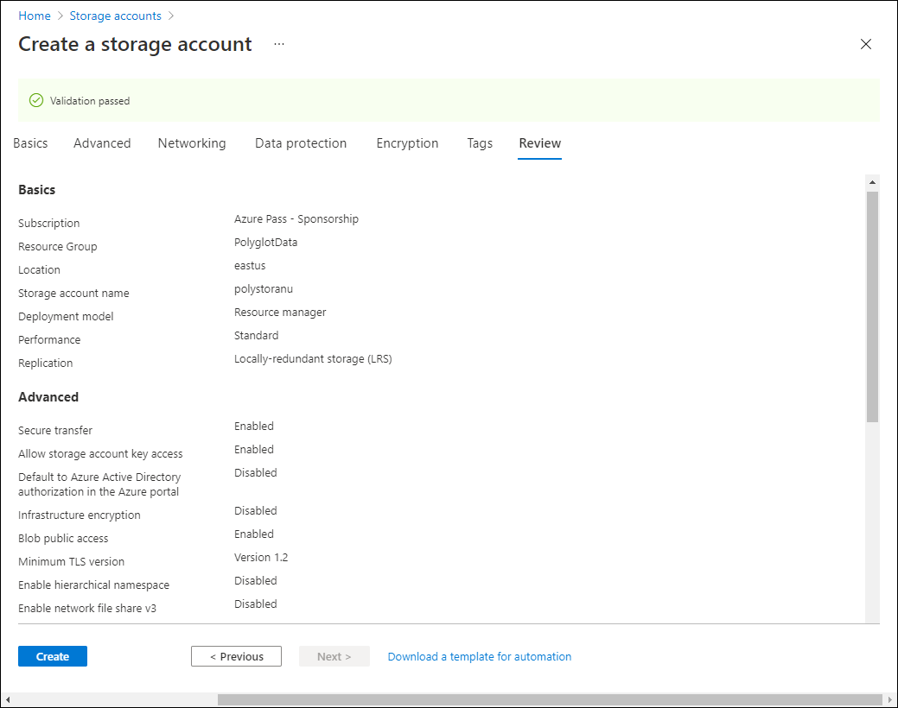

---
lab:
  az204Title: 'Lab 04: Construct a polyglot data solution'
  az204Module: 'Learning Path 04: Develop solutions that use Cosmos DB storage'
---

# 實驗室 04：建構多語言資料解決方案

## Microsoft Azure 使用者介面

基於 Microsoft 雲端工具的動態性質，您可能會遇到在本訓練內容開發後變更的 Azure UI。 因此，實驗指示可能無法正確對應實驗步驟。

當社群提醒 Microsoft 需要做修改時，我們會更新此訓練課程。 然而，雲端更新經常發生，所以您可能會在此訓練內容更新前遇到 UI 的變更。 **如果發生這種情況，請適應變更，然後視需要在實驗中調整。**

## 指示

### 在您開始使用 Intune 之前

#### 登入實驗室環境

使用下列認證登入您的 Windows 10 虛擬機器 (VM)：

- 使用者名稱：`Admin`
- 密碼：`Pa55w.rd`

> **注意**：您的講師會提供連線至虛擬實驗室環境的指示。

#### 檢閱已安裝的應用程式

尋找 Windows 10 桌面上的工作列。 工作列包含此次實驗中會用到的應用程式圖示，包括：

- Microsoft Edge
- 檔案總管
- Visual Studio Code

## 實驗情境

在本實驗中，您將建立 Azure Cosmos DB 資源和儲存體帳戶資源。 使用 C# 和 .NET，您將存取 Cosmos DB 資源並將資料上傳至其中。

此外，由於 Contoso 可能想要透過使用者易用的介面存取 Cosmos DB 中的資料，因此您將實作 .NET 解決方案，以在網頁瀏覽器中存取和顯示 Cosmos DB 資料。

最後，您將設定 Cosmos DB 執行個體的一致性層級，並針對變更摘要通知實作 Azure 函式。

## 架構圖


### 練習 1：在 Azure 中建立資料存放區資源

#### 工作 1：開啟 Azure 入口網站

1. 在工作列上，選取 **Microsoft Edge** 圖示。

1. 在開啟的瀏覽器視窗中，瀏覽至 Azure 入口網站 (`https://portal.azure.com`)，然後使用此實驗要使用的帳戶登入。

   > **注意**：如果這是您第一次登入 Azure 入口網站，系統會提供入口網站的導覽。 選取 [開始使用] 跳過導覽，並開始使用入口網站。

#### 工作 2：建立 Azure Cosmos DB 帳戶資源

1. 在 Azure 入口網站中使用 [搜尋資源、服務及文件] 文字輸入框，搜尋 **Azure Cosmos DB**，然後在結果清單中選取 [Azure Cosmos DB]。

1. 在 [Azure Cosmos DB]**** 窗格上，選取 [+ 建立]****。

1. 在 [**選取 API] 選項**刀鋒視窗中，選取 **[適用於 NoSQL** 的 Azure Cosmos DB] 方塊中的 **[建立**]。

1. 在 [建立 Azure Cosmos DB 帳戶 - Azure Cosmos DB for NoSQL] 頁面的 [基本] 索引標籤上執行下列動作，然後選取 [檢閱 + 建立]：

   | 設定                     | 動作                                                                                                                   |
   | --------------------------- | ------------------------------------------------------------------------------------------------------------------------ |
   | [訂閱] 清單       | 保留預設值                                                                                                          |
   | [資源群組] 區段  | 選取 [新建]                                                                                                    |
   | [名稱] 文字輸入框           | 輸入 **Polyglotdata** 後選取 [確定]                                                                                 |
   | [AccountName] 文字輸入框    | 輸入 **polycosmos** _[您的名稱]_                                                                                         |
   | [位置] 下拉式清單 | 選取位置最接近實驗用的電腦且可建立 Cosmos DB 帳戶的 Azure 區域 |
   | [容量模式]**** 區段   | 選取 [無伺服器]                                                                                                    |

   下列螢幕擷取畫面顯示 [建立 Azure Cosmos DB 帳戶 - Azure Cosmos DB for NoSQL] 頁面上的設定。

   

1. 在 [建立 Azure Cosmos DB 帳戶 - Azure Cosmos DB for NoSQL] 頁面的 [檢閱 + 建立] 索引標籤上，檢閱您在先前步驟所選取的選項。

1. 選取 [建立]，使用您指定的設定來建立 Azure Cosmos DB 帳戶。

   > **注意**：等候建立工作完成，再繼續進行實驗。

1. 選取 [前往資源]  。

1. 在 [Azure Cosmos DB 帳戶]**** 窗格上尋找 [設定]**** 區段，然後選取 [金鑰]**** 連結。

1. 在 [金鑰]**** 窗格的 [讀寫金鑰]**** 索引標籤上，記錄 [URI]****、[主要金鑰]**** 和 [主要連接字串]**** 文字輸入框的值。 您會在稍後的實驗中用到這些值。

#### 工作 3：建立 Azure 儲存體帳戶資源

1. 在 Azure 入口網站中，使用 [搜尋資源、服務和文件] 文字輸入框，搜尋**儲存體帳戶**，然後在結果清單中選取 [儲存體帳戶]。

1. 在 [儲存體帳戶] 刀鋒視窗上，選取 [+ 建立]。

1. 在 [建立儲存體帳戶] 刀鋒視窗的 [基本] 索引標籤上，執行下列動作，然後選取 [檢閱]：

   | 設定                           | 動作                                                                                  |
   | --------------------------------- | --------------------------------------------------------------------------------------- |
   | [訂閱] 清單             | 保留預設值                                                                         |
   | [資源群組] 區段        | 選取 **PolyglotData**                                                                 |
   | [儲存體帳戶名稱] 文字輸入框 | 輸入 **polystor** _[您的名稱]_                                                          |
   | [區域] 下拉式清單         | 選取您稍早在此練習中建立 Cosmos DB 帳戶的相同區域 |
   | [效能] 區段           | 選取 [標準]                                                                     |
   | [備援] 下拉式清單     | 選取 [本地備援儲存體 (LRS)]                                              |

   下列螢幕擷取畫面顯示 [建立儲存體帳戶] 窗格上的設定。

   

1. 在 [建立儲存體帳戶] 刀鋒視窗的 [檢閱] 索引標籤上，檢閱您在先前步驟所選取的選項。

1. 選取 [建立]，使用您指定的設定來建立儲存體帳戶。

   > **注意**：等候建立工作完成，再繼續進行實驗。

#### 檢閱

在此練習中，您建立了將在此實驗實作的多語言資料解決方案所需的 Azure 資源。 您所建立的 Azure 資源包括 Azure Cosmos DB 帳戶和 Azure 儲存體帳戶。

### 練習 2：檢閱並上傳資料

#### 工作 1：將影像上傳到 Azure Blob 儲存體

1. 在 Azure 入口網站的瀏覽窗格中，瀏覽回 [儲存體帳戶] 窗格，然後選取您在此實驗上一個練習中建立的 **polystor**[您的名稱] 儲存體帳戶。

1. 在 [polystor[您的名稱]] 儲存體帳戶窗格上，選取 [資料儲存體] 區段中的 [容器] 連結。

1. 在 [容器] 區段中選取 [+ 容器]。

1. 在 [新增容器] 快顯視窗中執行下列動作，然後選取 [建立]：

   | 設定                                | 動作                                   |
   | -------------------------------------- | ---------------------------------------- |
   | [名稱] 文字輸入框                      | 輸入 **images**                         |
   | [公用存取層級] 下拉式清單 | 選取 [私人] \(無匿名存取\) |

1. 回到 [容器] 區段中選取新建立的 [影像] 容器。

1. 在 [容器] 窗格上尋找 [設定] 區段，然後選取 [屬性] 連結。

1. 在 [屬性] 窗格中，注意 [URL] 文字輸入框內的值並記錄下來。 您會在稍後的實驗中用到此值。

1. 按兩下 **[下一步共用存取令牌** ]，然後按兩下 **[產生 SAS 令牌和 URL**]，以使用預設設定產生存取令牌。 請記下 Blob SAS 令牌**的值**，因為您稍後將需要此值。

1. 尋找並選取窗格上的 [概觀] 連結。
1. 在窗格上選取 [上傳]。

1. 在 [上傳 Blob] 快顯中執行下列動作：

   a. 在 [檔案] 區段中，選取 [瀏覽檔案] 或使用拖放功能。

   b. 在 [檔案總管] 視窗中，瀏覽至 **Allfiles (F):\\Allfiles\\Labs\\04\\Starter\\Images**，選取所有 42 個的個別 **.jpg** 影像檔，然後選取 [開啟]。

   c. 確定已選取 [如果檔案已經存在，則將其覆寫]，然後選取 [上傳]。

   > **注意**：等候所有 Blob 上傳後，再繼續進行實驗。

#### 工作 2：檢閱 JSON 資料

1. 從實驗用的電腦啟動 Visual Studio Code。

1. 從 [檔案] 功能表中選取 [開啟檔案]，瀏覽至 **Allfiles (F):\\Allfiles\\Labs\\04\\Starter\\AdventureWorks\\AdventureWorks.Upload**，選取 **models.json**，然後選取 [開啟]。

1. 檢閱 **models.json** 檔案的格式，並請注意該檔案包含 JSON 物件的陣列，以及屬於**產品**屬性的物件巢狀陣列。

   > **注意**：這會決定您在將 JSON 檔案上傳至 Cosmos DB 集合之前，要定義哪些類別來將 JSON 檔案的內容還原序列化。

1. 請注意，在 **models.json** 檔案中，其中一個屬性名為 **Category**。

   > **注意**：您將使用 **Category** 屬性來定義目標 Cosmos DB 集合的資料分割。

1. 關閉 Visual Studio Code。

#### 工作 3：建立 Cosmos DB 資料庫和集合，並執行 JSON 資料上傳

1. 在 [開始] 畫面上選取 [Visual Studio Code] 圖格。

1. 從 [檔案] 功能表選取 [開啟資料夾]。

1. 在開啟的 [檔案總管] 視窗中，瀏覽至 **Allfiles (F):\\Allfiles\\Labs\\04\\Starter\\AdventureWorks**，然後選取 [選取資料夾]。

1. 在 [Visual Studio Code] 視窗的 [功能表列] 上選取 [終端]，然後選取 [新增終端]。

1. 在終端中，確認目前目錄已設為 **AdventureWorks** (若尚未設定請進行變更)，然後執行下列命令以將終端內容切換為 **AdventureWorks.Upload** 資料夾：

   ```
   cd .\AdventureWorks.Upload\
   ```

   > **注意**：執行下一個步驟之前，請開啟 [Windows 檔案總管]，然後從 **Allfiles (F):\\Allfiles\\Labs\\04\\Starter\\AdventureWorks\\AdventureWorks.Upload\\AdventureWorks.Upload.csproj** 檔案中移除 [唯讀] 屬性

1. 從終端提示中執行下列命令，將 Azure Cosmos DB .NET 用戶端程式庫新增至目前開啟的專案：

   > **注意**：繼續進行下列命令之前，請確定您目前位於此路徑： **（F）：\\Allfiles\\Labs\\04\\Starter\\AdventureWorks\\AdventureWorks.Upload\\**

   ```
   dotnet add package Microsoft.Azure.Cosmos --version 3.28.0
   ```
   
   > **注意**：**dotnet add package** 命令會從 **NuGet** 新增 **Microsoft.Azure.Cosmos** 封裝。 如需詳細資訊，請參閱 [Microsoft.Azure.Cosmos](https://www.nuget.org/packages/Microsoft.Azure.Cosmos)。

1. 觀察列印在終端中的組建結果。 組建應在沒有錯誤或警告訊息的情況下成功完成。

1. 在 [Visual Studio Code]**** 視窗的 [Explorer]**** 窗格中展開 **AdventureWorks.Upload** 專案。

1. 開啟 **Program.cs** 檔案。

1. 在 **Program.cs** 檔案中檢閱 **using** 指示詞，請注意，這其中包含 **Microsoft.Azure.Cosmos**、**System.IO;** 、**System.Text.Json**、**System.Threading.Tasks** 和 **System.Collections.Generic**。 這可讓您將 JSON 項目從實驗用電腦的本機檔案以非同步方式上傳至 Cosmos DB 資料庫中的集合。

1. 在 **Program.cs** 檔案的第 14 行中，將空白字串取代成您稍早在此實驗中記錄的 Cosmos DB 帳戶的 **URI** 屬性，設定 **EndpointUrl** 的值。 請務必將該值括在雙引號中。

1. 在第 15 行中，將空白字串取代成您稍早在本實驗記錄的 Cosmos DB 帳戶的**主要金鑰**屬性，以設定 **AuthorizationKey** 的值。 請務必將該值括在雙引號中。

1. 在第 18 行中，將空白字串取代成 **"/Category"** 以設定 **PartitionKey** 的值。

1. 在第 19 行中，將空白字串取代成 **"F:\\\\Allfiles\\\\Labs\\\\04\\\\Starter\\\\AdventureWorks\\\\AdventureWorks.Upload\\\\models.json"** ，以設定 **JsonFilePath** 的值。

1. 在 try 區塊內，請注意 **CosmosClient** 類別的 **CreateDatabaseIfNotExistsAsync** 方法的引動過程。 若資料庫不存在，則此過程會予以建立。

1. 請注意**Database**類別的 **DefineContainer** 方法的引動過程。 若容器不存在，則此過程會建立可裝載 JSON 項目的容器。

   > **注意**：**DefineContainer** 方法包含成本最小化的選項，可讓您修改預設的索引編制原則 (自動編制所有屬性的索引)。

1. 請注意，**using 陳述式**使用 **StreamReader** 物件從文字檔讀取 JSON 項目，並將其還原序列化為 **Program.cs** 檔案中進一步定義的 **Model** 類別物件。

1. 請注意 ForEach 迴圈，該迴圈會逐一查看已還原序列化的物件集合，並以非同步方式將各個物件插入目標集合中。

1. 檢閱**Model**和**Product**類別，該類別可反映您稍早在本實驗中檢閱的 JSON 格式檔案中儲存的物件格式。

1. 儲存並關閉 **Program.cs** 檔案。

   > **注意**：如果您收到檔案為唯讀的提示，請選取 [覆寫]。

1. 在終端中，執行下列命令來還原任何遺漏的 NuGet 套件，並在資料夾中組建專案：

   ```
   dotnet build
   ```

   > **注意**：**dotnet build** 命令會在組建資料夾中的所有專案之前，自動還原任何遺漏的 NuGet 套件。

1. 從終端提示執行下列命令，即可執行 .NET Core 主控台應用程式：

   ```
   dotnet run
   ```

   > **注意**：**dotnet run** 命令會自動組建專案上的任何變更，然後在未附加偵錯工具的情況下啟動 Web 應用程式。 此命令會輸出指示資料載入進度的訊息，包括插入目標集合的項目數量，以及插入作業的所需時長。

1. 執行列印在終端中的命令並觀察其結果。 執行應該會順利完成，並顯示將 119 個項目插入目標 Cosmos DB 集合中的訊息。

1. 選取 [終止終端] \(**資源回收筒圖示**\)，關閉終端窗格和任何相關的程序。

#### 工作 4：驗證 JSON 資料上傳

1. 在您的實驗用電腦上，切換至顯示 Azure 入口網站的 **Microsoft Edge** 瀏覽器視窗。

1. 在 Azure 入口網站中，選取 [搜尋資源、服務和文件] 文字輸入框，在 [最近的資源] 清單中，選取您稍早在此實驗室中建立的 **polycosmos**[您的名稱] Azure Cosmos DB 帳戶。

1. 在 [Azure Cosmos DB 帳戶]**** 窗格上尋找並選取窗格上的 [資料總管]**** 連結。

1. 在 [資料總管] 窗格中展開 [零售] 資料庫節點。

1. 展開 [線上] 容器節點，然後選取 [新增 SQL 查詢]。

   > **注意**：此選項的標籤可能是隱藏的。 您可以將滑鼠游標暫留在 [資料總管] 窗格中的圖示上，以顯示標籤。

1. 在 [查詢] 索引標籤上，輸入下列文字：

   ```sql
   SELECT * FROM models
   ```

1. 選取 [執行查詢]，然後觀察查詢所傳回的 JSON 項目清單。

1. 回到查詢編輯器，以下列文字取代現有的文字：

   ```sql
   SELECT VALUE COUNT(1) FROM models
   ```

1. 選取 [執行查詢]，然後觀察 **COUNT** 彙總作業的結果。

1. 切換回 **Visual Studio Code** 視窗。

#### 檢閱

在此練習中，您使用了適用於 Azure Cosmos DB 的 .NET SDK 將資料插入 Azure Cosmos DB。 您接下來實作的 Web 應用程式將會使用此資料。

### 練習 3：設定 .NET Web 應用程式

#### 工作 1：更新資料存放區的參考並組建 Web 應用程式

1. 在 [Visual Studio Code]**** 視窗的 [Explorer]**** 窗格中展開 **AdventureWorks.Web** 專案。

1. 開啟 **appsettings.json** 檔案。

1. 在 JSON 物件的第 3 行中尋找 **ConnectionStrings.AdventureWorksCosmosCoNtext** 路徑。 請注意，目前的值是空白的：

   ```json
   "ConnectionStrings": {
       "AdventureWorksCosmosContext": "",
   },
   ```

1. 更新 **AdventureWorksCosmosCoNtext** 屬性的值，將其設為您稍早在此實驗室中記錄的 Azure Cosmos DB 帳戶的**主要連接字串**。

1. 在 JSON 物件的第 6 行中尋找 **Settings.BlobContainerUrl** 路徑。 請注意，目前的值是空白的：

   ```json
   "Settings": {
       "BlobContainerUrl": "",
       "BlobSASToken": "",
       ...
   }
   ```

1. 藉**由將 BlobContainerUrl** 和 **BlobSASToken** 屬性的值設定為**名為 images** Azure 儲存體 Blob 容器**的 URL** 屬性，以及您在此實驗室稍早記錄的 Blob SAS 令牌值，以更新其值。

1. 儲存 **appsettings.json** 檔案並將其關閉。

   > **注意**：如果您收到檔案為唯讀的提示，請選取 [覆寫]。

1. 在 **Visual Studio Code** 視窗中，以滑鼠右鍵按兩下 **總管窗格中的 AdventureWorks.Context** 資料夾，然後選取 **[在整合式終端**機中開啟]。

   ![顯示 [在整合式終端機中開啟] 的螢幕快照](media/l04_vscode_open_in_integreated_terminal.png)

   > **注意**：在您執行下一個步驟之前，請開啟 Windows 檔案總管，然後從 **Allfiles (F):\Allfiles\Labs\04\Starter\AdventureWorks\AdventureWorks.Context\AdventureWorks.Context.csproj** 檔案中移除唯讀屬性

1. 從終端提示中，確認目前目錄已設為 **AdventureWorks.CoNtext** (若尚未設定請進行變更)，然後執行下列命令以從 NuGet 匯入 **Microsoft.Azure.Cosmos**：

   > **注意**：繼續進行下列命令之前，請確定您目前位於此路徑： **（F）：\\Allfiles\\Labs\\04\\Starter\\AdventureWorks\\AdventureWorks.Context\\**

   ```
   dotnet add package Microsoft.Azure.Cosmos --version 3.28.0
   ```

1. 從終端機提示字元中，執行下列命令來建置 **AdventureWorks.Context** 專案：

   ```
   dotnet build
   ```

1. 觀察列印在終端中的組建結果。 組建應在沒有錯誤或警告訊息的情況下成功完成。

#### 工作 2：設定 Azure Cosmos DB 的連線能力

1. 在 [Visual Studio Code]**** 視窗的 [Explorer]**** 窗格中，展開 **AdventureWorks.Context** 專案。

1. 從 **AdventureWorks.Context** 資料夾節點的捷徑功能表中選取 [新增檔案]。

1. 在新的檔案提示中輸入 **AdventureWorksCosmosCoNtext.cs**。

1. 從 AdventureWorksCosmosContext.cs** 檔案的程式**代碼編輯器索引標籤，新增下列程式代碼：

   ```csharp
   using AdventureWorks.Models;
   using Microsoft.Azure.Cosmos;
   using Microsoft.Azure.Cosmos.Linq;
   using System;
   using System.Collections.Generic;
   using System.Linq;
   using System.Threading.Tasks;

   namespace AdventureWorks.Context
   {
       /* AdventureWorksCosmosContext class will implement the
       IAdventureWorksProductContext interface */
      public class AdventureWorksCosmosContext : IAdventureWorksProductContext
      {
           /* Create a new read-only Container variable named _container */
           private readonly Container _container;

         public AdventureWorksCosmosContext(string connectionString, string database = "Retail", string container = "Online")
         {
           /* Create a new instance of the CosmosClient class, and then obtain
             both a Database and Container instance from the client */
           _container = new CosmosClient(connectionString)
           .GetDatabase(database)
           .GetContainer(container);
         }

         public async Task<Model> FindModelAsync(Guid id)
         {
           /* Create a LINQ query, transform it into an iterator, iterate over the result set,
              and then return the single item in the result set */
           var iterator = _container.GetItemLinqQueryable<Model>()
           .Where(m => m.id == id).ToFeedIterator<Model>();
           List<Model> matches = new List<Model>();
           while (iterator.HasMoreResults)
           {
               var next = await iterator.ReadNextAsync();
               matches.AddRange(next);
           }

           return matches.SingleOrDefault();
         }

         public async Task<List<Model>> GetModelsAsync()
         {
           /* Run an SQL query, get the query result iterator, iterate over the result set,
               and then return the union of all results */
           string query = $@"SELECT * FROM items";
           var iterator = _container.GetItemQueryIterator<Model>(query);
           List<Model> matches = new List<Model>();
           while (iterator.HasMoreResults)
           {
               var next = await iterator.ReadNextAsync();
               matches.AddRange(next);
           }

           return matches;
         }

         public async Task<Product> FindProductAsync(Guid id)
         {
           /* Run an SQL query, get the query result iterator, iterate over the result set,
              and then return the single item in the result set */
           string query = $@"SELECT VALUE products
                       FROM models
                       JOIN products in models.Products
                       WHERE products.id = '{id}'";
           var iterator = _container.GetItemQueryIterator<Product>(query);
           List<Product> matches = new List<Product>();
           while (iterator.HasMoreResults)
           {
               var next = await iterator.ReadNextAsync();
               matches.AddRange(next);
           }

           return matches.SingleOrDefault();
         }

      }
   }
   ```

1. 儲存並關閉 **AdventureWorksCosmosContext.cs** 檔案。
1. 從終端提示中將目前目錄設為 **AdventureWorks.Context**，並執行下列命令來組建 .NET Web 應用程式：

   ```
   dotnet build
   ```

   > **注意**：如果有任何建置錯誤，請檢閱 **Allfiles > （F）：\\Allfiles\\Labs\\04\\Solution\\AdventureWorks AdventureWorks.Context\\** 資料夾中的 AdventureWorksCosmosContext.cs** 檔案**。

#### 工作 3：檢閱 .NET 應用程式啟動邏輯

1. 在 [Visual Studio Code]**** 視窗的 [Explorer]**** 窗格中展開 **AdventureWorks.Web** 專案。

1. 開啟 **Startup.cs** 檔案。

1. 在 **Startup** 類別中，注意現有的 **ConfigureProductService** 方法：

   ```csharp
   public void ConfigureProductService(IServiceCollection services)
   {
       services.AddScoped<IAdventureWorksProductContext, AdventureWorksCosmosContext>(provider =>
           new AdventureWorksCosmosContext(
               _configuration.GetConnectionString(nameof(AdventureWorksCosmosContext))
           )
       );
   }
   ```

   > **注意**：產品服務會使用 Cosmos DB 作為其資料庫。

1. 在不進行任何修改的情況下關閉 **Startup.cs** 檔案。

#### 工作 4：驗證 .NET 應用程式是否成功連線到資料存放區

1. 從 Visual Studio Code 的終端提示執行下列命令，將您的終端內容切換至 **AdventureWorks.Web** 資料夾：

   ```
   cd ..\AdventureWorks.Web\
   ```

1. 從終端提示執行下列命令，以執行 ASP.NET Web 應用程式：

   > **注意**：繼續進行下列命令之前，請確定您目前位於此路徑： **（F）：\\Allfiles\\Labs\\04\\Starter\\AdventureWorks\\AdventureWorks.Web\\**

   ```
   dotnet run
   ```

   > **注意**：**dotnet run** 命令會自動組建專案上的任何變更，然後在未附加偵錯工具的情況下啟動 Web 應用程式。 此命令會輸出執行中應用程式的 URL 和任何指派的連接埠。

1. 在工作列上，選取 **Microsoft Edge** 圖示。

1. 在開啟的瀏覽器視窗中，瀏覽至目前執行的 Web 應用程式 (<http://localhost:5000>)。

1. 在 Web 應用程式中，觀察從首頁顯示的型號清單。

1. 尋找 **Touring-1000** 型號，然後選取 [檢視詳細資料]。

1. 在 **Touring-1000** 產品詳細資料頁面上，檢閱選項清單。

1. 關閉顯示 Web 應用程式的瀏覽器視窗。

1. 切換至 [Visual Studio Code] 視窗，然後選取 [終止終端] \(**資源回收筒**圖示\) 以關閉目前開啟的終端和任何相關的程序。

#### 檢閱

在此練習中，您撰寫了 C# 程式碼，以使用 .NET SDK 查詢 Azure Cosmos DB 集合。
