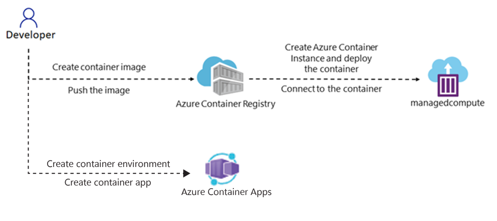

---
lab:
  az204Title: 'Lab 05: Deploy compute workloads by using images and containers'
  az204Module: 'Learning Path 05: Implement containerized solutions'
---

# 實驗 05：使用映像和容器部署計算工作負載

## Microsoft Azure 使用者介面

基於 Microsoft 雲端工具的動態性質，您可能會遇到在本訓練內容開發後變更的 Azure UI。 因此，實驗指示可能無法正確對應實驗步驟。

當社群提醒 Microsoft 需要做修改時，我們會更新此訓練課程。 然而，雲端更新經常發生，所以您可能會在此訓練內容更新前遇到 UI 的變更。 **如果發生這種情況，請適應變更，然後視需要在實驗中調整。**

## 指示

### 在您開始使用 Intune 之前

#### 登入實驗室環境

使用下列認證登入您的 Windows 11 虛擬機（VM）：

- 使用者名稱：`Admin`
- 密碼：`Pa55w.rd`

> **注意**：您的講師會提供連線至虛擬實驗室環境的指示。

#### 檢閱已安裝的應用程式

在 Windows 11 桌面上尋找任務列。 工作列包含此次實驗中會用到的應用程式圖示，包括：

-   Microsoft Edge
-   檔案總管

## 實驗情境

在本實驗中，您將探索如何使用 .NET 應用程式和 Docker 檔案，建立容器並將其部署至 Azure Container Registry。 此外，也會將容器化解決方案部署到 Azure 容器應用程式。

## 架構圖




### 練習 1：建立並部署 Docker 容器映像至 Azure Container Registry

#### 工作 1：開啟 Azure 入口網站

1. 在工作列上，選取 **Microsoft Edge** 圖示。

1. 在開啟的瀏覽器視窗中，瀏覽至 Azure 入口網站 (`https://portal.azure.com`)，然後登入您在此實驗要用的帳戶。

   > **注意**：如果這是您第一次登入 Azure 入口網站，系統會提供入口網站的導覽。 如果您想要跳過導覽，請選取 [開始使用] 即可開始使用入口網站。

#### 工作 2：建立資源群組

1. 在 Azure 入口網站的 [瀏覽] 窗格中，使用 [搜尋資源、服務和文件] 文字輸入框，搜尋**資源群組**，然後在結果清單中選取 [資源群組]。

1. 在 [資源群組] 窗格上，選取 [建立]。

1. 在 [建立資源群組] 窗格的 [基本] 索引標籤上，執行下列動作，然後選取 [檢閱 + 建立]：

    | 設定 | 動作 |
    | -- | -- |
    | [訂閱] 下拉式清單 | 保留預設值  |
    | [資源群組] 文字輸入框 | 輸入 **ContainerCompute** |
    | [區域] 下拉式清單 | 選取 **(美國) 美國東部** |

    下列螢幕擷取畫面顯示 [建立資源群組] 窗格上的設定。

    ![[建立資源群組] 窗格](./media/l05_create_a_resource_group.png)

1. 在 [檢閱 + 建立] 索引標籤上，檢閱您在之前步驟中選取的選項。

1. 選取 [建立]，使用您指定的設定建立資源群組。  

    > **注意**：等候建立工作完成，再繼續進行實驗。


#### 工作3：起始來源專案

1. 在任務欄上，選取 **[終端機** ] 圖示。

1. 執行下列命令，將目前目錄變更為 **Allfiles （F）：\\Allfiles\\Labs\\05\\入門** 目錄：

    ```powershell
    cd F:\Allfiles\Labs\05\Starter
    ```

1. 執行下列命令，以使用 .NET 8.0 在當前目錄中建立新的 .NET 控制台應用程式：

    ```powershell
    dotnet new console --output . --name ipcheck --framework net8.0
    ```

1. 執行下列命令，在名為 **Dockerfile** 的目前目錄中建立新的檔案：

    ```powershell
    New-Item -ItemType File Dockerfile
    ```

1. 執行下列命令以在 Visual Studio Code 中開啟目前的目錄：

    ```powershell
    code .
    ```

#### 工作 4：建立並測試 .NET 應用程式

1. 在 [Visual Studio Code] 視窗的 [Explorer] 窗格中，開啟 **Program.cs** 檔案。********

1. 刪除 **Program.cs** 檔案的整個內容。

1. 複製下列程式碼並在 **Program.cs** 檔案中貼上：

    ```csharp
    // Check if network is available
    if (System.Net.NetworkInformation.NetworkInterface.GetIsNetworkAvailable())
    {
        System.Console.WriteLine("Current IP Addresses:");

        // Get host entry for current hostname
        string hostname = System.Net.Dns.GetHostName();
        System.Net.IPHostEntry host = System.Net.Dns.GetHostEntry(hostname);
        
        // Iterate over each IP address and render their values
        foreach(System.Net.IPAddress address in host.AddressList)
        {
            System.Console.WriteLine($"\t{address}");
        }
    }
    else
    {
        System.Console.WriteLine("No Network Connection");
    }
    ```

1. 儲存 **Program.cs** 檔案。

1. **刪除Starter.sln**檔案。

    > **注意**：這可避免在使用 dotnet 命令時明確參考 .csproj 檔案的需求。

1. 切換至 **終端** 機應用程式。

1. 執行下列命令以執行應用程式：

    ```powershell
    dotnet run
    ```

1. 檢閱結果。 至少應該列出一個IP位址，代表指派給計算機的IP位址。

1. 切換回 [從 **Visual Studio Code** ] 視窗，然後從 **[總** 管] 窗格開啟 **Dockerfile** 檔案。

1. 複製下列程式碼並在 **Dockerfile** 檔案中貼上：

    ```
    # Start using the .NET 8.0 SDK container image
    FROM mcr.microsoft.com/dotnet/sdk:8.0 AS build

    # Change current working directory
    WORKDIR /app

    # Copy existing files from host machine
    COPY . ./

    # Publish application to the "out" folder
    RUN dotnet publish --configuration Release --output out

    # Start container by running application DLL
    ENTRYPOINT ["dotnet", "out/ipcheck.dll"]
    ```

1. 儲存 **Dockerfile** 檔案。

    > **注意**：接下來，您將建立包含所有項目檔的封存。 這可簡化將項目檔上傳至 Cloud Shell。

1. 切換至 **終端** 機應用程式。

1. 執行下列命令以執行應用程式：

    ```powershell
    Compress-Archive -Path .\* -DestinationPath .\lab05.zip
    ```

#### 工作 5：建立 Container Registry 資源

1. 切換至顯示 Azure 入口網站 的瀏覽器視窗。 

1. 在 Azure 入口網站 中，選取 **Cloud Shell 圖示 Cloud Shell** 圖示以開啟 Cloud Shell。 如果 Cloud Shell 預設為 PowerShell 工作階段，請選取 **[Cloud Shell **] 選單中的 [切換至 Bash****]，然後選取 [**確認**]。

    > **注意**：**Cloud Shell** 圖示以大於符號 (\>) 和底線字元 (\_) 表示。

    如果這是您第一次啟動 **Cloud Shell** ，您將會看到一系列提示來建立資源。 執行下表中顯示的動作：

    | 提示 | 動作 |
    |--|--|
    | 歡迎使用 Azure Cloud Shell | 選取 [Bash]****。 |
    | 快速入門 | 選取 **[掛接記憶體帳戶**]，然後從下拉式清單中選取您的 **儲存體 帳戶訂**用帳戶，最後選取 [**套用**]。 |
    | 掛接記憶體帳戶 | 選取 **[我們將為您**建立記憶體帳戶]，然後選取 [ **下一步**]。 |

1. 在 Cloud Shell** 窗格中，選取 **[** 管理檔案**]，然後在下拉功能表中選取 [**上傳**]。

1. 在 [**開啟**] 對話框中，流覽至 **Allfiles （F）：\\Allfiles\\Labs\\05\\Starter** 空白目錄，選取 [lab05.zip **]，然後選取 **[**開啟**]。

    > **注意**：這會將檔案上傳至 ****/~Cloud Shell** 會話內的**目錄。

1. 在入口**網站的 Cloud Shell** 命令提示字元中，執行下列命令，在目錄中建立名為 **ipcheck **\~**** 的新目錄：

    ```bash
    mkdir ~/ipcheck
    ```

1. 執行下列命令，將上傳的封存內容擷取至新建立的目錄 **\~/ipcheck**：

    ```bash
    unzip ~/lab05.zip -d ~/ipcheck
    ```

1. 執行下列命令，以設定 /ipcheck** 目錄中整個擷取內容的**\~讀取和執行許可權：

    ```bash
    chmod -R +xr ~/ipcheck
    ```

1. 執行下列命令，將目前目錄變更為 **\~/ipcheck**：

    ```bash
    cd ~/ipcheck
    ```

1. 在入口網站中的 [Cloud Shell] 命令提示字元執行下列命令，建立具有 Container Registry 資源唯一值的變數： 

    ```bash
    registryName=conregistry$RANDOM
    ```

1. 在入口網站中的 [Cloud Shell] 命令提示字元執行下列命令，驗證上一個步驟中建立的名稱是否可用： 

    ```bash
    az acr check-name --name $registryName
    ```

    如果結果顯示名稱可用，請繼續進行下一個步驟。 如果名稱無法使用，請重新執行上一個步驟中的命令，然後再次驗證可用性。

1. 在入口網站中的 [Cloud Shell] 命令提示字元執行下列命令，建立 Container Registry 資源： 

    ```bash
    az acr create --resource-group ContainerCompute --name $registryName --sku Basic
    ```

    > **注意**：等候建立工作完成，再繼續進行實驗。

#### 工作 6：儲存 Container Registry 中繼資料

1. 在入口網站中的 [Cloud Shell] 命令提示字元執行下列命令，取得訂閱中所有容器登錄的清單：

    ```
    az acr list --resource-group ContainerCompute
    ```

1. 執行下列命令，確定輸出顯示的是登錄的名稱。 如果沒看到 '[]' 以外的輸出，請稍候一分鐘，然後嘗試再次執行命令。

    ```
    az acr list --resource-group ContainerCompute --query "max_by([], &creationDate).name" --output tsv
    ```

1. 執行以下命令：

    ```
    acrName=$(az acr list --resource-group ContainerCompute --query "max_by([], &creationDate).name" --output tsv)
    ```

1. 執行以下命令：

    ```
    echo $acrName
    ```

#### 工作 7：部署 Docker 容器映像至 Container Registry

1. 執行下列命令，將 Active Directory 從 **\~/** 變更為 **\~/ipcheck：**

    ```
    cd ~/ipcheck
    ```

1. 執行下列命令，取得目前目錄的內容：

    ```
    dir
    ```

1. 執行下列命令，上傳原始程式碼至容器登錄，並組建容器映像為 Container Registry 工作：

    ```
    az acr build --registry $acrName --image ipcheck:latest .
    ```

    > **注意**：等候組建工作完成，再繼續進行實驗。

1. 關閉入口網站中的 [Cloud Shell] 窗格。

#### 工作 8：驗證 Container Registry 中的容器映像

1. 在 Azure 入口網站的 [瀏覽] 窗格上，選取 [資源群組] 連結。

1. 從 [資源群組] 窗格，選取之前在此實驗室中建立的 [ContainerCompute] 資源群組。

1. 從 [ContainerCompute] 窗格選取之前在此實驗中建立的容器登錄。

1. 從 [Container Registry] 窗格的 [服務] 區段中，選取 [存放庫] 連結。

1. 在 [存放庫] 區段中，選取 [ipcheck] 容器映像存放庫，然後選取 [最新] 標籤。

1. 檢閱包含 [最新] 標籤的容器映像版本中繼資料。

    > **注意**：您也可以選取 [執行識別碼] 連結，尋找組建工作的中繼資料。

#### 檢閱

在此練習中，您建立了顯示機器目前 IP 位址的 .NET 主控台應用程式， 然後新增 **Dockerfile** 檔案至應用程式，讓檔案可以轉換為 Docker 容器映像。 最後，部署容器映像至 Container Registry。

### 練習 2：部署 Azure 容器執行個體

#### 工作 1：在 Container Registry 上啟用管理使用者

1. 在 **ContainerCompute** 資源群組中，選取您先前在此實驗室中建立的容器登錄，然後選取 [ **存取金鑰** ] 刀鋒視窗。

1. 切換 [系統管理員使用者] 區段中的 切換，以啟用此容器登錄的系統管理員使用者。

#### 工作 2：自動部署容器映像至 Azure 容器執行個體

1. 在 [Container Registry] 窗格的 [服務] 區段中，選取 [存放庫] 連結。

1. 在 [**存放庫]** 區段中，選取包含 ipcheck** 容器映射的**存放庫。

1. 在 [存放庫] 刀鋒視窗的 **[設定**] 區段中，選取 **[存取密鑰**]。

1. 在 [**存取金鑰**] 刀鋒視窗中，選取 **[管理員 使用者**] 複選框。

1. 在 [存放庫] 刀鋒視窗 **的 [服務** ] 區段中，選取 [ **存放庫**]。 

1. 在存放庫清單中，選取 **[ipcheck**]。

1. 在ipcheck**窗格上，選取與**最新**標記項目相關聯的省略號功能表，然後選取[**執行實例**]。**

1. 在 [建立容器執行個體] 刀鋒視窗上，執行下列動作，然後選取 [建立]：

    | 設定 | 動作 |
    | -- | -- |
    | [容器名稱] 文字輸入框 | 輸入 **managedcompute** |
    | [容器映像] 文字輸入框 | 保留預設值 |
    | [OS 類型] 區段 | 選取 [Linux] |
    | [訂閱] 文字輸入框 | 保留預設值 |
    | [資源群組] 下拉式清單 | 選取 [ContainerCompute] |
    | [位置] 下拉式清單 | 選取 [美國東部] |
    | [核心數目] 下拉式清單 | 選取 [2] |
    | [記憶體 (GB)] 文字輸入框 | 輸入 **4** |
    | [公用 IP 位址] 區段 | 選取 [否] |

    下列螢幕擷取畫面顯示 [建立容器執行個體] 窗格上的設定。

    ![[建立容器執行個體] 窗格](./media/l05_create_container_instance.png)

    > **注意**：等候容器執行個體建立完成，再繼續進行實驗。

#### 工作 3：手動部署容器映像至容器執行個體

1. 在 Azure 入口網站的 [瀏覽] 窗格上，選取 [建立資源] 連結。

1. 在 [建立資源] 窗格的 [搜尋服務和市集] 文字輸入框中，輸入**容器執行個體**，然後選取 [輸入]。

1. 在 [市集] 搜尋結果窗格上，選取 [容器執行個體] 結果。

1. 在 [容器執行個體] 窗格上，選取 [建立]。

1. 在 [建立容器執行個體] 窗格的 [基本] 索引標籤上，執行下列動作，然後選取 [檢閱 + 建立]：

    | 設定 | 動作 |
    | -- | -- |
    | [訂閱] 下拉式清單 | 保留預設值 |
    | [資源群組] 下拉式清單 | 選取 [ContainerCompute] |
    | [容器名稱] 文字輸入框 | 輸入 **manualcompute** |
    | [區域] 下拉式清單 | 選取 **(美國) 美國東部** |
    | [映像來源] 區段 | 選取 [Azure Container Registry]**** |
    | [登錄] 下拉式清單 | 選取之前在此實驗中建立的 [Azure Container Registry] 資源 |
    | [映像] 下拉式清單 | 選取 **ipcheck** |
    | [映像標籤] 下拉式清單 | 選取 [最新] |
    | **大小：核心**  | 輸入 **2** |
    | **大小：記憶體 (GiB)** | 輸入 **4** |

    下列螢幕擷取畫面顯示 [建立容器執行個體] 窗格上的設定。

    ![[建立容器執行個體] 窗格](./media/l05_create_container_instance_manual.png)

1. 從 [檢閱 + 建立] 索引標籤，檢閱選取的選項。

1. 選取 [建立]，使用您指定的設定建立容器執行個體。  

    > **注意**：等候容器執行個體建立完成，再繼續進行實驗。


#### 工作 4：驗證容器執行個體是否已成功執行

1. 在 Azure 入口網站的 [瀏覽] 窗格上，選取 [資源群組] 連結。

1. 在 [資源群組] 窗格上，選取之前在此實驗中建立的 [ContainerCompute] 資源群組。

1. 在 [ContainerCompute] 窗格上，選取之前在此實驗中建立的 [manualcompute] 容器執行個體。

1. 在 [容器執行個體] 窗格的 [設定] 區段中，選取 [容器] 連結。

1. 在 [容器] 區段中，檢閱 [事件] 清單。

1. 選取 [記錄] 索引標籤，然後檢閱容器執行個體的文字記錄。

> **注意**：您也可以選擇從 **Managedcompute** 容器執行個體，尋找**事件**和**記錄**。

> **注意**：**manualcompute** 和 **managedcompute** 此時有可能不包含任何事件。

> **注意**：應用程式完成執行後，容器會終止，因其工作已完成。 如果是手動建立的容器執行個體，由於您已經指示執行成功後的結束是可接受的，所以容器僅執行一次。 自動建立的執行個體並未提供此選項，並假設容器應該持續保持執行，所以您會看到容器反覆重新啟動。

#### 檢閱

在此練習中，您使用了多個方法將容器映像部署至 Azure 容器執行個體。 使用手動方法，您可以進一步自訂部署，並將以工作為基礎的應用程式作為容器執行的一部分來執行。


### 練習 3：建立安全的容器應用程式環境並部署容器應用程式。

#### 工作 1：準備您的環境

1. 登入 Azure 入口網站。

1. 選取 [Cloud Shell] 圖示，然後選取 [Bash] 環境。

1. 在入口網站的 **Cloud Shell** 命令提示字元中，執行下列命令以安裝適用於 CLI 的 Azure 容器應用程式擴充功能： 

    ```bash
    az extension add --name containerapp --upgrade
    ```

1. 執行下列命令來註冊 Microsoft.App 命名空間： 

    ```bash
    az provider register --namespace Microsoft.App
    ```
   
   > **注意**：Azure 容器應用程式資源已從 **Microsoft.Web** 命名空間移轉至 **Microsoft.App** 命名空間。

1. 如果您之前尚未使用 Azure 監視器 Log Analytics 工作區，請執行下列命令來註冊 Azure 監視器 Log Analytics 工作區的 **Microsoft.OperationalInsights** 提供者： 

    ```bash
    az provider register --namespace Microsoft.OperationalInsights
    ```

    > **注意**：註冊 **Microsoft.App** 命名空間和 **Microsoft.OperationalInsights** 可能需要幾分鐘才能完成。

1. 設定本練習稍後使用的環境變數。 
   
   ```bash
     myRG=ContainerCompute
     myAppContEnv=az204-env-$RANDOM
    ```

透過已升級的 CLI 和所建立的環境變數，您可以建立容器應用程式環境並部署容器應用程式。

#### 工作 2：建立環境

Azure 容器應用程式中的環境會在容器應用程式群組周圍建立安全界限。 部署至相同環境的容器應用程式會部署在相同的虛擬網路中，並將記錄寫入相同的 Log Analytics 工作區。

1. 在入口網站的 **Cloud Shell** 命令提示字元中，執行下列命令以使用 `az containerapp env` create 命令建立環境： 

    ```bash
    az containerapp env create \
        --name $myAppContEnv \
        --resource-group $myRG \
        --location eastus
    ```

#### 工作 3：建立容器登錄

容器應用程式環境完成部署之後，您會將容器映像部署至 Azure 容器應用程式。

1. 在入口網站的 **Cloud Shell** 命令提示字元中，執行下列命令，以使用 `az containerapp create` 命令部署範例應用程式容器映像： 

    ```bash
    az containerapp create \
        --name my-container-app \
        --resource-group $myRG \
        --environment $myAppContEnv \
        --image mcr.microsoft.com/azuredocs/containerapps-helloworld:latest \
        --target-port 80 \
        --ingress 'external' \
        --query properties.configuration.ingress.fqdn
    ```
將 `--ingress` 設定為 `external`，即可讓容器應用程式可供公用要求使用。 此命令會傳回可存取應用程式的連結。

1. 選取 `az containerapp create` 命令傳回的連結，以確認容器應用程式正在執行。

