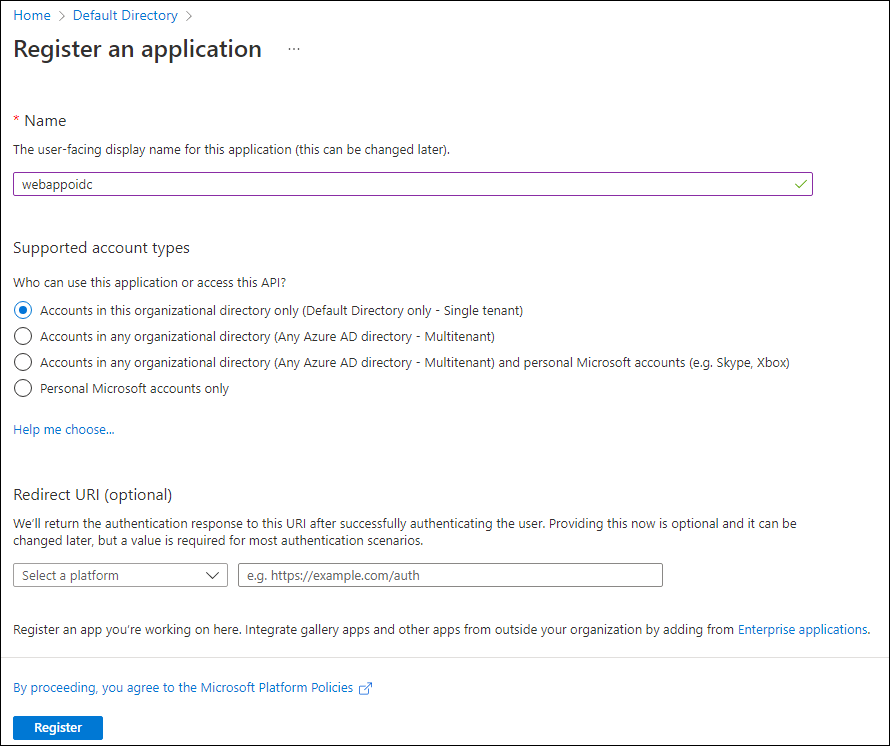

---
lab:
  az204Title: 'Lab 06: Authenticate by using OpenID Connect, MSAL, and .NET SDKs'
  az204Module: 'Learning Path 06: Implement user authentication and authorization'
---

# 實驗 06：使用 OpenID Connect、MSAL 和 .NET SDK 驗證

## Microsoft Azure 使用者介面

基於 Microsoft 雲端工具的動態性質，您可能會遇到在本訓練內容開發後變更的 Azure UI。 因此，實驗指示可能無法正確對應實驗步驟。

當社群提醒 Microsoft 需要做修改時，我們會更新此訓練課程。 然而，雲端更新經常發生，所以您可能會在此訓練內容更新前遇到 UI 的變更。 **如果發生這種情況，請適應變更，然後視需要在實驗中調整。**

## 指示

### 在您開始使用 Intune 之前

#### 登入實驗室環境

使用下列認證登入您的 Windows 10 虛擬機器 (VM)：

- 使用者名稱：`Admin`
- 密碼：`Pa55w.rd`

> **注意**：您的講師會提供連線至虛擬實驗室環境的指示。

#### 檢閱已安裝的應用程式

尋找 Windows 10 桌面上的工作列。 工作列包含此次實驗中會用到的應用程式圖示，包括：
    
-   Microsoft Edge
-   Visual Studio Code

## 實驗情境

在此實驗室中，您會在 Microsoft Entra ID 中註冊應用程式、新增使用者，然後測試使用者對應用程式的存取權，以驗證 Entra ID 是否可以保護它。 您也將使用 Graph 總管工具，針對 Entra ID 使用者帳戶的 Graph API 建置和測試要求。

## 架構圖


### 練習 1：設定單一租使用者 Entra ID 環境

#### 工作 1：開啟 Azure 入口網站

1. 在工作列上，選取 **Microsoft Edge** 圖示。

1. 在開啟的瀏覽器視窗中，瀏覽至 Azure 入口網站 (`https://portal.azure.com`)，然後使用此實驗要使用的帳戶登入。

    > **注意**：如果這是您第一次登入 Azure 入口網站，系統會提供入口網站的導覽。 選取 [開始使用] 跳過導覽，並開始使用入口網站。

#### 工作 2：在 Entra ID 目錄中註冊應用程式

1. 在 [Azure 入口網站] 中，使用 [**搜尋資源]、[服務和檔]** 文本框來搜尋 **Entra ID**，然後在結果清單中選取 **[Microsoft Entra ID**]。

    > **注意**：這會將您的瀏覽器會話重新導向至與您的 Azure 訂用帳戶相關聯的 Microsoft Entra ID 租使用者刀鋒視窗。

1. 在 [ **Microsoft Entra ID** ] 刀鋒視窗中，選取 **[管理 **] 區段中的 [應用程式註冊****]。

1. 在 [應用程式註冊] 區段中，選取 [+ 新增註冊]。

1. 在 [註冊應用程式] 區段中，執行下列動作，然後選取 [註冊]：
    
    | 設定 | 動作 |
    | -- | -- |
    | [名稱] 文字輸入框 | 輸入 **webappoidc** |
    | **支援的帳戶類型**清單 | 選取 [僅限此組織目錄中的帳戶] \(僅限預設目錄 - 單一租用戶\) |

    > **注意**：租用戶名稱可能會根據您的 Azure 訂閱而有所不同。
   
    下列螢幕擷取畫面顯示**註冊應用程式**區段中的設定。
          
     
      
    
#### 工作 3：記錄唯一識別碼

1. 在 [webappoidc] 應用程式註冊窗格上，選取 [概觀]。

1. 在 [概觀] 區段中，尋找並記錄 [應用程式 (用戶端) 識別碼] 文字輸入框的值。 您會在稍後的實驗中用到此值。

1. 在 [概觀] 區段中，尋找並記錄 [目錄 (租用戶) 識別碼] 文字輸入框的值。 您會在稍後的實驗中用到此值。

#### 工作 4：設定應用程式驗證設定

1. 在 [webappoidc] 應用程式註冊窗格上，選取 [管理] 區段中的 [驗證]。

1. 在 [驗證] 區段中，執行下列動作，然後選取 [設定]：

    | 設定 | 動作 |
    | -- | -- |
    | [平台設定] 區段 | 選取 [+ 新增平台] |
    | [設定平台] 窗格 | 選取 [Web] |
    | [重新導向 URI] 文字輸入框 | 輸入 `https://localhost:5001/` |
    | [前端通道登出 URL] 文字輸入框 | 輸入 `https://localhost:5001/signout-oidc` |
        
1. 回到 [平台設定] 區段中，選取 [新增 URI]，然後輸入 `https://localhost:5001/signin-oidc`。

1. 在 [隱含授與和混合式流程] 區段中，選取 [識別碼權杖] \(用於隱含和混合式流程\)。 

1. 選取 [儲存]。

    下列螢幕擷取畫面顯示 [驗證] 窗格上的設定。
          
     ![顯示 [驗證] 窗格上設定選項的螢幕擷取畫面。](./media/l06_aad_autentication_webapp.png)
       

#### 工作 5：建立 Azure AD 使用者

1. 在 Azure 入口網站中，選取 **Cloud Shell** 圖示 ，開啟新的 PowerShell 工作階段。 如果 Cloud Shell 預設為 Bash 工作階段，請選取 [Bash ]，然後在下拉式功能表中選取 [PowerShell]。

     > **注意**：如果這是您第一次啟動 **Cloud Shell**，當系統提示您選取 [Bash] 或 [PowerShell] 時，請選取 [PowerShell]。 系統顯示**您未裝載儲存體**訊息時，請選取此實驗中使用的訂閱，然後選取 [建立儲存體]。

1. 在 [Cloud Shell] 窗格中，執行下列命令，登入 Azure 訂閱相關的 Azure AD 租用戶：

    ```powershell
    Connect-AzureAD
    ```

1. 執行下列命令，擷取並顯示 Azure AD 租用戶的主要網域名稱系統 (DNS) 網域名稱：

    ```powershell
    $aadDomainName = ((Get-AzureAdTenantDetail).VerifiedDomains)[0].Name
    $aadDomainName
    ```

    > **注意**：記錄 DNS 網域名稱的值。 您會在稍後的實驗中用到此值。

1. 執行下列命令，建立用來測試 Azure AD 驗證的 Azure AD 使用者：

    ```powershell
    $passwordProfile = New-Object -TypeName Microsoft.Open.AzureAD.Model.PasswordProfile
    $passwordProfile.Password = 'Pa55w.rd1234'
    $passwordProfile.ForceChangePasswordNextLogin = $false
    New-AzureADUser -AccountEnabled $true -DisplayName 'aad_lab_user1' -PasswordProfile $passwordProfile -MailNickName 'aad_lab_user1' -UserPrincipalName "aad_lab_user1@$aadDomainName" 
    ```

1. 執行下列命令，識別新建立 Azure AD 使用者的使用者主體名稱 (UPN)：

    ```powershell
    (Get-AzureADUser -Filter "MailNickName eq 'aad_lab_user1'").UserPrincipalName
    ```

    > **注意**：記錄 UPN。 您會在稍後的實驗中用到此值。

1. 關閉 [Cloud Shell] 窗格。

#### 檢閱

在此練習中，您已註冊單一租用戶 Azure AD 應用程式，並建立 Azure AD 使用者帳戶。

### 練習 2：建立單一租用戶 ASP.NET Web 應用程式

#### 工作 1：建立 ASP.NET Web 應用程式專案

1. 在實驗用的電腦上，啟動**命令提示字元**。

1. 從命令提示字元中，執行下列命令，以建立目前的目錄並將其設為 **Allfiles (F):\\Allfiles\\Labs\\06\\Starter\\OIDCClient**：

    ```cmd
    F:
    cd F:\Allfiles\Labs\06\Starter\OIDCClient
    ```

1. 執行下列命令，根據 Model View Controller (MVC) 範本，建立新的 .NET Core Web 應用程式 (以您之前在此實驗中記錄的對應值取代預留位置 `<application_ID>`、`<tenant_ID>` 和 `<domain_Name>`)：

    ```cmd
    dotnet new mvc --auth SingleOrg --client-id <application_ID> --tenant-id <tenant_ID> --domain <domain_Name>
    rmdir .\obj /S /Q
    ```
    
    > **注意**：如果您在終端機中收到錯誤，則可能使用PowerShell。 在此情況下， `/S /Q` 請移除旗標並重新執行命令。

1. 執行下列命令以啟動 Visual Studio Code。 

    ```cmd
    code .
    ```
    > 若出現 **「信任此資料夾中所有檔案的作者嗎？」** 的提示，請選取 [Yes, I trust the authors] \(是，我信任這些作者\)。


1. 在 Visual Studio Code 的[Explorer] 窗格中，檢閱代表 MVC Web 應用程式的自動產生資料夾結構。

1. 瀏覽至 [屬性] 資料夾，開啟 launchSettings.json 檔案，然後套用下列變更：

    
    | 區段 | 屬性 | 值 |
    | -- | -- | -- |
    | **iisSettings** | **sslPort** | **44321** |
    | **OIDCClient**  | **applicationUrl** | `https://localhost:5001` |
    

    > **注意**：連接埠號碼必須符合建立 Azure AD 應用程式註冊時指定的值。

1. 儲存並關閉檔案。

1. 在 Visual Studio Code 的 [Explorer] 窗格中，選取 [OIDCClient.csproj]。

1. 確定 `<TargetFramework>` 元素的值已設為 **net6.0**。

1. 確定 `Microsoft.AspNetCore.Authentication.JwtBearer` 和 `Microsoft.AspNetCore.Authentication.OpenIdConnect` NuGet 套件的版本設定為 **6.0.9**。

1. 將 `Microsoft.Identity.Web` 和 `Microsoft.Identity.Web.UI` NuGet 套件的版本設為 **1.25.3**。

1. 確認 **OIDCClient.csproj** 檔案的內容與下列清單類似 (`UserSecretsId` 的值會有所不同) 並儲存變更。

    ```csharp
    <Project Sdk="Microsoft.NET.Sdk.Web">
      <PropertyGroup>
        <TargetFramework>net6.0</TargetFramework>
        <UserSecretsId>aspnet-OIDCClient-737DEB13-25D4-4C52-93C5-F485367E3C8C</UserSecretsId>
        <ImplicitUsings>enable</ImplicitUsings>
      </PropertyGroup>

      <ItemGroup>
        <PackageReference Include="Microsoft.AspNetCore.Authentication.JwtBearer" Version="6.0.9" NoWarn="NU1605" />
        <PackageReference Include="Microsoft.AspNetCore.Authentication.OpenIdConnect" Version="6.0.9" NoWarn="NU1605" />
        <PackageReference Include="Microsoft.Identity.Web" Version="1.25.3" />
        <PackageReference Include="Microsoft.Identity.Web.UI" Version="1.25.3" />
      </ItemGroup>
    </Project>
    ```

1. 關閉 OIDCClient.csproj 檔案。

1. 瀏覽至 [Views\Shared] 資料夾，然後開啟 **_LoginPartial.cshtml** 檔案。

1. 確認每個 span 元素中的 `asp-area` 屬性都參照 `MicrosoftIdentity`，如下列這一行所示：

    ```csharp
    <a class="nav-link text-dark" asp-area="MicrosoftIdentity" asp-controller="Account" asp-action="SignOut">Sign out</a>
    ```

1. 不做任何變更，將檔案關閉。

1. 開啟 appsettings.json 檔案，並檢閱 **AzureAd** 物件的內容，包括下列元素：

    | 元素 | 值 |
    | -- | -- |
    | `Instance` | `https://login.microsoftonline.com/`|
    | `Domain` | Azure 訂閱的相關聯 Azure AD 租用戶主要 DNS 網域 |
    | `TenantId` | Azure AD 租用戶 GUID |
    | `ClientId` | Azure AD 租用戶中註冊的應用程式 (用戶端) 識別碼 |
    | `CallbackPath` | `/signin-oidc` |

1. 不做任何變更，將檔案關閉。

1. 在 Visual Studio Code 的 [Explorer] **窗格中，選取 Program.cs**。

1. 確認檔案包含下列 **using** 指示詞：

    ```csharp
    using Microsoft.AspNetCore.Authentication.OpenIdConnect;
    using Microsoft.Identity.Web;
    using Microsoft.Identity.Web.UI;
    ```

1. 確認檔案包含下列幾行，其可將相關的驗證服務新增至容器：

    ```csharp
    // Add services to the container.
    builder.Services.AddAuthentication(OpenIdConnectDefaults.AuthenticationScheme)
      .AddMicrosoftIdentityWebApp(builder.Configuration.GetSection("AzureAd"));
    ```

1. 確認檔案包含下列幾行，其可新增用於帳戶管理的控制器和 Razor Pages：

    ```csharp
    builder.Services.AddRazorPages()
      .AddMicrosoftIdentityUI();
    ```

1. 儲存並關閉檔案。

### 工作 2：在單一租用戶案例中，測試單一租用戶 Web 應用程式

1. 在 [Visual Studio Code] 視窗中，從頂端功能表列移至 [終端機] 功能表，然後選取 [新增終端機]。

1. 在 [終端機] 面板中，目前工作目錄的目前路徑應該是 **F:\Allfiles\Labs\06\Starter\OIDCClient**。 執行下列命令以建置 .NET Web 應用程式：

    ```
    dotnet build
    ```

    > **注意**：如果有任何建置錯誤，請檢閱 **Allfiles (F):\\Allfiles\\Labs\\06\\Solution\\OIDCClient** 資料夾中的檔案。 忽略任何警告訊息。

1. 執行下列命令，產生自我簽署憑證，並將本機電腦設為信任該憑證：

    ```
    dotnet dev-certs https --trust
    ```

1. 如果系統提示安裝自動產生的憑證，請選取 [是]。

1. 從終端機提示字元，執行下列命令以執行 .NET Web 應用程式：

    ```
    dotnet run
    ```

1. 在 **InPrivate** 模式下，啟動 Microsoft Edge 瀏覽器，然後瀏覽至 `https://localhost:5001` URL。

1. 如果顯示**您的連線不是私人連線**訊息，請選取 [進階]，然後選取 [繼續前往 localhost] \(不安全\) 連結。

1. 在開啟的瀏覽器視窗中出現提示後，請使用您之前在此實驗建立的 **aad_lab_user1** Azure AD 帳戶 UPN 進行驗證，密碼為 **Pa55w.rd1234**。

    > **注意**：如果系統提示 [協助我們保護您的帳戶] 視窗，請選取 [暫時跳過]。

1. 瀏覽器視窗會自動開啟 [要求的權限] 網頁。

1. 檢閱要求的權限，包括**檢視您的基本設定檔**和**維護您授與存取的資料存取權**。

1. 選取 [接受]。

1. 檢閱瀏覽器顯示的目標網站**歡迎**首頁，並確認 **aad_user1** Azure AD 帳戶 UPN 顯示在瀏覽器視窗中。

1. 在**歡迎**頁面上，選取 [登出]。

1. 系統提示選取要登出的帳戶時，請選取 **aad_lab_user1** Azure AD 帳戶。 系統會自動重新導向**已登出**的頁面。

1. 關閉 Microsoft Edge 瀏覽器。

#### 檢閱 

在此練習中，您已實作單一租用戶 Web 應用程式，並在單一租用戶 Azure 環境中測試此應用程式。
