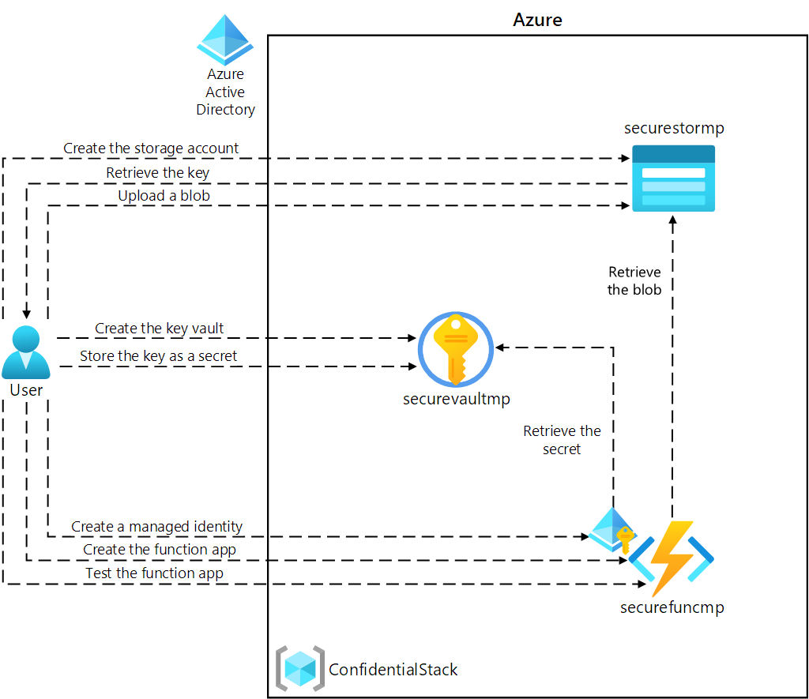

---
lab:
  az204Title: 'Lab 07: Access resource secrets more securely across services'
  az204Module: 'Learning Path 07: Implement secure Azure solutions'
---

# 實驗 07：在各服務間更安全地存取資源祕密

## Microsoft Azure 使用者介面

基於 Microsoft 雲端工具的動態性質，您可能會遇到在本訓練內容開發後變更的 Azure UI。 因此，實驗指示可能無法正確對應實驗步驟。

當社群提醒 Microsoft 需要做修改時，我們會更新此訓練課程。 然而，由於雲端經常更新，因此您可能會在此訓練內容更新前遇到 UI 的變更。 **如果發生這種情況，請適應變更，然後視需要在實驗中調整。**

## 指示

### 在您開始使用 Intune 之前

#### 登入實驗室環境

使用下列認證登入您的 Windows 11 虛擬機（VM）：

- 使用者名稱：`Admin`
- 密碼：`Pa55w.rd`

> **注意**：您的講師會提供連線至虛擬實驗室環境的指示。

#### 檢閱已安裝的應用程式

在 Windows 11 桌面上尋找任務列。 工作列包含此次實驗中會用到的應用程式圖示，包括：

- Microsoft Edge
- 檔案總管
- 終端機
- Visual Studio Code

## 實驗情境

在本實驗中，您將建立儲存體帳戶以及存取該儲存體帳戶的 Azure 函式應用程式。 為了示範連接字串資訊的安全儲存，您將佈建金鑰保存庫資源，並管理適當的秘密來儲存連接字串資訊。 您也會管理服務身分識別，進而安全地存取儲存體帳戶的連接字串資訊。

## 架構圖



### 練習 1：建立 Azure 資源

#### 工作 1：開啟 Azure 入口網站

1. 在工作列上，選取 **Microsoft Edge** 圖示。

1. 在開啟的瀏覽器視窗中，瀏覽至 Azure 入口網站 (`https://portal.azure.com`)，然後登入您在此實驗要用的帳戶。

   > **注意**：如果這是您第一次登入 Azure 入口網站，系統會提供入口網站的導覽。 選取 [開始使用] 跳過導覽，並開始使用入口網站。

#### 工作 2：建立儲存體帳戶

1. 在 Azure 入口網站中，使用 [搜尋資源、服務和文件] 文字輸入框，來搜尋 [儲存體帳戶]，然後在結果清單中選取 [儲存體帳戶]。

1. 在 [儲存體帳戶] **** 刀鋒視窗上，選取 [+ 建立]。

1. 在 [建立儲存體帳戶] 刀鋒視窗的 [基本] 索引標籤上，執行下列動作，然後選取 [檢閱]：

   | 設定                           | 動作                                                                     |
   | --------------------------------- | -------------------------------------------------------------------------- |
   | [訂閱] 下拉式清單   | 保留預設值                                                   |
   | [資源群組] 區段        | 選取 [新建]，輸入 **ConfidentialStack**，然後選取 [確定] |
   | [儲存體帳戶名稱] 文字輸入框 | 輸入 **securestor**[您的名稱]                                           |
   | [區域] 下拉式清單         | 選取 **(美國) 美國東部**                                                    |
   | [效能] 區段           | 選取 [標準] 選項                                             |
   | [備援] 下拉式清單     | 選取 [本地備援儲存體 (LRS)]                                 |

   下列螢幕擷取畫面顯示 [建立儲存體帳戶] 窗格上的設定。

   ![顯示 [建立儲存體帳戶] 窗格中設定的螢幕擷取畫面](./media/l07_create_a_storage_account.png)

1. 在 [檢閱] 索引標籤上，檢閱您在先前步驟中選取的選項。

1. 選取 [建立]，使用您指定的設定來建立儲存體帳戶。

   > **注意**：等候建立工作完成，再繼續進行實驗。

1. 在 [部署概觀] 窗格上，選取 [前往資源]。

1. 在 [儲存體帳戶] **** 刀鋒視窗的 [安全性 + 網路] **** 區段中，選取 [存取金鑰] **** 連結。

1. 在 [存取金鑰] **** 區段中，選取 [顯示金鑰]。

1. 在 [ **存取金鑰** ] 刀鋒視窗上，檢閱任一 連線 **字串**（使用 **[顯示**] 按鈕），然後在 記事本 中記錄任**一 連線 字串** 方塊的值。 金鑰**** 是平臺管理的加密金鑰，**不會**用於此實驗室。

   > **注意**：無論您選擇哪個連接字串都不會有影響。 它們是可互換的。

#### 工作 3：建立 Azure Key Vault

1. 在 Azure 入口網站中，使用 [搜尋資源、服務和文件] 文字輸入框，搜尋**金鑰保存庫**，然後在結果清單中選取 [金鑰保存庫]。

1. 在 [金鑰保存庫] 窗格上，選取 [建立]。

1. 在 [**建立金鑰保存庫**] 刀鋒視窗的 [基本]** 索引卷標上**，執行下列動作，然後選取 **[下一步**] 以移至 [**存取組態**] 索引標籤：

   | 設定                           | 動作                                   |
   | --------------------------------- | ---------------------------------------- |
   | [訂閱] 下拉式清單   | 保留預設值                 |
   | [資源群組] 下拉式清單 | 選取清單中的 **ConfidentialStack** |
   | [金鑰保存庫名稱] 文字輸入框       | 輸入 **securevault** _[您的名稱]_        |
   | [區域] 下拉式清單         | 選取 [美國東部]                       |
   | [定價層] 下拉式清單   | 選取 [標準]                      |

   下列螢幕擷取畫面顯示 [建立金鑰保存庫] 窗格上的設定。

   ![顯示 [建立金鑰保存庫] 窗格上設定的螢幕擷取畫面](./media/l07_create_key_vault.png)

1. 在 [ **存取組態** ] 索引卷標上，將許可權模型變更為 **保存庫存取原則** ，然後選取 [ **檢閱 + 建立**]。

1. 在 [檢閱 + 建立] 索引標籤上，檢閱在先前步驟中選取的選項。

1. 選取 [建立]，使用您指定的設定建立金鑰保存庫。

   > **注意**：等候建立工作完成，再繼續進行實驗。

#### 工作 4：建立函數應用程式

1. 在 Azure 入口網站中，使用 [搜尋資源、服務和文件] 文字輸入框，搜尋**函數應用程式**，然後在結果清單中選取 [函數應用程式]。

1. 在 [函數應用程式] 窗格上，選取 [建立]。

1. 在 [建立函數應用程式] 刀鋒視窗的 [基本] 索引標籤上，執行下列動作，然後選取 [下一步：儲存體]：

   | 設定                           | 動作                              |
   | --------------------------------- | ----------------------------------- |
   | [訂閱] 下拉式清單   | 保留預設值            |
   | [資源群組] 下拉式清單 | 選取 [ConfidentialStack]        |
   | [函數應用程式名稱] 文字輸入框    | 輸入 **securefunc**[您的名稱]    |
   | [發佈] 區段               | 選取 [程式碼]                     |
   | [執行階段堆疊] 下拉式清單  | 選取 **.NET**                     |
   | [版本] 下拉式清單        | 選取 **8 （LTS），隔離的背景工作模型**                        |
   | [區域] 下拉式清單         | 選取 [美國東部] 區域       |
   | [作業系統] 區段      | 選取 [Linux]                    |
   | **裝載** 下拉式清單        | 選取 [使用量 (無伺服器)] |

   下列螢幕擷取畫面顯示 [建立函數應用程式] 窗格上的設定。

   ![顯示 [建立函數應用程式] 窗格上設定的螢幕擷取畫面](./media/l07_create_function_app.png)

1. 在 [儲存體] 索引標籤上執行下列動作，然後選取 [檢閱 + 建立]：

   | 設定                            | 動作                                                |
   | ---------------------------------- | ----------------------------------------------------- |
   | [儲存體帳戶] 下拉式清單 | 選取 [securestor[您的名稱]] 儲存體帳戶 |

1. 在 [檢閱 + 建立] 索引標籤上，檢閱在先前步驟中選取的選項。

1. 選取 [建立]，使用您指定的設定來建立函數應用程式。

   > **注意**：等候建立工作完成，再繼續進行實驗。

#### 檢閱

在此練習中，您建立了要在此實驗中使用的所有資源。

### 練習 2：設定祕密和身分識別

#### 工作 1：設定系統指派的受管理服務識別

1. 在 Azure 入口網站的 [瀏覽] 窗格上，選取 [資源群組] 連結。

1. 在 [資源群組] 窗格上，選取 [ConfidentialStack] 資源群組。

1. 在 **ConfidentialStack** 窗格上，選取 [securefunc[您的名稱]] 函數應用程式。

   > **注意**：有兩個資源會具有相同的名稱，分別是函數應用程式和 Application Insights 資源。 請務必選取 [函數應用程式] 資源。

1. 在 [函數應用程式] 窗格上，從 [設定] 區段中選取 [身分識別] 選項。

1. 在 [身分識別] 窗格的 [系統指派] 索引標籤上，將 [狀態] 設為 [開啟]，然後選取 [儲存]。

1. 選取 [是] 以確認設定。

   > **注意**：等候系統指派的受控識別建立完成，再繼續進行此實驗。

#### 工作 2：建立 Key Vault 祕密

1. 在 Azure 入口網站的 [瀏覽] 窗格上，選取 [資源群組] 連結。

1. 在 [資源群組] 窗格上，選取 [ConfidentialStack] 資源群組。

1. 在 [ConfidentialStack] 窗格上，選取 [securevault[您的名稱]] 金鑰保存庫。

1. 在 [Key Vault] 刀鋒視窗上，選取 [物件] 區段中的 [祕密] 連結。

1. 在 [秘密] 窗格上，選取 [+ 產生/匯入]。

1. 在 [建立祕密] 窗格上執行下列動作，然後選取 [建立]：

   | 設定                           | 動作                                                                               |
   | --------------------------------- | ------------------------------------------------------------------------------------ |
   | [上傳選項] 下拉式清單 | 选择“手动”                                                                    |
   | [名稱] 文字輸入框                 | 輸入 **storagecredentials**                                                         |
   | **[秘密值]** 文字框         | 輸入您先前在此實驗中記錄的儲存體帳戶連接字串 |
   | [內容類型] 文字輸入框         | 保留空白                                                                          |
   | [設定啟用日] 核取方塊 | 未選取                                                                         |
   | [設定到期日] 核取方塊 | 未選取                                                                         |
   | [已啟用] 選項                | 選取 [是]                                                                       |

   下列螢幕擷取畫面顯示 [建立祕密] 窗格上的設定。

   ![顯示 [建立祕密] 窗格上設定的螢幕擷取畫面 ](./media/l07_create_a_secret.png)

   > **注意**：請先等候建立秘密完成，再繼續進行此實驗。

1. 返回 [秘密] 窗格，然後選取清單中的 **storagecredentials** 項目。

1. 在 [版本] 窗格上，選取最新版的 **storagecredentials** 秘密。

1. 在 [秘密版本] 窗格上執行下列動作：

   1. 選取 [顯示秘密值] 以尋找秘密值。

   1. 記錄 [秘密識別碼] 文字輸入框的值，因為您稍後會在實驗室中使用此值。

   > **注意**：您記錄的是 [秘密識別碼] 文字輸入框的值，而不是 [秘密值] 文字輸入框。

#### 工作 3：設定 Key Vault 存取原則

1. 在 Azure 入口網站的 [瀏覽] 窗格上，選取 [資源群組] 連結。

1. 在 [資源群組] 窗格上，選取 [ConfidentialStack] 資源群組。

1. 在 [ConfidentialStack] 窗格上，選取 [securevault[您的名稱]] 金鑰保存庫。

1. 在 [Key Vault] 刀鋒視窗上，選取 [概觀] 區段中的 [存取原則] 連結。

1. 在 [存取原則] 窗格上，選取 [+建立]。

1. 在 [ **建立存取原則** ] 刀鋒視窗的 **[Permissons** ] 區段中，進行下列選擇：

   | 設定                                      | 動作                        |
   | -------------------------------------------- | ----------------------------- |
   | [從範本設定] 下拉式清單 | 保留空白                   |
   | [金鑰權限] 核取方塊               | 0 (已選取)                    |
   | [祕密權限] 核取方塊            | 選取 **GET** 使用權限 |
   | [憑證權限] 核取方塊       | 0 (已選取)                    |

1. 選取 [ **主體]** 區段並選取下列選項：

   | 設定                   | 動作                                                                                                                                                                                                      |
   | ------------------------- | ----------------------------------------------------------------------------------------------------------------------------------------------------------------------------------------------------------- |
   | [選取主體] 連結 | 尋找並選取名為 [securefunc[您的名稱]] 的服務主體。 您先前在此實驗中建立的系統指派受控識別，其名稱會與 Azure 函式資源相同 |

1. 選取 [ **檢閱 + 建立** ]，然後選取 [ **建立**]。

   > **注意**：等候您對存取原則的變更儲存完成，再繼續進行此實驗。

#### 工作 4：建立自金鑰保存庫衍生的應用程式設定

1. 在 Azure 入口網站的 [瀏覽] 窗格上，選取 [資源群組] 連結。

1. 在 [資源群組] 窗格上，選取 [ConfidentialStack] 資源群組。

1. 在 [ConfidentialStack] 窗格上，選取 **securefunc[您的名稱]** 函數應用程式。

1. 在 [函數應用程式] 窗格上，從 [設定] 區段中選取 [設定] 選項。

1. 如果 [ **組態** ] 窗格包含 [ **應用程式設定**] 索引標籤，請按下它並執行下列作業：

   - 選取 **[+ 新增應用程式設定]**。
   - 在 [新增/編輯應用程式設定] 快顯視窗的 [名稱] 文字輸入框中，輸入 **StorageConnectionString**。
   - 在 [值] 文字輸入框中，使用下列語法來建構值：`@Microsoft.KeyVault(SecretUri=<Secret Identifier>)`，其中 `<Secret Identifier>` 預留位置代表您稍早在本練習中記錄的祕密識別碼。

   > **注意**：舉例來說，如果您的祕密識別碼是 `https://securevaultstudent.vault.azure.net/secrets/storagecredentials/17b41386df3e4191b92f089f5efb4cbf`，結果值就會是 `@Microsoft.KeyVault(SecretUri=https://securevaultstudent.vault.azure.net/secrets/storagecredentials/17b41386df3e4191b92f089f5efb4cbf)`。

   - 將 [部署位置設定] 核取方塊設為其預設值 (未選取)，然後選取 [確定] 以關閉快顯視窗並返回 [設定] 區段。
   - 選取 [儲存] 以儲存您的設定，然後在 [儲存變更] 確認快顯對話方塊中選取 [繼續]。

   > **注意**：等候應用程式設定儲存完成，再繼續進行實驗。

1. 如果 [**組態**] 窗格未包含 [應用程式設定 **] 索引卷標**，請從 **[設定**] 區段中選取 **[環境變數**]，然後執行下列作業：

   - 選取 [ **應用程式設定]** 索引標籤。
   - 在 [名稱 **] 資料行**中第一個可用的文字框中，輸入 **儲存體連線 ionString**。
   - 在右側的文字框中（在 [值 **] 數據行**中，使用下列語法輸入值建構：`@Microsoft.KeyVault(SecretUri=<Secret Identifier>)`，其中`<Secret Identifier>`佔位符代表您稍早在本練習中記錄的秘密標識碼。

   > **注意**：舉例來說，如果您的祕密識別碼是 `https://securevaultstudent.vault.azure.net/secrets/storagecredentials/17b41386df3e4191b92f089f5efb4cbf`，結果值就會是 `@Microsoft.KeyVault(SecretUri=https://securevaultstudent.vault.azure.net/secrets/storagecredentials/17b41386df3e4191b92f089f5efb4cbf)`。

   - **將 [部署位置設定**] 複選框保留為預設值（未選取），然後選取 [**套用**您輸入的值]，然後按兩下 [**確認**] 以確認作業。

   > **注意**：等候應用程式設定儲存完成，再繼續進行實驗。
   
#### 檢閱

在此練習中，您為函數應用程式建立了系統指派的受控服務識別，然後授予該身分識別適當的使用權限來取得金鑰保存庫中的秘密值。 最後，您建立了在函數應用程式組態設定中參考的秘密。

### 練習 3：組建 Azure Functions 應用程式

#### 工作 1：初始化函式專案

1. 在任務欄上，選取 **[終端機** ] 圖示。

1. 執行下列命令，將目前目錄變更為 **Allfiles (F):\\Allfiles\\Labs\\07\\Starter\\func** 空白目錄：

   ```powershell
   cd F:\Allfiles\Labs\07\Starter\func
   ```

   > **注意**：在 [Windows 檔案總管] 中，從 F:\Allfiles\Labs\07\Starter\func\.gitignore 檔案移除 [唯讀] 屬性。

1. 執行下列命令，使用 **Azure Functions Core Tools**，以在目前目錄透過 **dotnet** 執行階段建立新的本機 Functions 專案：

   ```powershell
   func init --worker-runtime dotnet-isolated --target-framework net8.0 --force
   ```

   > **注意**：您可以使用 **Azure Functions Core Tools** 檢閱文件以 [建立新專案][azure-functions-core-tools-new-project]。

1. 執行下列命令來 **建置** .NET 8 專案：

   ```powershell
   dotnet build
   ```

#### 工作 2：建立 HTTP 觸發函式

1. 執行下列命令，使用 **Azure Functions Core Tools**，透過 **HTTP trigger**範本來建立名為 **FileParser** 的新函式：

   ```powershell
   func new --template "HTTP trigger" --name "FileParser"
   ```

   > **注意**：您可以使用 **Azure Functions Core Tools** 檢閱文件以 [建立新函式][azure-functions-core-tools-new-function]。

1. 關閉目前執行的 **終端** 機應用程式。

#### 工作 3：設定並讀取應用程式設定

1. 在 [開始] 畫面上選取 [Visual Studio Code] 圖格。

1. 在 [檔案]**** 功能表上，選取 [開啟資料夾]****。

1. 在開啟的 [檔案總管] 視窗中，瀏覽至 **Allfiles (F):\\Allfiles\\Labs\\07\\Starter\\func**，然後選取 [選取資料夾]。

1. 在 [Visual Studio Code] 視窗的 [Explorer] 窗格上，開啟 **local.settings.json** 檔案。

1. 記下 **Values** 物件目前的值：

   ```json
   "Values": {
       "AzureWebJobsStorage": "UseDevelopmentStorage=true",
       "FUNCTIONS_WORKER_RUNTIME": "dotnet-isolated"
   }
   ```

1. 新增名為 **StorageConnectionString** 的新設定，然後將其指派為 **[TEST VALUE]** 的字串值，以更新 **Values** 物件的值：

   ```json
   "Values": {
       "AzureWebJobsStorage": "UseDevelopmentStorage=true",
       "FUNCTIONS_WORKER_RUNTIME": "dotnet-isolated",
       "StorageConnectionString": "[TEST VALUE]"
   }
   ```

1. **local.settings.json** 檔案現在應該包含：

   ```json
   {
     "IsEncrypted": false,
     "Values": {
       "AzureWebJobsStorage": "UseDevelopmentStorage=true",
       "FUNCTIONS_WORKER_RUNTIME": "dotnet-isolated",
       "StorageConnectionString": "[TEST VALUE]"
     }
   }
   ```

1. 選取 [儲存] 以將您的變更儲存至 **local.settings.json** 檔案。

1. 在 [Visual Studio Code] 視窗的 [Explorer] 窗格上開啟 **FileParser.cs** 檔案。

1. 在程式代碼編輯器中，以下列程式代碼取代從第 18 行開始之 **函式 FileParser** 自動產生的程式代碼內容：

    ```csharp
           [Function("FileParser")]
            public HttpResponseData Run([HttpTrigger(AuthorizationLevel.Function, "get", "post")] HttpRequestData req)
            {
                _logger.LogInformation("C# HTTP trigger function processed a request.");

                var response = req.CreateResponse(HttpStatusCode.OK);
                response.Headers.Add("Content-Type", "text/plain; charset=utf-8");

                string connectionString = Environment.GetEnvironmentVariable("StorageConnectionString");
                response.WriteString(connectionString);

                return response;
            }
    ``` 

1. 忽略 Null 值的相關警告。 

1. 檢閱產生的程式代碼，其應該包含下列內容（此程式代碼會傳回 儲存體連線 ionString 環境變數的值）：

   ```csharp
   using System.Net;
   using Microsoft.Azure.Functions.Worker;
   using Microsoft.Azure.Functions.Worker.Http;
   using Microsoft.Extensions.Logging;

   namespace func
   {
       public class FileParser
       {
           private readonly ILogger _logger;

           public FileParser(ILoggerFactory loggerFactory)
           {
               _logger = loggerFactory.CreateLogger<FileParser>();
           }

           [Function("FileParser")]
           public HttpResponseData Run([HttpTrigger(AuthorizationLevel.Function, "get", "post")] HttpRequestData req)
           {
               _logger.LogInformation("C# HTTP trigger function processed a request.");

               var response = req.CreateResponse(HttpStatusCode.OK);
               response.Headers.Add("Content-Type", "text/plain; charset=utf-8");

               string connectionString = Environment.GetEnvironmentVariable("StorageConnectionString");
               response.WriteString(connectionString);

               return response;
           }
       }
   }
   ```

1. 選取 [儲存] 將您的變更儲存至 **FileParser.cs** 檔案。

#### 工作 4：驗證本機函式

1. 在任務欄上，選取 **[終端機** ] 圖示。

1. 執行下列命令，將目前目錄變更為 **Allfiles (F):\\Allfiles\\Labs\\07\\Starter\\func** 空白目錄：

   ```powershell
   cd F:\Allfiles\Labs\07\Starter\func
   ```

1. 執行下列命令以執行函數應用程式專案：

   ```powershell
   func start --build
   ```

   > **注意**：您可以使用 **Azure Functions Core Tools** 檢閱文件以 [在本機啟動函數應用程式專案][azure-functions-core-tools-start-function]。

1. 在實驗用的電腦上，啟動**命令提示字元**。

1. 執行下列命令以針對 `http://localhost:7071/api/FileParser`執行 GET** REST API 呼叫測試**：

   ```powershell
   curl -X GET -i http://localhost:7071/api/FileParser
   ```

1. 觀察以 HTTP 要求的形式回傳的 **StorageConnectionString** [TEST VALUE] 值：

   ```powershell
   HTTP/1.1 200 OK
   Content-Type: text/plain; charset=utf-8
   Date: Tue, 01 Sep 2020 23:35:39 GMT
   Server: Kestrel
   Transfer-Encoding: chunked

   [TEST VALUE]
   ```

1. 關閉終端機應用程式目前執行的所有實例****，以及**命令提示字元**應用程式。

#### 工作 5：使用 Azure Functions Core Tools 部署函式

1. 在任務欄上，選取 **[終端機** ] 圖示。

1. 執行下列命令，將目前目錄變更為 **Allfiles (F):\\Allfiles\\Labs\\07\\Starter\\func** 空白目錄：

   ```powershell
   cd F:\Allfiles\Labs\07\Starter\func
   ```

1. 執行下列命令以登入 Azure 命令列介面 (CLI)：

   ```powershell
   az login
   ```

1. 在 **Microsoft Edge** 瀏覽器視窗中，輸入您用來存取 Azure 訂用帳戶的帳戶認證，然後選取 [ **登入**]。

1. 返回目前開啟 **的終端** 機視窗。 等候登入流程完成。

1. 執行下列命令以發佈函數應用程式專案 (將 `<function-app-name>` 預留位置取代為您稍早在本實驗中建立的函數應用程式名稱)：

   ```powershell
   func azure functionapp publish <function-app-name> --dotnet-version 8.0
   ```

   > **注意**：舉例來說，如果您的**函數應用程式名稱**是 **securefuncstudent**，您的命令會是 `func azure functionapp publish securefuncstudent --force`。 您可以使用 **Azure Functions Core Tools** 檢閱文件以 [發佈本機函數應用程式專案][azure-functions-core-tools-publish-azure]。

1. 等候部署完成，再繼續進行實驗。

1. 關閉目前執行的 **終端** 機應用程式。

#### 工作 6：測試自金鑰保存庫衍生的應用程式設定

1. 在工作列上選取 **Microsoft Edge** 圖示，然後選取包含 Azure 入口網站的索引標籤。

1. 在 Azure 入口網站的 [瀏覽] 窗格上，選取 [資源群組] 連結。

1. 在 [資源群組] 窗格上，選取 [ConfidentialStack] 資源群組。

1. 在 [ConfidentialStack] 窗格上，選取 **securefunc[您的名稱]** 函數應用程式。

1. 在 [ **函式應用程式]** 刀鋒視窗上，選取 [ **概觀]** 選項。

1. 在 [概觀] 頁面底部的 [ **函** 式] 索引標籤上，選取現有的 **FileParser** 函式。

1. 在 [函式] 窗格上，選取 [開發人員] 區段中的 [程式碼 + 測試] 選項。

1. 在函式編輯器中選取 [測試/執行]。

1. 在自動顯示的窗格中，選取 [HTTP 方法] 清單的 **GET**。

1. 選取 [執行] 以測試函數。

1. 檢閱測試回合的結果。 結果應該是您的 Azure 儲存體連接字串。

#### 檢閱

在此練習中，您使用了服務識別來讀取儲存在 Key Vault 中的秘密值，並將該值作為函數應用程式的結果傳回。

### 練習 4：存取 Azure Blob 儲存體資料

#### 工作 1：上傳範例 Blob 儲存體

1. 在 Azure 入口網站的 [瀏覽] 窗格上，選取 [資源群組] 連結。

1. 在 [資源群組] 窗格上，選取 [ConfidentialStack] 資源群組。

1. 在 [ConfidentialStack] 窗格上選取 [securefunc[您的名稱]] 儲存體帳戶。

1. 在 [儲存體帳戶] 窗格的 [資料儲存體] 區段中，選取 [容器] 連結。

1. 在 [容器] 區段中選取 [+ 容器]。

1. 在 [新增容器] 快顯視窗中執行下列動作，然後選取 [建立]：

   | 設定                                | 動作                                   |
   | -------------------------------------- | ---------------------------------------- |
   | [名稱] 文字輸入框                      | 輸入 **drop**                           |

1. 返回 [ **容器]** 區段，然後流覽至新建立 **的卸** 除容器。

1. 在 [容器] 窗格上，選取 [上傳]。

1. 在 [上傳 blob] 視窗中，執行下列動作，然後選取 [上傳]：

   | 設定                                        | 動作                                                                                                               |
   | ---------------------------------------------- | -------------------------------------------------------------------------------------------------------------------- |
   | [檔案] 區段                              | 選取 [瀏覽檔案] 或使用拖放功能                                                         |
   | [檔案總管] 視窗                       | 瀏覽至 **Allfiles (F):\\Allfiles\\Labs\\07\\Starter**，選取 **records.json** 檔案，然後選取 [開啟] |
   | [如果檔案已存在即覆寫檔案] 核取方塊 | 請務必選取此核取方塊                                                                               |

   > **注意**：等候 blob 上傳後，再繼續實驗。

1. 返回 [容器] 窗格，然後在 Blob 清單中選取 **records.json** Blob。

1. 在 [Blob] 窗格上尋找 Blob 中繼資料，然後複製 Blob 的 URL。

1. 在工作列上，啟動 **Microsoft Edge** 圖示的捷徑功能表，然後選取 [新增視窗]。

1. 在新的瀏覽器視窗中，參考您為 Blob 複製的 URL。

1. 現在應該會顯示找不到資源的錯誤訊息。

   > **注意**：這預期為未啟用 Blob 的匿名存取。

#### 工作 2：提取並設定 Azure SDK for .NET

1. 在任務欄上，選取 **[終端機** ] 圖示。

1. 執行下列命令，將目前目錄變更為 **Allfiles (F):\\Allfiles\\Labs\\07\\Starter\\func** 空白目錄：

   ```powershell
   cd F:\Allfiles\Labs\07\Starter\func
   ```

1. 執行下列命令以新增 Azure.儲存體 12.18.0** **版**。來自 NuGet 的 Blob 套件**：

   ```powershell
   dotnet add package Azure.Storage.Blobs --version 12.18.0
   ```

   > **注意**：[Azure.Storage.Blobs](https://www.nuget.org/packages/Azure.Storage.Blobs) NuGet 套件參考了撰寫 Azure Blob 儲存體程式碼所需的 Azure SDK for .NET 子集。

1. 關閉目前執行的 **終端** 機應用程式。

1. 在 [開始] 畫面上選取 [Visual Studio Code] 圖格。

1. 在 [檔案]**** 功能表上，選取 [開啟資料夾]****。

1. 在開啟的 [檔案總管] 視窗中，瀏覽至 **Allfiles (F):\\Allfiles\\Labs\\07\\Starter\\func**，然後選取 [選取資料夾]。

1. 在 [Visual Studio Code] 視窗的 [Explorer] 窗格上開啟 **FileParser.cs** 檔案。

1. 為 Azure.儲存體 新增 **using 指示詞****。** Blob 和 **Azure.儲存體。Blobs.Models** 命名空間：

   ```csharp
   using Azure.Storage.Blobs;
   using Azure.Storage.Blobs.Models;
   ```

1. 以下列程式代碼取代從第 19 行開始的目前 **FileParser** 方法內容：

    ```csharp
            [Function("FileParser")]
            public HttpResponseData Run([HttpTrigger(AuthorizationLevel.Function, "get", "post")] HttpRequestData req)
            {
                _logger.LogInformation("C# HTTP trigger function processed a request.");

                var response = req.CreateResponse(HttpStatusCode.OK);

                string connectionString = Environment.GetEnvironmentVariable("StorageConnectionString");

                /* Create a new instance of the BlobClient class by passing in your
                   connectionString variable, a  "drop" string value, and a
                   "records.json" string value to the constructor */
                BlobClient blob = new BlobClient(connectionString, "drop", "records.json");

                // Download the content of the referenced blob 
                BlobDownloadResult downloadResult = blob.DownloadContent();

                 // Retrieve the value of the downloaded blob and convert it to string
                response.WriteString(downloadResult.Content.ToString());
            
                //return the response
                return response;
            }
    ``` 

1. 忽略有關 Null 值的警告。

1. 檢閱產生的程式代碼，其應該包含下列內容（此程式代碼會傳回從 儲存體連線 ionString 環境變數所指定的記憶體帳戶下載的 Blob 內容）：

   ```csharp
   namespace func
   {
       public class FileParser
       {
           private readonly ILogger _logger;

           public FileParser(ILoggerFactory loggerFactory)
           {
               _logger = loggerFactory.CreateLogger<FileParser>();
           }

           [Function("FileParser")]
           public HttpResponseData Run([HttpTrigger(AuthorizationLevel.Function, "get", "post")] HttpRequestData req)
           {
               _logger.LogInformation("C# HTTP trigger function processed a request.");

               var response = req.CreateResponse(HttpStatusCode.OK);

               string connectionString = Environment.GetEnvironmentVariable("StorageConnectionString");

               /* Create a new instance of the BlobClient class by passing in your
                  connectionString variable, a  "drop" string value, and a
                  "records.json" string value to the constructor */
               BlobClient blob = new BlobClient(connectionString, "drop", "records.json");

               // Download the content of the referenced blob 
               BlobDownloadResult downloadResult = blob.DownloadContent();

                // Retrieve the value of the downloaded blob and convert it to string
               response.WriteString(downloadResult.Content.ToString());
            
               //return the response
               return response;
           }
       }
   }
   ```

1. 選取 [儲存] 將您的變更儲存至 **FileParser.cs** 檔案。

#### 工作 3：部署和驗證 Azure Functions 應用程式

1. 在任務欄上，選取 **[終端機** ] 圖示。

1. 執行下列命令，將目前目錄變更為 **Allfiles (F):\\Allfiles\\Labs\\07\\Starter\\func** 空白目錄：

   ```powershell
   cd F:\Allfiles\Labs\07\Starter\func
   ```

1. 執行下列命令以登入 Azure CLI：

   ```powershell
   az login
   ```

1. 在 **Microsoft Edge** 瀏覽器視窗中，輸入 Microsoft 帳戶的電子郵件地址和密碼，然後選取 [登入]。

1. 返回目前開啟 **的終端** 機視窗。 等候登入流程完成。

1. 再次執行下列命令以發佈函數應用程式專案 (將 `<function-app-name>` 預留位置取代為您稍早在本實驗中使用的函數應用程式名稱)：

   ```powershell
   func azure functionapp publish <function-app-name> --dotnet-version 8.0
   ```

   > **注意**：舉例來說，如果您的**函數應用程式名稱**是 **securefuncstudent**，您的命令會是 `func azure functionapp publish securefuncstudent`。 您可以使用 **Azure Functions Core Tools** 檢閱文件以 [發佈本機函數應用程式專案][azure-functions-core-tools-publish-azure]。

1. 等候部署完成，再繼續進行實驗。

1. 關閉目前執行的 **終端** 機應用程式。

1. 在工作列上選取 **Microsoft Edge** 圖示，然後參考 Azure 入口網站。

1. 在 Azure 入口網站的 [瀏覽] 窗格上，選取 [資源群組] 連結。

1. 在 [資源群組] 窗格上，選取 [ConfidentialStack] 資源群組。

1. 在 [ConfidentialStack] 窗格上，選取 **securefunc[您的名稱]** 函數應用程式。

1. 在 [ **函式應用程式]** 刀鋒視窗上，選取 [ **概觀]** 選項。

1. 在 [概觀] 頁面的 [ **函式** ] 索引標籤上，選取現有的 **FileParser** 函式。

1. 在 [函式] 窗格上，選取 [開發人員] 區段中的 [程式碼 + 測試] 選項。

1. 在函式編輯器中選取 [測試/執行]。

1. 在自動顯示的窗格中，選取 [HTTP 方法] 清單的 **GET**。

1. 選取 [執行] 以測試函數。

1. 檢閱測試回合的結果。 輸出會包含儲存在 Azure 儲存體帳戶中的 **$/drop/records.json** Blob 內容。

#### 檢閱

在此練習中，您使用了 C\# 程式碼來存取儲存體帳戶，然後下載了 Blob 的內容。
