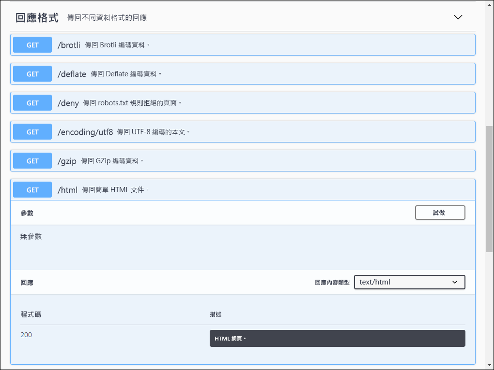
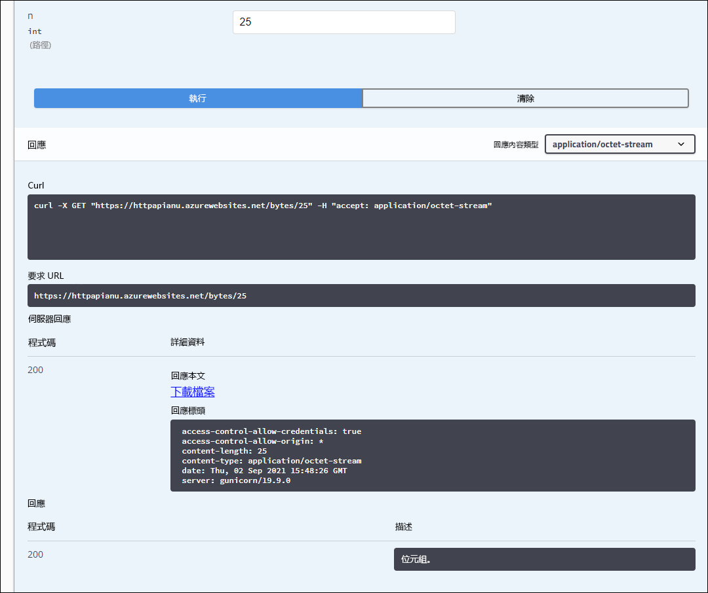
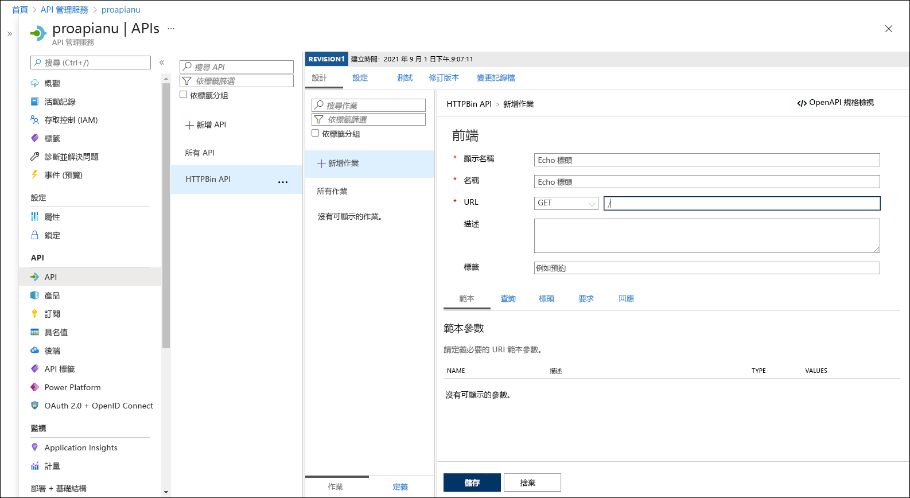
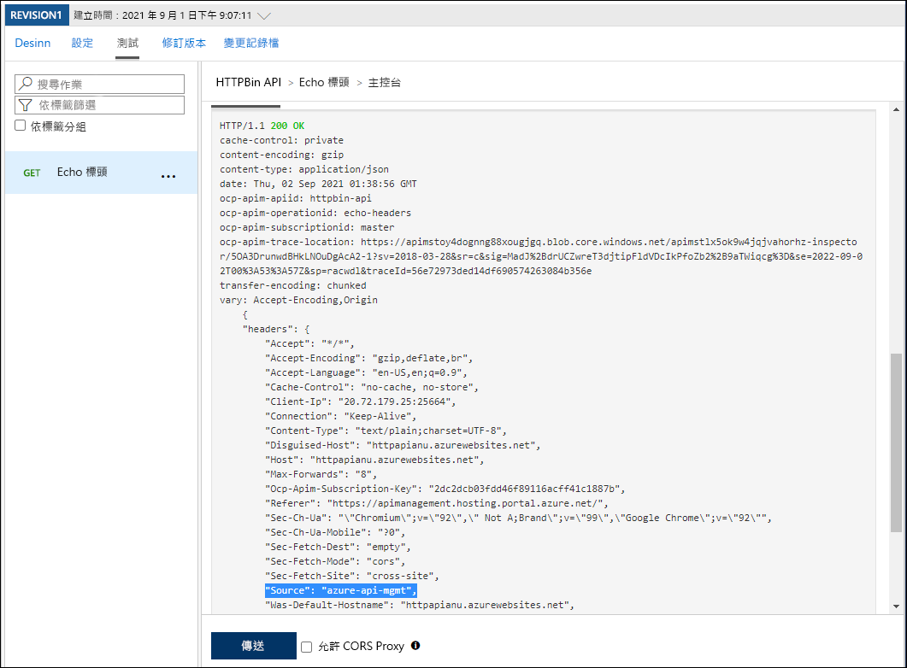
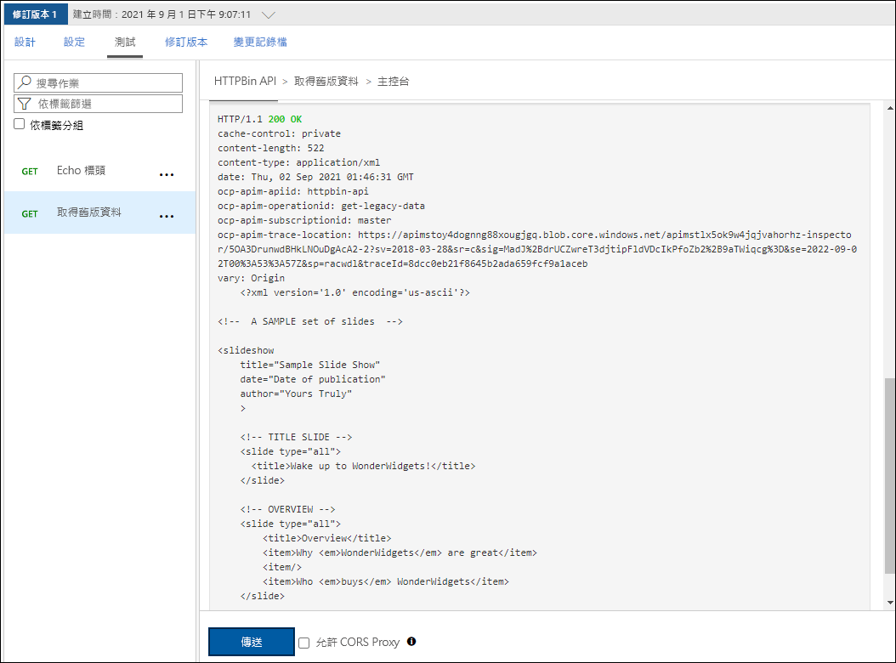

---
lab:
  az204Title: 'Lab 08: Create a multi-tier solution by using Azure services'
  az204Module: 'Learning Path 08: Implement API Management'
---

# 實驗 08：使用 Azure 服務建立多層解決方案

## Microsoft Azure 使用者介面

基於 Microsoft 雲端工具的動態性質，您可能會遇到在本訓練內容開發後變更的 Azure UI。 因此，實驗指示可能無法正確對應實驗步驟。

當社群提醒 Microsoft 需要做修改時，我們會更新此訓練課程。 然而，雲端更新經常發生，所以您可能會在此訓練內容更新前遇到 UI 的變更。 **如果發生這種情況，請適應變更，然後視需要在實驗中調整。**

## 指示

### 在您開始使用 Intune 之前

#### 登入實驗室環境

使用下列認證登入您的 Windows 11 虛擬機器 (VM)：

- 使用者名稱：`Admin`
- 密碼：`Pa55w.rd`

> **注意**：您的講師會提供連線至虛擬實驗室環境的指示。

#### 檢閱已安裝的應用程式

尋找 Windows 11 桌面上的工作列。 工作列包含此次實驗中會用到的應用程式圖示：
    
-   Microsoft Edge

## 實驗情境

在此概念證明中，您將建立容器化應用程式，以在 Azure 上裝載 Web 應用程式，作為 API 的資訊來源。 接著，您將使用 Azure API 管理功能來建置 API Proxy，以公開及測試 API。 開發人員可以查詢 API 來測試服務並驗證其適用性。

## 架構圖


### 練習 1：使用 Docker 容器映像建立 Azure App Service 資源

#### 工作 1：開啟 Azure 入口網站

1. 在工作列上，選取 **Microsoft Edge** 圖示。

1. 在開啟的瀏覽器視窗中，瀏覽至 Azure 入口網站 (`https://portal.azure.com`)，然後登入您在此實驗要用的帳戶。

    > **注意**：如果這是您第一次登入 Azure 入口網站，系統會提供入口網站的導覽。 選取 [開始使用] 跳過導覽，並開始使用入口網站。

#### 工作 2：使用 Azure App Service 資源，透過 httpbin 容器映像建立 Web 應用程式

1. 在 Azure 入口網站中，使用 [搜尋資源、服務和文件] 文字輸入框，搜尋 **App Services**，然後在結果清單中選取 [App Services]。

1. 在 [App Services] 窗格上，選取 [+ 建立]。

1. 在 [建立 Web 應用程式] 窗格的 [基本] 索引標籤上，執行下列動作：
    
    | 設定 | 動作 |
    | -- | -- |
    | [訂閱] 下拉式清單 | 保留預設值 |
    | [資源群組] 區段 | 選取 [新建]，輸入 **ApiService**，然後選取 [確定] |
    | [名稱] 文字輸入框 | 輸入 **httpapi** [您的名稱] |
    | [發佈] 區段 | 選取 [容器]**** |
    | [作業系統] 區段 | 選取 [Linux] |
    | [區域] 下拉式清單 | 選取與資源群組位置相同的 Azure 區域 |
    | [Linux 方案] 區段 | 選取 [新建]，在 [名稱] 文字輸入框中輸入值 **ApiPlan**，然後選取 [確定] |
    | [定價方案] 區段 | 選取 [探索定價方案]****，在 [選取 App Service 定價方案]**** 頁面上，選取 [基本 B1]****，然後選取 [選取]**** |

1. 選取 **[下一步：資料庫>**。
   
1. 選取 **[下一步：容器>**。

1. 在 [Docker] 索引標籤上執行下列動作，然後選取 [檢閱 + 建立]：

    | 設定 | 動作 |
    | -- | -- |
    | [映像來源] 下拉式清單 | 選取 [Docker Hub 或其他登錄]**** |
    | [選項] 下拉式清單 | 選取 [單一容器] |
    | [存取類型] 下拉式清單 | 選取 [公用] |
    | [映像和標籤] 文字輸入框 | 輸入 **kennethreitz/httpbin:latest** |

1. 在 [檢閱 + 建立] 索引標籤上，檢閱在先前步驟中選取的選項。

1. 選取 [建立]，使用您指定的設定建立 Web 應用程式。

    > **注意**：等候建立工作完成，再繼續進行實驗。

#### 工作 3：測試 httpbin Web 應用程式

1. 在 Azure 入口網站中，使用 [搜尋資源、服務和文件] 文字輸入框，搜尋 **App Services**，然後在結果清單中選取 [App Services]。

1. 在 [App Services] 窗格上，選取新建立的 Web 應用程式。

1. 在顯示新建立應用程式屬性的窗格上，選取 [瀏覽]。

1. 在 Web 應用程式中執行下列動作：

    a.  選取 [回應格式]。

    b.  選取 [GET /html]。

    c.  選取 [試試看]。

    下列螢幕擷取畫面顯示 Web 應用程式的 [試用] 區段。

    

    d.  選取 [執行]。

    e.  檢閱 [回應本文] 和 [回應標頭] 文字輸入框的值。

    f.  檢閱 [要求 URL] 文字輸入框的值。

1. 在 Web 應用程式中執行下列動作：

    a.  選取 [動態資料]。

    b.  選取 [GET /bytes/{n}]。

    c.  選取 [試試看]。

    d.  在 [n] 文字輸入框中輸入 **25**。

    e.  選取 [執行]  。

    f.  檢閱 [回應本文] 和 [回應標頭] 文字輸入框的值。

    g.  選取 [下載檔案]，檔案下載完成後，在記事本中開啟該檔案並檢閱其內容，然後予以關閉。

    > **注意**：該檔案包含隨機產生的位元組序列。

    下列螢幕擷取畫面顯示 Web 應用程式的 [動態資料] 區段。
  
    

1. 在 Web 應用程式中執行下列動作：

    a.  選取 [狀態碼]。

    b.  選取 [GET /status/{codes}]。

    c.  選取 [試試看]。

    d.  在 [代碼] 文字輸入框中，輸入 **404**。

    e.  選取 [執行]  。

    f.  檢閱**伺服器回應**並注意其是否有包含**錯誤：找不到** 項目。
     
1. 關閉顯示 Web 應用程式的瀏覽器視窗。

1. 切換回顯示 [httpapi[您的名稱]] Web 應用程式的瀏覽器視窗。

1. 在 [App Service 概觀] 刀鋒視窗的 [基本資訊] 中，記錄 [預設網域] 連結的值。 您稍後會在實驗室中使用此值，將要求傳送至對應的 API。

#### 檢閱

在本練習中，您使用了來源為 Docker Hub 的容器映像，建立新的 Azure Web 應用程式。

### 練習 2：使用 Azure APIM 組建 API Proxy 層

#### 工作 1：建立 APIM 資源

1. 在 Azure 入口網站中，使用 [搜尋資源、服務和文件] 文字輸入框，搜尋 **APIM 服務**，然後在結果清單中選取 [APIM 服務]。

1. 在 [APIM 服務] 窗格上，選取 [+ 建立]。

1. 在 [**建立 API 管理 服務**] 刀鋒視窗中，執行下列動作，然後選取 [**檢閱 + 建立**]：

    
    | 設定 | 動作 |
    | -- | -- |
    | [訂閱] 下拉式清單 | 保留預設值。 |
    | [資源群組] 區段 | 選取您稍早在實驗室中建立的 **ApiService** 群組 |
    | [區域] 清單 | 選取您在先前練習中選擇的相同區域 |
    | [資源名稱] 文字輸入框 | 輸入 **proapi** *[您的名稱]* |
    | [組織名稱]**** 文字輸入框 | 輸入 **Contoso** |
    | [管理員電子郵件] 文字輸入框 | 輸入 `admin@contoso.com` |
    | [定價層] 下拉式清單 | **消耗(99.95% SLA)** |

    下列螢幕擷取畫面顯示 Web 應用程式 [建立 APIM] 窗格的設定。
    
    ![建立 [APIM] 窗格](./media/l08_create_api_management.png)

1. 在 [檢閱 + 建立] 索引標籤上，檢閱您在上一個步驟中指定的選項，然後選取 [建立]。

    > **注意**：等候建立工作完成，再繼續進行實驗。

1. 在 [部署概觀] 窗格上，選取 [前往資源]。

#### 工作 2：定義新的 API

1. 在 [APIM 服務] 窗格上的 [API] 區段中，選取 [API]。

1. 在 [定義新的 API] 區段中，選取 [HTTP]。

1. 在 [建立 HTTP API] 視窗中，執行下列動作並選取 [建立]：
    
    | 設定 | 動作 |
    | -- | -- |
    | [顯示名稱] 文字輸入框 | 輸入 **HTTPBin API** |
    | [名稱] 文字輸入框 | 輸入 **httpbin-api** |
    | [Web 服務 URL] 文字輸入框 | 輸入您稍早在此實驗室中複製的 Web 應用程式 URL。 **注意**：請確定 URL 以 https:// 首碼開頭 |
    | [API URL 尾碼] 文字輸入框 | 將其留白 |
 
    下列螢幕擷取畫面顯示 Web 應用程式 [建立空白 API] 視窗的設定。

    

    > **注意**：等候新的 API 建立完成。

1. 在 [設計] 索引標籤上，選取 [+ 新增作業]。

1. 在 [新增作業] 區段中，執行下列動作並選取 [儲存]：


    | 設定 | 動作 |
    | -- | -- |
    | [顯示名稱] 文字輸入框 | 輸入**回應標頭** |
    | [名稱] 文字輸入框 | 確認其值已設為 **echo-headers** |
    | [URL] 清單 | 選取 [GET] |
    | [URL] 文字輸入框 | 輸入 **/** |

    下列螢幕擷取畫面顯示 [新增作業] 區段的設定。
    
    

    
1. 回到 [設計] 索引標籤，在作業清單中選取 [回應標頭]。

1. 在 [設計] 區段中的 [輸入處理] 圖格上，選取 [+ 新增原則]。

1. 在 [新增輸入原則] 區段中，選取 [設定標頭] 圖格。

1. 在 [設定標頭] 區段中，執行下列動作並選取 [儲存]：
    
    | 設定 | 動作 |
    | -- | -- |
    | [名稱] 文字輸入框    | 輸入**來源** |
    | [值] 文字輸入框 | 選取 [清單]，選取 [新增值]，然後輸入 **azure-api-mgmt** |
    | [動作] 清單 | 選取 [附加] |

    下列螢幕擷取畫面顯示 [設計] 區段的設定。

    ![[回應標頭] 設計窗格](./media/l08_get_echo_headers_design.png)

1. 回到 [設計] 索引標籤，在作業清單中選取 [回應標頭]。

1. 在 [回應標頭] [設計] 區段中的 [後端] 圖格上，選取鉛筆圖示。

1. 在 [後端] 區段中，執行下列動作並選取 [儲存]：

    | 設定 | 動作 |
    | -- | -- |
    | [服務 URL] 區段 | 選取 [覆寫] 核取方塊 |
    | [服務 URL] 文字輸入框 | 將值 **/headers** 附加至其目前的值。 **注意**：例如，如果目前的值為 `https://httpapi[yourname].azurewebsites.net`，則新值將會是 `https://httpapi[yourname].azurewebsites.net/headers` |
    
1. 回到 [設計] 索引標籤上，在作業清單中選取 [回應標頭]，然後再選取 [測試] 索引標籤。

1. 在 [回應標頭] 區段中，選取 [傳送]。

    下列螢幕擷取畫面顯示 [回應標頭] 區段的設定。

    ![[測試回應標頭] 索引標籤](./media/l08_test_echo_headers.png)
    
1. 檢閱 API 要求的結果。

    > **注意**：確認回應中是否有許多作為要求一部分傳送的標頭回應。 其應該包含作為您這次工作所建立一部分的新 [來源] 標頭。
     
    下列螢幕擷取畫面顯示對**回應標頭**要求的回應。

    
     
1. 選取 [設計] 索引標籤以返回作業清單。

#### 工作 3：操作 API 回應

1. 在 [設計] 索引標籤上，選取 [+ 新增作業]。

1. 在 [新增作業] 區段中，執行下列動作並選取 [儲存]：

    | 設定 | 動作 |
    | -- | -- |
    | [顯示名稱] 文字輸入框 | 輸入**取得舊版資料** |
    | [名稱] 文字輸入框 | 確認其值已設為 **get-legacy-data** |
    | [URL] 清單 | 確認其值已設為 **GET** |
    | [URL] 文字輸入框 | 輸入 **/xml** |

1. 回到 [設計] 索引標籤，在作業清單中選取 [取得舊版資料]。

1. 選取 [測試] 索引標籤，然後選取 [傳送]。

1. 檢閱 API 要求的結果。

    > **注意**：此時結果應為 XML 格式。

    下列螢幕擷取畫面顯示 API 要求的結果。
    
    

    
1. 選取 [設計] 索引標籤，然後選取 [取得舊版資料]。

1. 在 [設計] 窗格的 [輸出處理] 區段中，選取 [新增原則]。
    
    下列螢幕擷取畫面顯示 [輸出處理] 區段。
    
    ![取得舊版資料作業的 [輸出處理] 區段](./media/l08_get_legacy_data_outbound_processing.png)
    
1. 在 [新增輸出原則] 區段中，選取 [其他原則] 圖格。

1. 在原則程式碼編輯器中，尋找下列 XML 內容區塊：

    ```
    <outbound>
        <base />
    </outbound>
    ```

1. 以下列 XML 取代該 XML 區塊：

    ```
    <outbound>
        <base />
        <xml-to-json kind="direct" apply="always" consider-accept-header="false" />
    </outbound>
    ```

1. 在原則程式碼編輯器中，選取 [儲存]。

1. 回到 [設計] 索引標籤，在作業清單中選取 [取得舊版資料]，然後選取 [測試]。

1. 在 [取得舊版資料] 區段中，選取 [傳送]。

1. 檢閱 API 要求的結果。

    > **注意**：新結果會以 JavaScript 物件標記法 (JSON) 格式顯示。

1. 在 [HTTP 回應] 區段中，執行下列動作：

    1. 選取 [追蹤]。

    1. 如果出現提示，請選取 [啟用追蹤一小時]****。

    1. 選取 [追蹤]**** 索引標，檢閱 [後端]**** 及 [輸出]**** 文字輸入框中的內容，然後注意其中是否在時間資訊中包含對應的 API 作業詳細資料。

#### 工作 4：操作 API 要求

1. 在 [設計] 索引標籤上，選取 [+ 新增作業]。

1. 在 [新增作業] 區段中，執行下列動作並選取 [儲存]：

    | 設定  | 動作 |
    | -- | -- |
    | [顯示名稱] 文字輸入框 | 輸入**修改狀態代碼** |
    | [名稱] 文字輸入框 | 確認其值已設為 **modify-status-code** |
    | [URL] 清單 | 選取 [GET] |
    | [URL] 文字輸入框 | 輸入 **/status/404** |

1. 回到 [設計] 索引標籤，在作業清單中選取 [修改狀態代碼]。

1. 在 [設計] 區段中的 [輸入處理] 圖格上，選取 [+ 新增原則]。

1. 在 [新增輸入原則] 區段中，選取 [重寫 URL] 圖格。

1. 在 [重寫 URL] 區段中，執行下列動作：
       
    a.  在 [後端] 文字輸入框中，輸入 **/status/200**。
    
    b.  選取 [儲存]。

1. 回到 [設計] 索引標籤上，在作業清單中選取 [修改狀態代碼]，然後再選取 [測試] 索引標籤。
    
1. 在 [修改狀態代碼] 區段中，選取 [傳送]。

1. 檢閱 API 要求的結果。

    > **注意**：確認要求已傳回 **HTTP/1.1 200 OK** 回應。
   
#### 檢閱

在此練習中，您在 App Service 資源及任何想要針對其 API 進行查詢的開發人員之間建立了 Proxy 層。
