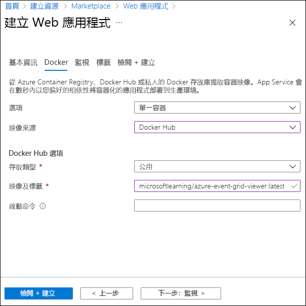

---
lab:
  az204Title: 'Lab 09: Publish and subscribe to Event Grid events'
  az204Module: 'Module 09: Develop event-based solutions'
---

# <a name="lab-09-publish-and-subscribe-to-event-grid-events"></a>實驗 09：發佈並訂閱事件方格事件

## <a name="microsoft-azure-user-interface"></a>Microsoft Azure 使用者介面

基於 Microsoft 雲端工具的動態性質，您可能會遇到在本訓練內容開發後變更的 Azure UI。 因此，實驗指示可能無法正確對應實驗步驟。

當社群提醒 Microsoft 需要做修改時，我們會更新此訓練課程。 然而，雲端更新經常發生，所以您可能會在此訓練內容更新前遇到 UI 的變更。 **如果發生這種情況，請適應變更，然後視需要在實驗中調整。**

## <a name="instructions"></a>指示

### <a name="before-you-start"></a>在您開始使用 Intune 之前

#### <a name="sign-in-to-the-lab-environment"></a>登入實驗室環境

使用下列認證登入 Windows 10 虛擬機器 (VM)：

- 使用者名稱：**系統管理員**

- 密碼：**Pa55w.rd**

> **注意**：您的講師會提供連線至虛擬實驗室環境的指示。

#### <a name="review-the-installed-applications"></a>檢閱已安裝的應用程式

尋找 Windows 10 桌面上的工作列。 工作列包含此次實驗中會用到的應用程式圖示，包括：

- Microsoft Edge

- Microsoft Visual Studio Code

## <a name="architecture-diagram"></a>架構圖


### <a name="exercise-1-create-azure-resources"></a>練習 1：建立 Azure 資源

#### <a name="task-1-open-the-azure-portal"></a>工作 1：開啟 Azure 入口網站

1. 在工作列上，選取 **Microsoft Edge** 圖示。

1. 在開啟的瀏覽器視窗中，瀏覽至 Azure 入口網站 (<https://portal.azure.com>)，然後登入您在此實驗要用的帳戶。

    > **注意**：如果這是您第一次登入 Azure 入口網站，系統會提供入口網站的導覽。 選取 [開始使用] 跳過導覽，並開始使用入口網站。

#### <a name="task-2-open-azure-cloud-shell"></a>工作 2：開啟 Azure Cloud Shell

1. 在 Azure 入口網站中，選取 **Cloud Shell** 圖示  ，開啟新的 Bash 工作階段。 如果 Cloud Shell 預設為 PowerShell 工作階段，請選取 [PowerShell]，然後在下拉式功能表中，選取 [Bash]。 

    > **注意**：如果這是您第一次啟動 **Cloud Shell**，當系統提示您選取 [Bash] 或 [PowerShell] 時，請選取 [Bash]。 系統顯示**您未裝載儲存體**訊息時，請選取此實驗中使用的訂閱，然後選取 [建立儲存體]。

1. 在 Azure 入口網站的 **Cloud Shell** 命令提示字元中，執行下列命令，取得 Azure 命令列介面 (Azure CLI) 工具的版本：

    ```bash
    az --version
    ```

#### <a name="task-3-review-the-microsofteventgrid-provider-registration"></a>工作 3：檢閱 Microsoft EventGrid 提供者註冊

1. 在 [Cloud Shell] 窗格中，執行下列命令，檢查資源提供者 "Microsoft.EventGrid" 是否已經註冊：

    ```bash
    az provider show --namespace Microsoft.EventGrid --query "registrationState"
    ```

1. 您可以注意到 **Microsoft.EventGrid** 提供者已經註冊。

1. 關閉 [Cloud Shell] 窗格。

#### <a name="task-4-create-a-custom-event-grid-topic"></a>工作 4：建立自訂事件方格主題

1. 在 Azure 入口網站的 [瀏覽] 窗格上，選取 [建立資源]。

1. 在 [建立資源] 窗格上的 [搜尋服務和市集] 文字輸入框中，輸入**事件方格主題**，然後選取 [輸入]。 

1. 在 [市集] 搜尋結果窗格中，選取 [事件方格主題] 結果，然後選取 [建立]。  

1. 在 [建立主題] 窗格的 [基本] 索引標籤上，執行下列動作，然後選取 [進階] 索引標籤：  

    | 設定 | 動作 |
    | -- | -- |
    | [訂閱] 下拉式清單  | 保留預設值 |
    | [資源群組] 下拉式清單 | 選取 [新建]，輸入 **PubSubEvents**，然後選取 [確定] |
    | [名稱] 文字輸入框 | 輸入 **hrtopic**[您的名稱] |
    | [區域] 下拉式清單 | 選取 [美國東部] |

   下列螢幕擷取畫面顯示 [基本] 索引標籤上的設定。

   

1. 在 [進階] 索引標籤的 [事件結構描述] 下拉式清單中，選取 [事件方格結構描述]，然後選取 [檢閱 + 建立]。   

1. 在 [檢閱 + 建立] 索引標籤上，檢閱在先前步驟中選取的選項。

1. 選取 [建立] 使用指定的設定建立事件方格主題。
  
    > **注意**：等候 Azure 完成建立主題，再繼續進行實驗。 建立主題後，您會收到通知。

#### <a name="task-5-deploy-the-azure-event-grid-viewer-to-a-web-app"></a>工作 5：將 Azure 事件方格檢視器部署至 Web 應用程式

1. 在 Azure 入口網站的 [瀏覽] 窗格上，選取 [建立資源]。

1. 在 [建立資源] 窗格的 [搜尋服務和市集] 文字輸入框中，輸入 **Web 應用程式**，然後選取 [輸入]。 

1. 在 [市集] 搜尋結果窗格中，選取 [Web 應用程式] 結果，然後選取 [建立]。  

1. 在 [建立 Web 應用程式] 窗格的 [基本] 索引標籤上，執行下列動作，然後選取 [下一步：Docker]  ：

   | 設定 | 動作 |
   | -- | -- |
   | [訂閱] 下拉式清單 | 保留預設值 |
   | [資源群組] 下拉式清單 | 選取清單中的 [PubSubEvents] |
   | [名稱] 文字輸入框 | 輸入 **eventviewer**[您的名稱] |
   | [發佈] 區段 | 選取 [Docker 容器] |
   | [作業系統] 區段 | 選取 [Linux] |
   | [區域] 下拉式清單 | 選取 [美國東部] |
   | [Linux 方案 (美國東部)] 區段 | 選取 [新建]，在 [名稱] 文字輸入框中，輸入 **EventPlan**，然後選取 [確定]   |
   | [SKU 和大小] 區段 | 保留預設值 |

   下列螢幕擷取畫面顯示 [建立 Web 應用程式] 窗格上的設定。

   ![顯示 [建立 Web 應用程式] 窗格上設定的螢幕擷取畫面](./media/l09_create_web_app.png)

1. 在 [Docker] 索引標籤上執行下列動作，然後選取 [檢閱 + 建立]： 

    | 設定 | 動作 |
    | -- | -- |
    | [選項] 下拉式清單 | 選取 [單一容器] |
    | [映像來源] 下拉式清單 | 選取 [Docker Hub]**** |
    | [存取類型] 下拉式清單 | 選取 [公用] |
    | [映像和標籤] 文字輸入框 | 輸入 **microsoftlearning/azure-event-grid-viewer:latest** |

   下列螢幕擷取畫面顯示 **Docker** 索引標籤上的設定。

   

1. 在 [檢閱 + 建立] 索引標籤上，檢閱在先前步驟中選取的選項。

1. 選取 [建立] 使用指定的設定，建立 Web 應用程式。
  
    > **注意**：等候 Azure 完成建立 Web 應用程式，再繼續進行實驗。 應用程式建立完成時，您會收到通知。

#### <a name="review"></a>檢閱

在此練習中所建立的事件方格主題和 Web 應用程式，將會在實驗的其餘部分中使用。

### <a name="exercise-2-create-an-event-grid-subscription"></a>練習 2：建立事件方格訂閱

#### <a name="task-1-access-the-event-grid-viewer-web-application"></a>工作 1：存取事件方格檢視器 Web 應用程式

1. 在 Azure 入口網站的 [瀏覽] 窗格上，選取 [資源群組]。

1. 在 [資源群組] 窗格上，選取 [PubSubEvents] 資源群組。 

1. 在 [PubSubEvents] 窗格上，選取 [eventviewer[您的名稱]] Web 應用程式。 

1. 在 [App Service] 窗格的 [設定] 類別中，選取 [屬性] 連結。  

1. 在 [屬性] 區段中，記錄 **URL** 連結的值。 您會在稍後的實驗中用到此值。

1. 選取 [概觀]，然後選取 [瀏覽]。 

1. 觀察目前執行的 **Azure 事件方格檢視器** Web 應用程式。 讓此 Web 應用程式在實驗的其餘部分繼續執行。

    > **注意**：此 Web 應用程式會在事件傳送至其端點時即時更新。 您會使用此應用程式來監視實驗全程中發生的事件。

1. 返回目前開啟並顯示 Azure 入口網站的瀏覽器視窗。

#### <a name="task-2-create-a-new-subscription"></a>工作 2：建立新訂閱

1. 在 Azure 入口網站的 [瀏覽] 窗格上，選取 [資源群組]。

1. 在 [資源群組] 窗格中，選取之前在此實驗中建立的 [PubSubEvents] 資源群組。 

1. 在 [PubSubEvents] 窗格中，選取之前在此實驗中建立的 [hrtopic[您的名稱]] 事件方格主題。 

1. 在 [事件方格主題] 窗格上，選取 [+ 事件訂閱]。 

1. 在 [建立事件訂閱] 窗格上，執行下列動作，然後選取 [建立]： 

    | 設定 | 動作 |
    | -- | -- |
    | [名稱] 文字輸入框 | 輸入 **basicsub** |
    | [事件結構描述] 下拉式清單 | 選取 [事件方格結構描述] |
    | [端點類型] 下拉式清單 | 選取 [Webhook] |
    | **端點** | 選取 [選取端點]。 在 [訂閱者端點] 文字輸入框中，輸入之前記錄的 **Web 應用程式 URL** 值，請確定此值使用 **https://** 前置詞、加上尾碼 **/api/updates**，然後選取 [確認選取項目]。  例如，如果 **Web 應用程式 URL** 值為 ``http://eventviewerstudent.azurewebsites.net/``，您的**訂閱者端點**即為 ``https://eventviewerstudent.azurewebsites.net/api/updates``。 |

   下列螢幕擷取畫面顯示 [建立事件訂閱] 窗格上的設定。

   ![顯示 [建立事件訂閱] 窗格上設定的螢幕擷取畫面](./media/l09_create_event_subscription.png)

    > **注意**：等候 Azure 完成建立訂閱，再繼續進行實驗。 建立訂閱後，您會收到通知。

#### <a name="task-3-observe-the-subscription-validation-event"></a>工作 3：觀察訂閱驗證事件

1. 返回顯示 **Azure 事件方格檢視器** Web 應用程式的瀏覽器視窗。

1. 檢閱訂閱建立程序中建立的 **Microsoft.EventGrid.SubscriptionValidationEvent** 事件。

1. 選取事件並檢閱事件的 JSON 內容。

1. 返回目前開啟 Azure 入口網站的瀏覽器視窗。

#### <a name="task-4-record-subscription-credentials"></a>工作 4：記錄訂閱認證

1. 在 Azure 入口網站的 [瀏覽] 窗格上，選取 [資源群組]。

1. 在 [資源群組] 窗格中，選取之前在此實驗中建立的 [PubSubEvents] 資源群組。 

1. 在 [PubSubEvents] 窗格中，選取之前在此實驗中建立的 [hrtopic[您的名稱]] 事件方格主題。 

1. 在 [事件方格主題] 窗格上，記錄 [主題端點] 欄位的值。  您會在稍後的實驗中用到此值。

1. 在 [設定] 類別中，選取 [存取金鑰] 連結。 

1. 在 [存取金鑰] 區段中，記錄 [金鑰 1] 文字輸入框的值。  您會在稍後的實驗中用到此值。

#### <a name="review"></a>檢閱

在此練習中，您已建立新訂閱、驗證該訂閱的註冊，並記錄發佈新事件至主題的必要認證。

### <a name="exercise-3-publish-event-grid-events-from-net"></a>練習 3：從 .NET 發佈事件方格事件

#### <a name="task-1-create-a-net-project"></a>工作 1：建立 .NET 專案

1. 在 [開始] 畫面上選取 [Visual Studio Code] 圖格。 

1. 在 [檔案]**** 功能表上，選取 [開啟資料夾]****。

1. 在開啟的 [檔案總管] 視窗中，瀏覽至 **Allfiles (F):\\Allfiles\\Labs\\09\\Starter\\EventPublisher**，然後選取 [選取資料夾]。

1. 在 [Visual Studio Code] 視窗中，從頂端功能表列移至 [終端機] 功能表，然後選取 [新增終端機]。

1. 執行下列命令，在目前資料夾中建立名為 **EventPublisher** 的新 .NET 專案：

    ```powershell
    dotnet new console --framework net6.0 --name EventPublisher --output . 
    ```

    > **注意**：**dotnet new** 命令會在與專案同名的資料夾中，建立新的**console**專案。

1. 執行下列命令，從 NuGet 匯入 4.11.0 版的 **Azure.Messaging.EventGrid**：

    ```powershell
    dotnet add package Azure.Messaging.EventGrid --version 4.11.0
    ```
    

    > **注意**：**dotnet add package** 命令會從 NuGet 新增 **Microsoft.Azure.EventGrid** 封裝。 如需詳細資訊，請移至 [Azure.Messaging.EventGrid](https://www.nuget.org/packages/Azure.Messaging.EventGrid/4.11.0)。


1. 執行下列命令組建 .NET Web 應用程式：

    ```powershell
    dotnet build
    ```

1. 選取 [終止終端] 或**資源回收筒**圖示，關閉目前開啟的終端和任何相關的程序。

#### <a name="task-2-modify-the-program-class-to-connect-to-event-grid"></a>工作 2：修改 Program 類別並連線事件方格

1. 在 [Visual Studio Code] **** 視窗的 [Explorer] 窗格中，開啟 **Program.cs** 檔案。

1. 在 **Program.cs** 檔案的 [程式碼編輯器] 索引標籤上，刪除現有檔案中所有的程式碼。

1. 新增下列程式碼，以從 NuGet 匯入的 **Azure.Messaging.EventGrid** 封裝，匯入 **Azure** 和 **Azure.Messaging.EventGrid** 命名空間：

    ```csharp
    using Azure;
    using Azure.Messaging.EventGrid;
    ```

1. 新增下列程式碼，針對此檔案要使用的內建命名空間，新增 **using** 指示詞：

    ```csharp
    using System;
    using System.Threading.Tasks;
    ```

1. 輸入下列程式碼，建立新的 **Program** 類別：

    ```csharp
    public class Program
    {
    }
    ```

1. 在 **Program** 類別中，輸入下列程式碼，建立名為 **topicEndpoint** 的新字串常數：

    ```csharp
    private const string topicEndpoint = "";
    ```

1. 更新 **topicEndpoint** 字串常數的值，將其設為您之前在此實驗中記錄的事件方格主題的**主題端點**。

1. 在 **Program** 類別中，輸入下列程式碼，建立名為 **topicKey** 的新字串常數：

    ```csharp
    private const string topicKey = "";
    ```

1. 更新 **topicKey** 字串常數的值，將其設為您之前在此實驗中記錄的事件方格主題的**索引鍵**。

1. 在 **Program** 類別中，輸入下列程式碼，建立新的非同步 **Main** 方法：

    ```csharp
    public static async Task Main(string[] args)
    {
    }
    ```

1. 觀察 **Program.cs** 檔案，現在應該包含下列程式碼：

    ```csharp
    using Azure;
    using Azure.Messaging.EventGrid;
    using System;
    using System.Threading.Tasks;    
    public class Program
    {
        private const string topicEndpoint = "<topic-endpoint>";
        private const string topicKey = "<topic-key>";        
        public static async Task Main(string[] args)
        {
        }
    }
    ```

#### <a name="task-3-publish-new-events"></a>工作 3：發佈新事件

1. 在 **Main** 方法中，執行下列動作，發佈事件清單至主題端點：

    a. 使用 **topicEndpoint** 字串常數作為建構函式參數，新增下列程式碼，建立名為**endpoint**的 **Uri** 類型新變數：

    ```csharp
    Uri endpoint = new Uri(topicEndpoint); 
    ```

    b. 使用 **topicKey** 字串常數作為建構函式參數，新增下列程式程式碼，並建立名為**topicKey**的 **[AzureKeyCredential](https://docs.microsoft.com/dotnet/api/azure.azurekeycredential)** 類型新變數：

    ```csharp
    AzureKeyCredential credential = new AzureKeyCredential(topicKey);
    ```

    c. 使用**端點**和**認證**變數作為建構函式參數，新增下列程式碼，並建立名為**endpoint**的 **[EventGridPublisherClient](https://docs.microsoft.com/dotnet/api/azure.messaging.eventgrid.eventgridpublisherclient)** 類型新變數：

    ```csharp
    EventGridPublisherClient client = new EventGridPublisherClient(endpoint, credential);
    ```

    d. 新增下列程式碼區塊，建立名為 **firstEvent** 的 **[EventGridEvent](https://docs.microsoft.com/dotnet/api/azure.messaging.eventgrid.eventgridevent)** 類型新變數，並使用資料範例填入該變數：

    ```csharp
    EventGridEvent firstEvent = new EventGridEvent(
        subject: $"New Employee: Alba Sutton",
        eventType: "Employees.Registration.New",
        dataVersion: "1.0",
        data: new
        {
            FullName = "Alba Sutton",
            Address = "4567 Pine Avenue, Edison, WA 97202"
         }
     );
     ```

    e. 新增下列程式碼區塊，建立名為 **secondEvent** 的 **[EventGridEvent](https://docs.microsoft.com/dotnet/api/azure.messaging.eventgrid.eventgridevent)** 類型新變數，並使用資料範例填入該變數：

     ```csharp
        EventGridEvent secondEvent = new EventGridEvent(
            subject: $"New Employee: Alexandre Doyon",
            eventType: "Employees.Registration.New",
            dataVersion: "1.0",
            data: new
            {
                FullName = "Alexandre Doyon",
                Address = "456 College Street, Bow, WA 98107"
            }
        );
     ```

    f. 使用 **firstEvent** 變數作為參數，新增下列程式碼，並以非同步方式叫用 **[EventGridPublisherClient.SendEventAsync](https://docs.microsoft.com/dotnet/api/azure.messaging.eventgrid.eventgridpublisherclient.sendeventasync)** 方法：

     ```csharp
     await client.SendEventAsync(firstEvent);
     ```

    g. 新增下列程式碼，轉譯「已發佈第一個事件」訊息至主控台：

     ```csharp
     Console.WriteLine("First event published");
     ```

    h. 使用 **secondEvent** 變數作為參數，新增下列程式碼，並以非同步方式叫用 **[EventGridPublisherClient.SendEventAsync](https://docs.microsoft.com/dotnet/api/azure.messaging.eventgrid.eventgridpublisherclient.sendeventasync)** 方法：

     ```csharp
     await client.SendEventAsync(secondEvent);
     ```

    i. 新增下列程式碼，轉譯「已發佈第二個事件」訊息至主控台：

     ```csharp
     Console.WriteLine("Second event published");
     ```

1. 檢閱 **Main** 方法，現在應該包含：

    ```csharp
    public static async Task Main(string[] args)
    {
        Uri endpoint = new Uri(topicEndpoint);
        AzureKeyCredential credential = new AzureKeyCredential(topicKey);
        EventGridPublisherClient client = new EventGridPublisherClient(endpoint, credential);        
        EventGridEvent firstEvent = new EventGridEvent(
            subject: $"New Employee: Alba Sutton",
            eventType: "Employees.Registration.New",
            dataVersion: "1.0",
            data: new
            {
                FullName = "Alba Sutton",
                Address = "4567 Pine Avenue, Edison, WA 97202"
            }
        );
        EventGridEvent secondEvent = new EventGridEvent(
            subject: $"New Employee: Alexandre Doyon",
            eventType: "Employees.Registration.New",
            dataVersion: "1.0",
            data: new
            {
                FullName = "Alexandre Doyon",
                Address = "456 College Street, Bow, WA 98107"
            }
        );
        await client.SendEventAsync(firstEvent);
        Console.WriteLine("First event published");
        await client.SendEventAsync(secondEvent);
        Console.WriteLine("Second event published");
    }
    ```

1. 儲存 **Program.cs** 檔案。

1. 在 [Visual Studio Code] 視窗中，啟用 [Explorer] 窗格的捷徑功能表，然後選取 [在整合式終端中開啟]。  

1. 執行下列命令並執行 .NET Web 應用程式：

    ```powershell
    dotnet run
    ```

    > **注意**：如果有任何建置錯誤，請檢閱位於 **Allfiles (F):\\Allfiles\\Labs\\09\\Solution\\EventPublisher** 資料夾中的 **Program.cs**。

1. 觀察目前執行的主控台應用程式成功輸出的訊息。

1. 選取 [終止終端] 或**資源回收筒**圖示，關閉目前開啟的終端和任何相關的程序。

#### <a name="task-4-observe-published-events"></a>工作 4：觀察已發佈事件

1. 返回 **Azure 事件方格檢視器** Web 應用程式的瀏覽器視窗。

1. 檢閱主控台應用程式建立的 **Employees.Registration.New** 事件。

1. 選取任何事件並檢閱事件的 JSON 內容。

1. 返回 Azure 入口網站。

#### <a name="review"></a>檢閱

在此練習中，您已使用 .NET 主控台應用程式，發佈新事件至事件方格主題。

### <a name="exercise-4-clean-up-your-subscription"></a>練習 4：清除訂閱

#### <a name="task-1-open-azure-cloud-shell"></a>工作 1：開啟 Azure Cloud Shell

1. 在 Azure 入口網站中，選取 **Cloud Shell** 圖示  ，開啟新的 Bash 工作階段。 如果 Cloud Shell 預設為 PowerShell 工作階段，請選取 [PowerShell]，然後在下拉式功能表中，選取 [Bash]。 

    > **注意**：如果這是您第一次啟動 **Cloud Shell**，當系統提示您選取 [Bash] 或 [PowerShell] 時，請選取 [PowerShell]。 系統顯示**您未裝載儲存體**訊息時，請選取此實驗中使用的訂閱，然後選取 [建立儲存體]。

#### <a name="task-2-delete-a-resource-group"></a>工作 2：刪除資源群組

1. 在 [Cloud Shell] 窗格中，執行下列命令刪除 **PubSubEvents** 資源群組：

    ```bash
    az group delete --name PubSubEvents --no-wait --yes
    ```

     > **注意**：此命令會以非同步方式執行 (由 --nowait 參數決定)，所以雖然您可以在同一個 Bash 工作階段中立即執行另一個 Azure CLI 命令，但系統需要幾分鐘才會實際移除資源群組。

1. 關閉入口網站中的 [Cloud Shell] 窗格。

#### <a name="task-3-close-the-active-applications"></a>工作 3：關閉作用中的應用程式

1. 關閉目前執行中的 Microsoft Edge 應用程式。

1. 關閉目前執行的 Visual Studio Code 應用程式。

#### <a name="review"></a>檢閱

在此練習中，您已移除此實驗中使用的資源群組，並清除了您的訂閱。
