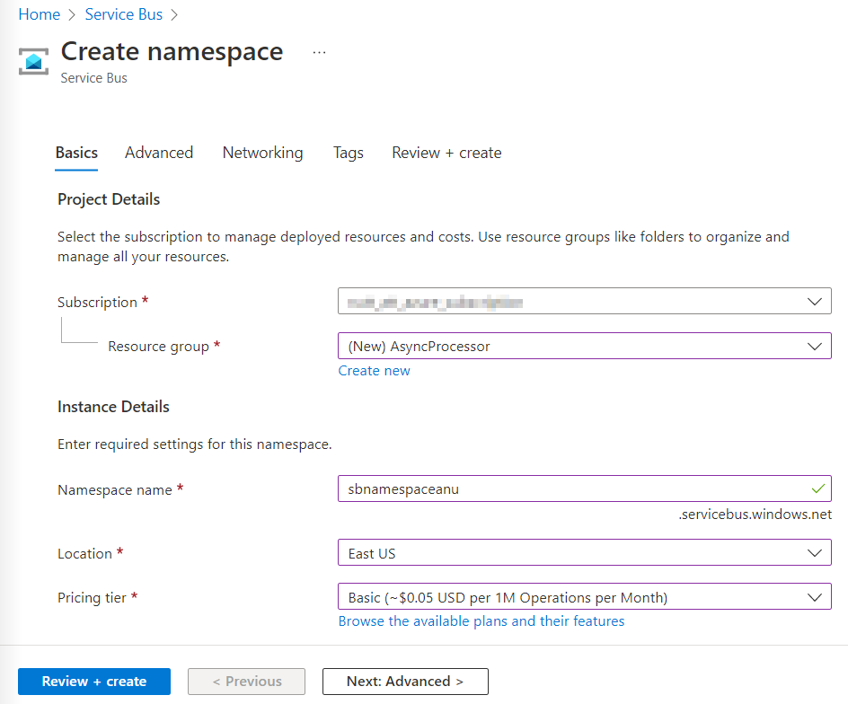
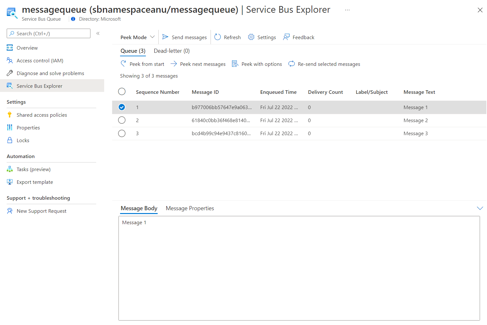

---
lab:
  az204Title: 'Lab 10: Asynchronously process messages by using Azure Service Bus Queues'
  az020Title: 'Lab 10: Asynchronously process messages by using Azure Service Bus Queues'
  az204Module: 'Module 10: Develop message-based solutions'
  az020Module: 'Module 10: Develop message-based solutions'
ms.openlocfilehash: 251f19ea16a3a55a4dfec26c82565ff2418334da
ms.sourcegitcommit: 9711ba92ee508e51804c0757218f4405df6f0f7f
ms.translationtype: HT
ms.contentlocale: zh-TW
ms.lasthandoff: 07/25/2022
ms.locfileid: "147406092"
---
# <a name="lab-10-asynchronously-process-messages-by-using-azure-service-bus-queues"></a>實驗室 10：使用 Azure 服務匯流排佇列，以非同步方式處理訊息

## <a name="microsoft-azure-user-interface"></a>Microsoft Azure 使用者介面

基於 Microsoft 雲端工具的動態性質，您可能會遇到在本訓練內容開發後變更的 Azure UI。 因此，實驗指示可能無法正確對應實驗步驟。

當社群提醒 Microsoft 需要做修改時，我們會更新此訓練課程。 然而，雲端更新經常發生，所以您可能會在此訓練內容更新前遇到 UI 的變更。 **如果發生這種情況，請適應變更，然後視需要在實驗中調整。**

## <a name="instructions"></a>指示

### <a name="before-you-start"></a>在您開始使用 Intune 之前

#### <a name="sign-in-to-the-lab-environment"></a>登入實驗室環境

使用下列認證登入您的 Windows 10 虛擬機器 (VM)：
    
-   使用者名稱：**系統管理員**

-   密碼：**Pa55w.rd**

> **注意**：您的講師會提供連線至虛擬實驗室環境的指示。

#### <a name="review-the-installed-applications"></a>檢閱已安裝的應用程式

尋找 Windows 10 桌面上的工作列。 工作列包含此次實驗中會用到的應用程式圖示，包括：
    
-   Microsoft Edge

-   Visual Studio Code

## <a name="architecture-diagram"></a>架構圖


### <a name="exercise-1-create-azure-resources"></a>練習 1：建立 Azure 資源

#### <a name="task-1-open-the-azure-portal"></a>工作 1：開啟 Azure 入口網站

1.  在工作列上，選取 **Microsoft Edge** 圖示。

1.  在瀏覽器視窗中，瀏覽至 Azure 入口網站 ([portal.azure.com](https://portal.azure.com))，然後登入您在此實驗要用的帳戶。

    > **注意**：如果這是您第一次登入 Azure 入口網站，系統會提供入口網站的導覽。 選取 [開始使用] 跳過導覽，並開始使用入口網站。

#### <a name="task-2-create-an-azure-service-bus-queue"></a>工作 2：建立 Azure 服務匯流排佇列

1.  在 Azure 入口網站中，使用 [搜尋資源、服務和文件] 文字輸入框，搜尋 **服務匯流排**，然後在結果清單中選取 [服務匯流排]。 

1.  在 [服務匯流排] 窗格上，選取 [+ 建立]。 

1.  在 [建立命名空間] 窗格的 [基本] 索引標籤上，執行下列動作，然後選取 [檢閱 + 建立]：  
        
    | 設定                           | 動作                                                       |
    | --------------------------------- | ------------------------------------------------------------ |
    | [訂閱] 下拉式清單    |保留預設值。 |
    | [資源群組] 區段 | 選取 [新建]，輸入 **AsyncProcessor**，然後選取 [確定]。|
    | [命名空間名稱] 文字輸入框 | 輸入 **sbnamespace**[您的名稱]。|
    | [區域] 下拉式清單 |  選取可以部署 Azure 服務匯流排的任何 Azure 區域。|
    | [定價層] 下拉式清單 |  選取 [基本]。|

    下列螢幕擷取畫面顯示 [建立命名空間] 窗格的 [基本] 索引標籤上的設定。 
    
       
     
1.  在 [檢閱 + 建立] 索引標籤上，檢閱在先前步驟中選取的選項。

1.  選取 [建立] 使用指定的設定，建立 [服務匯流排] 命名空間。 

    > **注意**：等候建立工作完成，再繼續進行實驗。

1.  在 [部署] 窗格上，選取 [移至資源] 按鈕，瀏覽至新建立的 [服務匯流排] 命名空間。  

1.  在[服務匯流排] 命名空間窗格的 [設定] 區段中，選取 [共用存取原則]。  

1.  在原則清單中，選取 [RootManageSharedAccessKey]。

1.  在 [主要連接字串] 項目旁的 [SAS 原則:**RootManageSharedAccessKey] 窗格上，選取 [複製至剪貼簿] 按鈕，並記錄複製的值。**   您會在稍後的實驗中用到此值。

    > **注意**：您選擇兩個可用金鑰的任何一個都不會有影響。 它們是可互換的。

1.  在 [服務匯流排] 命名空間窗格的 [實體] 區段中，選取 [佇列]，然後選取 [+ 佇列]。   

1.  在 [建立佇列] 窗格上，檢閱可用的設定，在 [名稱] 文字輸入框中，輸入 **messagequeue**，然後選取 [建立]。  

1.  選取 [messagequeue]，即可顯示 **服務匯流排** 佇列的屬性。

1.  保持瀏覽器視窗開啟。 您會在稍後的實驗中用到此視窗。

#### <a name="review"></a>檢閱

在此練習中，您已建立 Azure **服務匯流排** 命名空間及 **服務匯流排** 佇列，將會在實驗的其餘部分中使用。

### <a name="exercise-2-create-a-net-core-project-to-publish-messages-to-a-service-bus-queue"></a>練習 2：建立 .NET Core 專案以發佈訊息至服務匯流排佇列

#### <a name="task-1-create-a-net-core-project"></a>工作 1：建立 .NET Core 專案

1.  從實驗用的電腦啟動 Visual Studio Code。

1.  在 Visual Studio Code 的 [檔案] 功能表中，選取 [開啟資料夾]。 

1.  在 [開啟資料夾] 視窗中，瀏覽至 **Allfiles (F):\\Allfiles\\Labs\\10\\Starter\\MessagePublisher**，然後選取 [選取資料夾]。 

1.  在 [Visual Studio Code] 視窗中，啟用捷徑功能表，然後選取 [在整合式終端中開啟]。 

1.  在終端提示執行下列命令，在目前的資料夾中，建立名為 **MessagePublisher** 的新 .NET 專案：

    ```
    dotnet new console --name MessagePublisher --output .
    ```

    > **注意**：**dotnet new** 命令會在與專案同名的資料夾中，建立新的 **主控台** 專案。

1.  執行下列命令，從 NuGet 匯入 7.2.1 版的 **Azure.Messaging.ServiceBus** 封裝：

    ```
    dotnet add package Azure.Messaging.ServiceBus --version 7.2.1
    ```

    > **注意**：**dotnet add package** 命令會從 NuGet 新增 **Azure.Messaging.ServiceBus** 封裝。 如需詳細資訊，請移至 [Azure.Messaging.ServiceBus](https://www.nuget.org/packages/Azure.Messaging.ServiceBus/)。

1.  在終端提示執行下列命令，組建 .NET Core 主控台應用程式：

    ```
    dotnet build
    ```

1.  選取 [終止終端] \(**資源回收筒圖示**\)，關閉終端窗格和任何相關的程序。

#### <a name="task-2-publish-messages-to-an-azure-service-bus-queue"></a>工作 2：發佈訊息至 Azure 服務匯流排佇列

1.  在 [Visual Studio Code] 視窗的 [總管] 窗格中，開啟 **Program.cs** 檔案。 

1.  在 **Program.cs** 檔案的程式碼編輯器索引標籤上，刪除現有檔案中所有的程式碼。

1.  新增下列程式碼，以方便使用此檔案要參考的內建命名空間：

    ```csharp
    using System;
    using System.Threading.Tasks;
    ```

1.  新增下列程式碼，從 NuGet 匯入的 **Azure.Storage.Queues** 封裝，匯入封裝中所包含的 **Azure.Messaging.ServiceBus** 命名空間：

    ```csharp
    using Azure.Messaging.ServiceBus;
    ```
    
1.  輸入下列程式碼，在 MessagePublisher 命名空間中，建立新的 **Program** 類別：

    ```csharp
    namespace MessagePublisher
    {
       public class Program
       {
       }
    }
    ```

1.  在 **Program** 類別中，輸入下列程式碼，建立名為 **storageConnectionString** 的字串常數：

    ```csharp
    private const string storageConnectionString = "";
    ```

1.  更新 **storageConnectionString** 字數常串的值，將其設為您之前在此實驗中記錄的服務匯流排命名空間的 **主要連接字串**。

1.  輸入下列程式碼，建立名為 **queueName** 的字串常數，其值為 **messagequeue**，符合您之前在本練習中建立的服務匯流排佇列名稱。

    ```csharp
    private const string queueName = "messagequeue";
    ```

1.  輸入下列程式碼，建立整數常數，儲存要傳送至目標佇列的訊息數目：

    ```csharp
    private const int numOfMessages = 3;
    ```

1.  輸入下列程式碼，建立擁有目標佇列連線的服務匯流排用戶端：

    ```csharp
    static ServiceBusClient client;
    ```

1.  輸入下列程式碼，建立用來發佈訊息至目標佇列的服務匯流排傳送者：

    ```csharp
    static ServiceBusSender sender;
    ```

1.  輸入下列程式碼，建立非同步的 **Main** 方法：

    ```csharp
    public static async Task Main(string[] args)
    {
    }
    ```

1.  檢閱 **Program.cs** 檔案，其現在應該包含下列程式碼。 請注意，`<storage-connection-string>` 預留位置代表目標 Azure 服務匯流排命名空間的連接字串：

    ```csharp
    using System;
    using System.Threading.Tasks;
    using Azure.Messaging.ServiceBus;
    namespace MessagePublisher
    {
        public class Program
        {
            private const string storageConnectionString = "<storage-connection-string>";
            private const string queueName = "messagequeue";
            private const int numOfMessages = 3;
            static ServiceBusClient client;
            static ServiceBusSender sender;
            public static async Task Main(string[] args)
            {
            }
        }
    }
    ```

1.  在 **Main** 方法中，新增下列程式碼，初始化 *ServiceBusClient* 類型的 **client**，提供連線至服務匯流排命名空間，以及負責傳送訊息的 **sender**：

    ```csharp
    client = new ServiceBusClient(storageConnectionString);
    sender = client.CreateSender(queueName);  
    ```

    > **注意**：服務匯流排用戶端可以安全快取，並作為應用程式的存留期的 singleton 使用。 這被視為是定期發佈和讀取訊息時的最佳做法之一。

1.  在 **Main** 方法中，新增下列程式碼，建立 **ServiceBusMessageBatch** 物件，讓您可以使用 **TryAddMessage** 方法，將多則訊息合併為批次：

    ```csharp
    using ServiceBusMessageBatch messageBatch = await sender.CreateMessageBatchAsync();
    ```

1.  在 **Main** 方法中，新增下列程式碼，新增訊息至批次，並在訊息大小超過批次支援的限制時，擲回例外狀況：

    ```csharp
    for (int i = 1; i <= numOfMessages; i++)
    {
        if (!messageBatch.TryAddMessage(new ServiceBusMessage($"Message {i}")))
        {
            throw new Exception($"The message {i} is too large to fit in the batch.");
        }
    }
    ```

1.  在 **Main** 方法中，新增下列程式碼，建立 try 區塊，並透過 **sender** 以非同步方式，發佈批次中的訊息至目標佇列：

    ```csharp
    try
    {
        await sender.SendMessagesAsync(messageBatch);
        Console.WriteLine($"A batch of {numOfMessages} messages has been published to the queue.");
    }
    ```

1.  在 **Main** 方法中，新增下列程式碼，建立 finally 區塊，並以非同步方式處置 **sender** 和 **client** 物件，釋放任何網路和非受控資源：

    ```csharp
    finally
    {
        await sender.DisposeAsync();
        await client.DisposeAsync();
    }
    ```

1.  檢閱 **Main** 方法，現在應該包含下列程式碼： 

    ```csharp
    public static async Task Main(string[] args)
    {
        client = new ServiceBusClient(storageConnectionString);
        sender = client.CreateSender(queueName);
        using ServiceBusMessageBatch messageBatch = await sender.CreateMessageBatchAsync();
        for (int i = 1; i <= numOfMessages; i++)
        {
            if (!messageBatch.TryAddMessage(new ServiceBusMessage($"Message {i}")))
            {
                throw new Exception($"The message {i} is too large to fit in the batch.");
            }
        }
        try
        {
            await sender.SendMessagesAsync(messageBatch);
            Console.WriteLine($"A batch of {numOfMessages} messages has been published to the queue.");
        }
        finally
        {
            await sender.DisposeAsync();
            await client.DisposeAsync();
        }
    }
    ```

1.  儲存 **Program.cs** 檔案。

1.  在 [Visual Studio Code] 視窗中，啟用捷徑功能表，然後選取 [在整合式終端中開啟]。 

1.  在終端提示執行下列命令，啟動 .NET Core 主控台應用程式：

    ```
    dotnet run
    ```

    > **注意**：如果您遇到任何錯誤，請檢閱 **Allfiles (F):\\Allfiles\\Labs\\10\\Solution\\MessagePublisher** 資料夾中的 **Program.cs** 檔案。

1.  確認顯示在終端的主控台訊息是否指出已發佈三則訊息的批次至佇列。

1.  選取 [終止終端] \(**資源回收筒圖示**\)，關閉終端窗格和任何相關的程序。

1.  切換至顯示 Azure 入口網站中服務匯流排佇列 **messagequeue** 的 Microsoft Edge 瀏覽器。

1.  檢閱 [基本] 窗格，並注意佇列包含了三則有效訊息。

    下列螢幕擷取畫面顯示服務匯流排佇列計量和訊息計數。
     
       
     
1.  選取 [Service Bus Explorer (預覽)] 刀鋒視窗。

1.  選取 [查看模式] 索引標籤標頭，然後在 [佇列] 索引標籤上，選取 [從開始查看] 按鈕。

1.  確認佇列包含三則訊息。

1.  選取第一則訊息，並在 [訊息] 窗格中檢閱訊息的內容。

    下列螢幕擷取畫面顯示第一則訊息的內容。
         
       

     
1.  關閉 [訊息] 窗格。

#### <a name="review"></a>檢閱

在此練習中，您已設定發佈訊息至 Azure 服務匯流排佇列的 .NET 專案。

### <a name="exercise-3-create-a-net-core-project-to-read-messages-from-a-service-bus-queue"></a>練習 3：建立 .NET Core 專案以從服務匯流排佇列讀取訊息

#### <a name="task-1-create-a-net-project"></a>工作 1：建立 .NET 專案

1.  從實驗用的電腦啟動 Visual Studio Code。

1.  在 Visual Studio Code 的 [檔案] 功能表中，選取 [開啟資料夾]。 

1.  在 [開啟資料夾] 視窗中，瀏覽至 **Allfiles (F):\\Allfiles\\Labs\\10\\Starter\\MessageReader**，然後選取 [選取資料夾]。 

1.  在 [Visual Studio Code] 視窗中，啟用捷徑功能表，然後選取 [在整合式終端中開啟]。 

1.  在終端提示執行下列命令，在目前的資料夾中，建立名為 **MessageReader** 的新 .NET 專案：

    ```
    dotnet new console --name MessageReader --output .
    ```

1.  執行下列命令，從 NuGet 匯入 7.2.1 版的 **Azure.Messaging.ServiceBus** 封裝：

    ```
    dotnet add package Azure.Messaging.ServiceBus --version 7.2.1
    ```

1.  在終端提示執行下列命令，組建 .NET Core 主控台應用程式：

    ```
    dotnet build
    ```

1.  選取 [終止終端] \(**資源回收筒圖示**\)，關閉終端窗格和任何相關的程序。

#### <a name="task-2-read-messages-from-an-azure-service-bus-queue"></a>工作 2：從 Azure 服務匯流排佇列讀取訊息

1.  在 [Visual Studio Code] 視窗的 [總管] 窗格中，開啟 **Program.cs** 檔案。 

1.  在 **Program.cs** 檔案的程式碼編輯器索引標籤上，刪除現有檔案中所有的程式碼。

1.  新增 Program.cs 檔案中所包含的相同程式碼，以允許與 Azure 服務匯流排佇列互動，但將命名空間設為 **MessageReader**：

    ```csharp
    using System;
    using System.Threading.Tasks;
    using Azure.Messaging.ServiceBus;
    namespace MessageReader
    {
       public class Program
       {
          private const string storageConnectionString = "";
          static string queueName = "messagequeue";
          static ServiceBusClient client;
       }
    }
    ```

1.  和之前一樣，更新 **storageConnectionString** 字串常數的值，將其設為您之前在此實驗中記錄的 **服務匯流排** 命名空間的 **主要連接字串**。

1.  輸入下列程式碼，建立用來處理佇列訊息的 ServiceBusProcessor：

    ```csharp
    static ServiceBusProcessor processor;
    ```

1.  輸入下列程式碼，建立靜態非同步的 **MessageHandler** 工作，在佇列中顯示正在處理的訊息主體，並在處理完成後將其刪除：

    ```csharp
    static async Task MessageHandler(ProcessMessageEventArgs args)
    {
        string body = args.Message.Body.ToString();
        Console.WriteLine($"Received: {body}");
        await args.CompleteMessageAsync(args.Message);
    }
    ```

1.  輸入下列程式碼，建立靜態非同步 **ErrorHandler** 工作，管理訊息處理期間遇到的任何例外狀況：

    ```csharp
    static Task ErrorHandler(ProcessErrorEventArgs args)
    {
        Console.WriteLine(args.Exception.ToString());
        return Task.CompletedTask;
    }
    ```

1.  輸入下列程式碼，建立非同步的 **Main** 方法：

    ```csharp
    static async Task Main(string[] args)
    {
    }
    ```

1.  檢閱 **Program.cs** 檔案，其現在應該包含下列程式碼。 `<storage-connection-string>` 預留位置代表目標 Azure 服務匯流排命名空間的連接字串：

    ```csharp
    using System;
    using System.Threading.Tasks;
    using Azure.Messaging.ServiceBus;
    namespace MessageReader
    {
        class Program
        {
            static string storageConnectionString = "";
            static string queueName = "messagequeue";
            static ServiceBusClient client;
            static ServiceBusProcessor processor;
            static async Task MessageHandler(ProcessMessageEventArgs args)
            {
                string body = args.Message.Body.ToString();
                Console.WriteLine($"Received: {body}");
                await args.CompleteMessageAsync(args.Message);
            }
            static Task ErrorHandler(ProcessErrorEventArgs args)
            {
                Console.WriteLine(args.Exception.ToString());
                return Task.CompletedTask;
            }
            static async Task Main()
            {
            }
        }
    }
    ```

1.  在 **Main** 方法中，新增下列程式碼，初始化 **ServiceBusClient** 類型的client，提供連線至服務匯流排命名空間，以及負責處理訊息的 **processor**：

    ```csharp
    client = new ServiceBusClient(storageConnectionString);
    processor = client.CreateProcessor(queueName, new ServiceBusProcessorOptions());
    ```

    > **注意**：如之前所述，服務匯流排用戶端可以安全快取，並作為應用程式的存留期的 singleton 使用。 這被視為是定期發佈和讀取訊息時的最佳做法之一。

1.  在 **Main** 方法中，新增下列程式碼，建立 try 區塊，實作訊息和錯誤處理常式、起始訊息處理，並在使用者輸入後停止處理：

    ```csharp
    try
    {
        processor.ProcessMessageAsync += MessageHandler;
        processor.ProcessErrorAsync += ErrorHandler;
        await processor.StartProcessingAsync();
        Console.WriteLine("Wait for a minute and then press any key to end the processing");
        Console.ReadKey();
        Console.WriteLine("\nStopping the receiver...");
        await processor.StopProcessingAsync();
        Console.WriteLine("Stopped receiving messages");
    }
    ```

1.  在 **Main** 方法中，新增下列程式碼，建立 finally 區塊，並以非同步方式處置 **processor** 和 **client** 物件，釋放任何網路和非受控資源：

    ```csharp
    finally
    {
        await processor.DisposeAsync();
        await client.DisposeAsync();
    }
    ```

1.  檢閱 **Main** 方法，現在應該包含下列程式碼：

    ```csharp
    static async Task Main()
    {
        client = new ServiceBusClient(storageConnectionString);
        processor = client.CreateProcessor(queueName, new ServiceBusProcessorOptions());
        try
        {
            processor.ProcessMessageAsync += MessageHandler;
            processor.ProcessErrorAsync += ErrorHandler;
            await processor.StartProcessingAsync();
            Console.WriteLine("Wait for a minute and then press any key to end the processing");
            Console.ReadKey();
            Console.WriteLine("\nStopping the receiver...");
            await processor.StopProcessingAsync();
            Console.WriteLine("Stopped receiving messages");
        }
        finally
        {
            await processor.DisposeAsync();
            await client.DisposeAsync();
        }
    }
    ```

1.  儲存 **Program.cs** 檔案。

1.  在 [Visual Studio Code] 視窗中，啟用捷徑功能表，然後選取 [在整合式終端中開啟]。 

1.  在終端提示執行下列命令，啟動 .NET Core 主控台應用程式：

    ```
    dotnet run
    ```

    > **注意**：如果您遇到任何錯誤，請檢閱 **Allfiles (F):\\Allfiles\\Labs\\10\\Solution\\MessageReader** 資料夾中的 **Program.cs** 檔案。

1.  確認顯示在終端的主控台訊息是否指出已收到佇列中的三則訊息。

1.  在終端提示按下任何按鍵，停止接收器並終止應用程式執行。

1.  選取 [終止終端] \(**資源回收筒圖示**\)，關閉終端窗格和任何相關的程序。

1.  切換回顯示 Azure 入口網站中服務匯流排佇列 **messagequeue** 的 Microsoft Edge 瀏覽器。

1.  在 [Service Bus Explorer] \(預覽\) 窗格上，選取 [重新整理]，並注意佇列中的有效訊息數目已變更為 **0**。 

#### <a name="review"></a>檢閱

在此練習中，您會使用 .NET 程式庫，從 Azure 服務匯流排佇列，讀取並刪除訊息。

### <a name="exercise-4-clean-up-your-subscription"></a>練習 4：清除訂閱

#### <a name="task-1-open-azure-cloud-shell"></a>工作 1：開啟 Azure Cloud Shell

1.  在 Azure 入口網站中，選取 **Cloud Shell** 圖示  ，開啟新的 Bash 工作階段。 如果 Cloud Shell 預設為 PowerShell 工作階段，請選取 [PowerShell]，然後在下拉式功能表中，選取 [Bash]。 

    > **注意**：如果這是您第一次啟動 **Cloud Shell**，當系統提示您選取 [Bash] 或 [PowerShell] 時，請選取 [PowerShell]。 系統顯示 **您未裝載儲存體** 訊息時，請選取此實驗中使用的訂閱，然後選取 [建立儲存體]。

#### <a name="task-2-delete-resource-groups"></a>工作 2：刪除資源群組

1.  在 [Cloud Shell] 窗格中，執行下列命令刪除 **AsyncProcessor** 資源群組：

    ```
    az group delete --name AsyncProcessor --no-wait --yes
    ```
    
     > **注意**：此命令會以非同步方式執行 (由 --nowait 參數決定)，所以雖然您可以在同一個 Bash 工作階段中立即執行另一個 Azure CLI 命令，但系統需要幾分鐘才會實際移除資源群組。
  
1.  關閉入口網站中的 [Cloud Shell] 窗格。

#### <a name="task-3-close-the-active-applications"></a>工作 3：關閉作用中的應用程式

1.  關閉目前執行中的 Microsoft Edge 應用程式。

1.  關閉目前執行的 Visual Studio Code 應用程式。

#### <a name="review"></a>檢閱

在此練習中，您已移除此實驗中使用的資源群組，並清除了您的訂閱。
