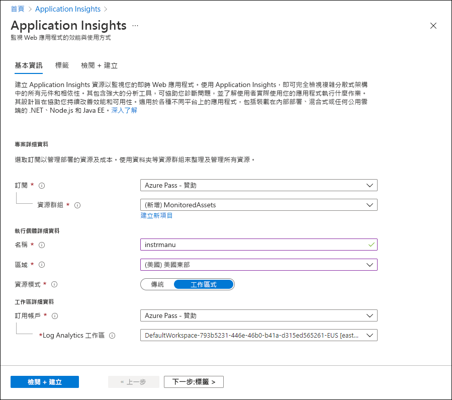
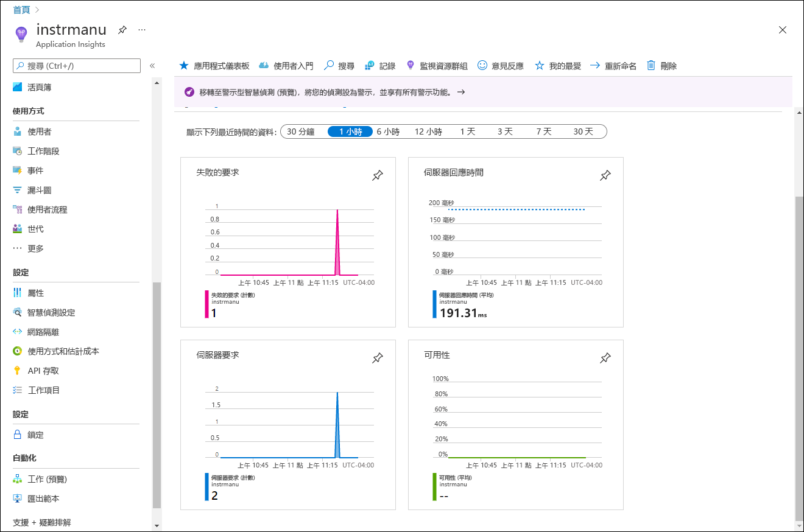
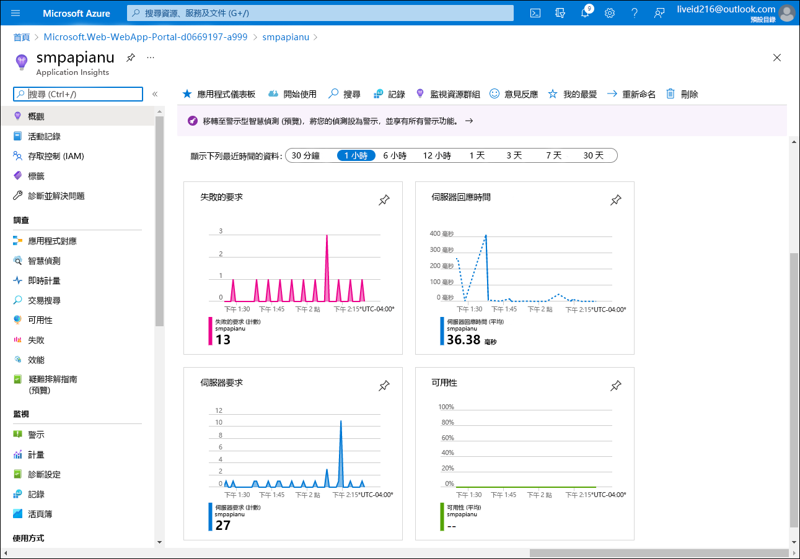

---
lab:
  az204Title: 'Lab 11: Monitor services that are deployed to Azure'
  az020Title: 'Lab 11: Monitor services that are deployed to Azure'
  az204Module: 'Module 11: Monitor and optimize Azure solutions'
  az020Module: 'Module 11: Monitor and optimize Azure solutions'
ms.openlocfilehash: 442177b32dbee3346b8b81216c61ca5337826fe1
ms.sourcegitcommit: 9abfe3b5a1c9ccd2f0610348052d04169573f81a
ms.translationtype: HT
ms.contentlocale: zh-TW
ms.lasthandoff: 06/01/2022
ms.locfileid: "145995040"
---
# <a name="lab-11-monitor-services-that-are-deployed-to-azure"></a>實驗 11：監視部署至 Azure 的服務

## <a name="microsoft-azure-user-interface"></a>Microsoft Azure 使用者介面

基於 Microsoft 雲端工具的動態性質，您可能會遇到在本訓練內容開發後變更的 Azure UI。 因此，實驗指示可能無法正確對應實驗步驟。

當社群提醒 Microsoft 需要做修改時，我們會更新此訓練課程。 然而，雲端更新經常發生，所以您可能會在此訓練內容更新前遇到 UI 的變更。 **如果發生這種情況，請適應變更，然後視需要在實驗中調整。**

## <a name="instructions"></a>指示

### <a name="before-you-start"></a>在您開始使用 Intune 之前

#### <a name="sign-in-to-the-lab-environment"></a>登入實驗室環境

使用下列認證登入您的 Windows 10 虛擬機器 (VM)：
    
-   使用者名稱：**系統管理員**

-   密碼：**Pa55w.rd**

> **注意**：您的講師會提供連線至虛擬實驗室環境的指示。

#### <a name="review-the-installed-applications"></a>檢閱已安裝的應用程式

尋找 Windows 10 桌面上的工作列。 工作列包含此次實驗中會用到的應用程式圖示，包括：
    
-   Microsoft Edge

-   檔案總管

-   Visual Studio Code

-   Azure PowerShell

## <a name="architecture-diagram"></a>架構圖


### <a name="exercise-1-create-and-configure-azure-resources"></a>練習 1：建立及設定 Azure 資源

#### <a name="task-1-open-the-azure-portal"></a>工作 1：開啟 Azure 入口網站

1.  在工作列上，選取 **Microsoft Edge** 圖示。

1.  在瀏覽器視窗中，瀏覽至 Azure 入口網站 ([portal.azure.com](https://portal.azure.com))，然後登入您在此實驗要用的帳戶。

    > **注意**：如果這是您第一次登入 Azure 入口網站，系統會提供入口網站的導覽。 選取 [開始使用] 跳過導覽，並開始使用入口網站。

#### <a name="task-2-create-an-application-insights-resource"></a>工作 2：建立 Application Insights 資源

1.  在 Azure 入口網站中，使用頁面頂端的 [搜尋資源、服務及文件] 文字輸入框來搜尋 **Application Insights**，然後在結果清單中選取 [Application Insights]。

1.  在 [Application Insights] 窗格上，選取 [+ 建立]。

1.  在 [Application Insights] 窗格的 [基本] 索引標籤上，執行下列動作，然後選取 [檢閱 + 建立]：
    
    | 設定                         | 動作                                                       |
    | ------------------------------- | ------------------------------------------------------------ |
    | [訂閱] 下拉式清單 | 保留預設值。                                    |
    | [資源群組] 區段      | 選取 [新建]，輸入 **MonitoredAssets**，然後選取 [確定]。 |
    | [名稱] 文字輸入框     | **instrm**[您的名稱]。                           |
    | [區域] 下拉式清單       | 選取可以部署 Azure 服務匯流排的任何 Azure 區域。 |
    | [資源模式] 區段 | 選取 [工作區型] 選項。|
    | [工作區詳細資料] 區段 | 保留 [訂閱] 及 [Log Analytics 工作區] 下拉式清單的預設值。|
    
    下列螢幕擷取畫面顯示 [Application Insights] 窗格上的設定。

       
     
1.  在 [檢閱 + 建立] 索引標籤上，檢閱您在先前步驟中選取的選項。

1.  選取 [建立]，使用指定的設定建立 **Application Insights** 執行個體。

    > **注意**：等候建立工作完成，再繼續進行實驗。

1.  在 [Microsoft.AppInsights 概觀] **\|** 窗格上，選取 [前往資源] 按鈕，瀏覽至新建立的 [Application Insights 資源] 窗格。

1.  在 [Application Insights] 窗格上的 [設定] 區段中，選取 [屬性] 連結。

1.  在 [屬性] 窗格上的 [檢測金鑰] 項目旁，選取 [複製至剪貼簿] 按鈕，然後記錄複製的值。 您會在稍後的實驗中用到此值。

    > **注意**：用戶端應用程式會使用此金鑰來連線到特定的 **Application Insights** 資源。

### <a name="task-3-create-an-azure-web-api-resource"></a>工作 3：建立 Azure Web API 資源

1.  在 Azure 入口網站中，使用頁面頂端的 [搜尋資源、服務及文件] 文字輸入框來搜尋 **App Services**，然後在結果清單中選取 [App Services]。

1.  在 [App Services] 窗格上，選取 [+ 建立]。
    
1.  在 [建立 Web 應用程式] 窗格的 [基本] 索引標籤上，執行下列動作，然後選取 [下一步：部署]  ：

    | 設定                         | 動作                                                       |
    | ------------------------------- | ------------------------------------------------------------ |
    | [訂閱] 下拉式清單 | 保留預設值。                                    |
    | [資源群組] 下拉式清單      |選取 **MonitoredAssets**。 |
    | [名稱] 文字輸入框     | 輸入 **smpapi**[您的名稱] |
    | [發佈] 區段       | 選取 [程式碼]。 |
    | [執行階段堆疊] 下拉式清單 | 選取 .NET Core 3.1 (LTS)。|
    | [作業系統] 區段 |  選取 [Windows]。|
    | [區域] 下拉式清單 |  選取與您選擇作為 **應用程式執行個體** 資源位置的相同區域。 |
    | [App Service 方案] 區段 |  選取 [建立新的]。 |
    | [名稱] 文字輸入框 |  輸入 **MonitoredPlan** 然後選取 [確定]。|
    |  [SKU 和大小] 區段 |  保留預設值。 |

1.  在 [部署] 索引標籤上選取 [下一步：網路 (預覽)]，然後選取 [下一步：監視]。

1.  在 [監視] 索引標籤上執行下列動作，然後選取 [檢閱 + 建立]：

    | 設定                         | 動作                                                       |
    | ------------------------------- | ------------------------------------------------------------ |
    | [啟用 Application Insights] 區段 | 確認已選取 [是]。                                    |
    | [Application Insights] 下拉式清單     | 選取您先前在此實驗室中建立的 **instrm**[您的名稱] Application Insights 資源。|

1.  在 [檢閱 + 建立] 索引標籤上，檢閱您在先前步驟中選取的選項。

1.  選取 [建立]，使用您指定的設定建立 Web API。

    > **注意**：等候建立工作完成，再繼續進行實驗。

1.  在部署的 [概觀] 窗格上選取 [前往資源] 按鈕，即可瀏覽至新建立的 [Azure Web API] 窗格。

1.  在 [App Service] 窗格上的 [設定] 區段中，選取 [設定] 連結。

1.  在 [設定] 區段中，執行下列動作：

    a.  在 [應用程式設定] 索引標籤上選取 [顯示值]，即可顯示與您 Web API 相關聯的祕密。

    b.  請注意代表 **APPINSIGHTS\_INSTRUMENTATIONKEY** 金鑰的值。 當您組建 Web API 資源時，此值會自動設定。

1.  在 [App Service] 窗格上的 [設定] 區段中，選取 [屬性] 連結。

1.  在 [屬性] 區段中，記錄 **URL** 連結的值。 您稍後會在實驗中用到此值，將要求提交至 Web API。

#### <a name="task-4-configure-web-api-autoscale-options"></a>工作 4：設定 Web API 自動調整選項

1.  在 [App Service] 窗格上的 [設定] 區段中，選取 [擴增 (App Service 方案)] 連結。

1.  在 [擴增] 區段中，執行下列動作並選取 [儲存]：

    | 設定                         | 動作                                                       |
    | ------------------------------- | ------------------------------------------------------------ |
    | [擴增] 區段 | 選取 [自訂自動調整]。|
    | [自動調整設定名稱] 文字輸入框     | 輸入 **ComputeScaler**。|
    | [資源群組] 下拉式清單     |選取 **MonitoredAssets**。 |
    | [縮放模式] 區段      | 選取 [依計量縮放]。 |
    | [執行個體限制] 區段中的 [最小值] 文字輸入框 | 輸入 **2**。|
    | [執行個體限制] 區段中的 [最大值] 文字輸入框 | 輸入 **8**。|
    | [執行個體限制] 區段中的 [預設] 文字輸入框 | 輸入 **3**。 |

    下列螢幕擷取畫面顯示 [App Service] 窗格上 [擴增] 區段中的設定。

    ![[Azure Web API] 窗格上的預設縮放條件](./media/l11_scale_web_app_default.png)

    | 設定                         | 動作                                                       |
    | ------------------------------- | ------------------------------------------------------------ |
    | [規則] 區段 |  選取 [新增規則]。|
    | [縮放規則] 窗格 | 保留所有設定的預設值，然後選取 [新增]。|

    下列螢幕擷取畫面顯示 [App Service] 窗格上 [擴增] 區段中的其他設定。

    ![[Azure Web API] 窗格上預設縮放條件的 [縮放規則] 窗格](./media/l11_scale_web_app_rule.png)

    > **注意**：等候儲存作業完成，再繼續進行實驗。

#### <a name="review"></a>檢閱

在本練習中，您建立了將用於實驗其餘部分的 Azure 資源。

### <a name="exercise-2-monitor-a-local-web-api-by-using-application-insights"></a>練習 2：使用 Application Insights 監視本地 Web API

#### <a name="task-1-build-a-net-web-api-project"></a>工作 1：組建 .NET Web API 專案

1.  從實驗用的電腦啟動 **Visual Studio Code**。

1.  在 Visual Studio Code 的 [檔案] 功能表中，選取 [開啟資料夾]。

1.  在 [開啟資料夾] 視窗中，瀏覽至 **Allfiles (F):\\Allfiles\\Labs\\11\\Starter\\Api**，然後選取 [選取資料夾]。

1.  在 [Visual Studio Code] 視窗中，啟用捷徑功能表，然後選取 [在整合式終端中開啟]。

1.  在終端提示中執行下列命令，在目前目錄中建立名為 **SimpleApi** 的新 .NET Web API 應用程式：

    ```
    dotnet new webapi --output . --name SimpleApi
    ```

1.  執行下列命令，從 NuGet 將 **Microsoft.ApplicationInsights** 2.18.0 版匯入目前的專案：

    ```
    dotnet add package Microsoft.ApplicationInsights --version 2.18.0
    ```

    > **注意**：**dotnet add package** 命令會從 NuGet 新增 **Microsoft.ApplicationInsights** 套件。 如需詳細資訊，請參閱 [Microsoft.ApplicationInsights](https://www.nuget.org/packages/Microsoft.ApplicationInsights/)。

1.  執行下列命令，從 NuGet 匯入 **Microsoft.ApplicationInsights.AspNetCore** 2.18.0 版：

    ```
    dotnet add package Microsoft.ApplicationInsights.AspNetCore --version 2.18.0
    ```

    > **注意**：**dotnet add package** 命令會從 NuGet 新增 **Microsoft.ApplicationInsights.AspNetCore** 套件。 如需詳細資訊，請參閱 [Microsoft.ApplicationInsights.AspNetCore](https://www.nuget.org/packages/Microsoft.ApplicationInsights.AspNetCore)。

1.  在終端提示中執行下列命令，從 NuGet 將 **Microsoft.ApplicationInsights.PerfCounterCollector** 2.18.0 版匯入目前的專案：

    ```
    dotnet add package Microsoft.ApplicationInsights.PerfCounterCollector --version 2.18.0
    ```

    > **注意**：**dotnet add package** 命令會從 NuGet 新增 **Microsoft.ApplicationInsights.PerfCounterCollector** 套件。 如需詳細資訊，請參閱 [Microsoft.ApplicationInsights.PerfCounterCollector](https://www.nuget.org/packages/Microsoft.ApplicationInsights.PerfCounterCollector/)。

1.  在終端提示中執行下列命令，組建 .NET Web API：

    ```
    dotnet build
    ```

#### <a name="task-2-update-app-code-to-disable-https-and-use-application-insights"></a>工作 2：更新應用程式程式碼，停用 HTTPS 並使用 Application Insights

1.  在 [Visual Studio Code] 視窗中的 [Explorer] 窗格上，選取 **Startup.cs** 檔案來開啟 [編輯器] 窗格上的檔案。

1.  在 [編輯器] 窗格上的 [啟動] 類別中，尋找並刪除第 39 行中的下列程式碼：

    ```csharp
    app.UseHttpsRedirection();
    ```

    > **注意**：這一行程式碼會強制 Web API 使用 HTTPS。 對於此實驗來說，這是沒有必要的。

1.  在 [啟動] 類別定義的開頭，新增名為 **INSTRUMENTATION_KEY** 的靜態字串常數，並將其值設為您先前在此實驗中記錄的 Application Insights 資源檢測金鑰：

    ```csharp
    private const string INSTRUMENTATION_KEY = "instrumentation_key";
    ```

    > **注意**：例如，如果您的檢測金鑰是 `d2bb0eed-1342-4394-9b0c-8a56d21aaa43`，則該程式碼會是 `private const string INSTRUMENTATION_KEY = "d2bb0eed-1342-4394-9b0c-8a56d21aaa43";`

1.  找出 [啟動] 類別中的 **ConfigureServices** 方法：

    ```csharp
    public void ConfigureServices(IServiceCollection services)
    {
        services.AddControllers();
    }
    ```

1.  從新的一行開始，在 **ConfigureServices** 方法的結尾新增下列程式碼，使用提供的檢測金鑰設定 Application Insights：

    ```csharp
    services.AddApplicationInsightsTelemetry(INSTRUMENTATION_KEY);
    ```

1.  檢閱 **ConfigureServices** 方法，其現在應該包含下列程式碼：

    ```csharp
    public void ConfigureServices(IServiceCollection services)
    {
        services.AddControllers();
        services.AddApplicationInsightsTelemetry(INSTRUMENTATION_KEY);        
    }
    ```

1.  儲存 **Startup.cs** 檔案。

1.  在終端提示中執行下列命令，組建 .NET Web API。

    ```
    dotnet build
    ```

#### <a name="task-3-test-an-api-application-locally"></a>工作 3：在本機測試 API 應用程式

1.  在終端提示中執行下列命令，然後選取 [輸入] 來建立憑證。 在提示選項上選取 [是]。

    ```
    dotnet dev-certs https --trust
    ```

1.  在終端提示中執行下列命令，啟動 .NET Web API。

    ```
    dotnet run
    ```

1.  從工作列點選 **Microsoft Edge** 圖示來開啟捷徑功能表，然後開啟新的瀏覽器視窗。

1.  在開啟的瀏覽器視窗中，瀏覽至其中 URL 包含您 Web API **/weatherforecast** 相對路徑的頁面，這時該頁面會裝載於連接埠 **5000** 上的 **localhost**。
    
    > **注意**：完整的 URL 為 `http://localhost:5000/weatherforecast`。

    > **注意**：頁面應該包含下列格式的輸出：

    ```
    [{"date":"2021-09-04T10:15:04.0969996-07:00","temperatureC":54,"temperatureF":129,"summary":"Sweltering"},{"date":"2021-09-05T10:15:04.0972401-07:00","temperatureC":44,"temperatureF":111,"summary":"Balmy"},{"date":"2021-09-06T10:15:04.0976549-07:00","temperatureC":41,"temperatureF":105,"summary":"Scorching"},{"date":"2021-09-07T10:15:04.0976613-07:00","temperatureC":-4,"temperatureF":25,"summary":"Freezing"},{"date":"2021-09-08T10:15:04.0976618-07:00","temperatureC":33,"temperatureF":91,"summary":"Balmy"}]
    ```

1.  關閉顯示由 `http://localhost:5000/weatherforecast` 所產生頁面的瀏覽器視窗。

1.  在 Visual Studio Code 中，選取 [終止終端] \(**資源回收筒** 圖示\)，關閉 [終端] 窗格和任何相關的程序。

#### <a name="task-4-review-metrics-in-application-insights"></a>工作 4：在 Application Insights 中檢閱計量

1.  在您的實驗用電腦上，切換至顯示 Azure 入口網站的 **Microsoft Edge** 瀏覽器視窗。

1.  在 Azure 入口網站中，瀏覽回到您先前在此實驗中建立的 **instrm**[您的名稱] Application Insights 資源窗格。

1.  在 [Application Insights] 窗格上，並在窗格中心的圖格中尋找顯示的計量。 具體而言，是要找出已發生的伺服器要求數量及平均的伺服器回應時間。

    下列螢幕擷取畫面顯示本機 Web 應用程式的 **Application Insights** 計量。

    

    > **注意**：最多可能需要五分鐘才能在 Application Insights 計量圖表中觀察到要求。

#### <a name="review"></a>檢閱

在此練習中，您使用 ASP.NET 建立了 API 應用程式，並將其設為將應用程式計量串流至 Application Insights。 接著，您使用了 Application Insights 儀表板來檢閱 API 的效能詳細資料。

### <a name="exercise-3-monitor-a-web-api-using-application-insights"></a>練習 3：使用 Application Insights 監視 Web API

#### <a name="task-1-deploy-an-application-to-the-web-api"></a>工作 1：將應用程式部署至 Web API

1.  在實驗用的電腦上，切換至 Visual Studio Code。

1.  在 [Visual Studio Code] 視窗的 [Explorer] 窗格中，瀏覽至 **bin\Debug\netcoreapp3.1** 目錄。

    > **注意**：若要確認您位於 **bin\Debug\netcoreapp3.1** 目錄中，請在 Visual Studio Code [檔案] 功能表上選取 [開啟資料夾]，瀏覽至 **Allfiles (F):\\Allfiles\\Labs\\11\\Starter\\Api\\bin\\Debug\\netcoreapp3.1**，然後選取 [選取資料夾]。

1.  將名為 **web.config** 的檔案新增至目錄。

1.  開啟 **web.config** 檔案並新增下列內容：

    ```
    <?xml version="1.0" encoding="utf-8"?>
    <configuration>
      <location path="." inheritInChildApplications="false">
        <system.webServer>
          <handlers>
            <add name="aspNetCore" path="*" verb="*" modules="AspNetCoreModuleV2" resourceType="Unspecified" />
          </handlers>
          <aspNetCore processPath="dotnet" arguments=".\SimpleApi.dll" stdoutLogEnabled="false" stdoutLogFile=".\logs\stdout" hostingModel="inprocess" />
        </system.webServer>
      </location>
    </configuration>
    ```

1.  儲存並關閉檔案。

1.  在 [Visual Studio Code] 視窗中，啟用捷徑功能表，然後選取 [在整合式終端中開啟]。

1.  在終端提示中執行下列命令，確認目前的目錄設為 **Allfiles (F):\\Allfiles\\Labs\\11\\Starter\\Api\\bin\\Debug\\netcoreapp3.1**，也就是部署檔案的所在位置：

    ```
    cd F:\Allfiles\Labs\11\Starter\Api\bin\Debug\netcoreapp3.1
    ```

1.  執行下列命令來建立 ZIP 檔案，該檔案包含您接下來要部署至 Azure Web API 的入門專案：

    ```powershell
    Compress-Archive -Path * -DestinationPath api.zip
    ```

1.  在終端提示中執行下列命令，使用 Azure PowerShell 登入您的 Azure 訂閱：

    ```powershell
    Connect-AzAccount
    ```

1.  切換至顯示 Azure 入口網站的 Microsoft Edge 瀏覽器，依照終端提示顯示的指示在瀏覽器視窗中開啟另一個分頁，瀏覽至 `https://microsoft.com/devicelogin`，接著在出現提示時輸入提供的代碼，然後使用此實驗要使用的帳戶登入。

    > **注意**：等候登入流程完成。

1.  關閉新開啟的瀏覽器分頁，然後切換回 [Visual Studio Code] 視窗中的終端提示。

1.  執行下列命令，顯示 **MonitoredAssets** 資源群組中所有 Web 應用程式的清單：

    ```powershell
    Get-AzWebApp -ResourceGroupName MonitoredAssets
    ```

1.  執行下列命令，顯示 **MonitoredAssets** 資源群組中的 Web 應用程式清單，其名稱開頭為 **smpapi\*** ：

    ```powershell
    Get-AzWebApp -ResourceGroupName MonitoredAssets | Where-Object {$_.Name -like 'smpapi*'}
    ```

1.  執行下列命令，顯示上一個步驟中識別的第一個 Web 應用程式名稱，並將其儲存在名為 **$webAppName** 的變數中：

    ```powershell
    Get-AzWebApp -ResourceGroupName MonitoredAssets | Where-Object {$_.Name -like 'smpapi*'} | Select-Object -ExpandProperty Name
    $webAppName = (Get-AzWebApp -ResourceGroupName MonitoredAssets | Where-Object {$_.Name -like 'smpapi*'})[0] | Select-Object -ExpandProperty Name
    ```

1.  執行下列命令，將您先前在此工作中建立的 **api.zip** 檔案部署到您在上一個步驟中識別其名稱的 Web API：

    ```powershell
    az webapp deployment source config-zip --resource-group MonitoredAssets --src api.zip --name $webAppName
    ```

    > **注意**：如果系統提示您進行驗證，請執行 `az login` 並遵循指示來完成登入流程。

    > **注意**：等候部署完成，再繼續進行實驗。

    > **注意**：檢閱命令輸出並驗證 `provisioningState` 已設為 `Succeeded`。 此命令的輸出應該具有下列格式：

    ```
    Getting scm site credentials for zip deployment
    Starting zip deployment. This operation can take a while to complete ...
    Deployment endpoint responded with status code 202
    {
        "active": true,
        "author": "N/A",
        "author_email": "N/A",
        "complete": true,
        "deployer": "ZipDeploy",
        "end_time": "2021-09-03T17:02:18.124062Z",
        "id": "f5fb8ef6a11d4f8387f09dc47628007e",
        "is_readonly": true,
        "is_temp": false,
        "last_success_end_time": "2021-09-03T17:02:18.124062Z",
        "log_url": "https://smpapianu.scm.azurewebsites.net/api/deployments/latest/log",
        "message": "Created via a push deployment",
        "progress": "",
        "provisioningState": "Succeeded",
        "received_time": "2021-09-03T17:02:11.942626Z",
        "site_name": "smpapianu",
        "start_time": "2021-09-03T17:02:12.1613438Z",
        "status": 4,
        "status_text": "",
        "url": "https://smpapianu.scm.azurewebsites.net/api/deployments/latest"
    }
    ```

1.  在實驗用的電腦上，啟動另一個 Microsoft Edge 瀏覽器視窗。

1.  在瀏覽器視窗中，瀏覽至您先前在此工作中部署 API 應用程式的 Azure Web API 應用程式，方法是將尾碼 **/weatherforecast** 附加至其 URL (先前在此實驗中所記錄)。

    > **注意**：例如，如果您的 URL 是 `https://smpapianu.azurewebsites.net`，則新的 URL 會是 `https://smpapianu.azurewebsites.net/weatherforecast`。

1.  驗證該輸出是否與本地執行 API 應用程式時產生的輸出相似。

    > **注意**：輸出會包含不同的值，但其格式應該會相同。

    > **注意**：如果您收到例外狀況，請確定 **web.config** 檔案的內容符合此工作稍早所示的範例。 如果不相符，請進行任何必要的變更，然後重新產生 **api.zip** 檔案並重新部署。

#### <a name="task-2-configure-in-depth-metric-collection-for-web-apps"></a>工作 2：深入設定 Web Apps 的計量集合

1.  在您的實驗用電腦上，切換至顯示 Azure 入口網站的 **Microsoft Edge** 瀏覽器視窗。

1.  在 Azure 入口網站中，瀏覽回到您先前在此實驗中建立的 **smpapi**[您的名稱] Web 應用程式資源窗格。

1.  在 [App Service] 窗格上，選取 [Application Insights]。

1.  在 [Application Insights] 窗格上執行下列動作，選取 [套用]，然後在確認對話方塊中選取 [是]：

    | 設定                         | 動作                                                       |
    | ------------------------------- | ------------------------------------------------------------ |
    | [Application Insights] 滑桿 | 確認其已設為 [啟用]。|
    | [檢測應用程式] 區段    | 選取 [.NET Core] 索引標籤。|
    | [集合層級] 區段    | 選取 [建議]。 |
    | [分析工具] 區段      | 選取 [開啟]。|
    | [快照偵錯工具] 區段 | 選取 [關閉]。|
    | [SQL 命令] 區段 | 選取 [關閉]。|


    下列螢幕擷取畫面顯示 Azure Web API 的 **Application Insights** 設定。

    

1.  切換至您在先前工作中開啟的瀏覽器分頁，以顯示將 API 應用程式部署至目標 Azure API 應用程式的結果 (包括目標 URL 中的 **/weatherforecast** 相對路徑)，並重新整理瀏覽器頁面幾次。

1.  檢閱 API 所產生的 JSON 格式輸出。

1.  記錄您用來存取 JSON 格式輸出的 URL。

    > **注意**：如果 **smpapianu** 是您稍早建立的網站名稱，則 URL 的格式應為 `https://smpapianu.azurewebsites.net/weatherforecast`。

#### <a name="task-3-get-updated-metrics-in-application-insights"></a>工作 3：在 Application Insights 取得更新的計量

1.  返回顯示 Azure 入口網站中 Azure Web 應用程式的瀏覽器視窗。

1.  在 Web 應用程式的 [Application Insights] 窗格上，選取 [檢視 Application Insights 資料] 連結。

1.  在 [Application Insights] 窗格上，檢閱圖格 (位於窗格中心) 中的已收集計量，包含已發生的伺服器要求數量及平均伺服器回應時間。

    下列螢幕擷取畫面顯示 Azure 入口網站中 Azure Web 應用程式的 **Application Insights** 計量。

    

    > **注意**：更新的計量最多可能需要五分鐘才會出現在 Application Insights 計量圖表中。

#### <a name="task-4-view-real-time-metrics-in-application-insights"></a>工作 4：在 Application Insights 中檢視即時計量

1.  在 [Application Insights] 窗格中的 [調查] 區段中，選取 [即時計量]。

1.  切換回瀏覽器視窗，視窗中顯示在目標 Azure Web 應用程式中執行的目標 API 應用程式 (其目標為目標 URL 中的 **/weatherforecast** 相對路徑)，然後重新整理瀏覽器頁面數次。

1.  切換至顯示 [即時計量] 窗格的瀏覽器視窗並檢閱其內容。

    > **注意**：[傳入要求] 區段應該會在幾秒內更新，顯示您對 Web API 所做的要求。

### <a name="exercise-4-application-insights-logging-with-net-core"></a>練習 4：Application Insights 使用 .NET Core 記錄

#### <a name="task-1-configure-logging-for-a-net-core-api-app"></a>工作 1：設定 .NET Core API 應用程式的記錄

1.  切換至 [Visual Studio Code] 視窗。

1.  在終端提示中執行下列命令，將目前的目錄設定為 **Allfiles (F):\\Allfiles\\Labs\\11\\Starter\\Api**，也就是部署檔案的所在位置：

    ```
    cd F:\Allfiles\Labs\11\Starter\Api
    ```

1.  執行下列命令，從 NuGet 將 **Microsoft.Extensions.Logging.ApplicationInsights** 2.18.0 版匯入目前的專案：

    ```
    dotnet add package Microsoft.Extensions.Logging.ApplicationInsights --version 2.18.0
    ```

    > **注意**：**dotnet add package** 命令會從 NuGet 新增 **Microsoft.ApplicationInsights** 套件。 如需詳細資訊，請參閱 [Microsoft.Extensions.Logging.ApplicationInsights](https://www.nuget.org/packages/Microsoft.Extensions.Logging.ApplicationInsights)。

1.  在 [Visual Studio Code] 視窗的 [Explorer] 窗格中，瀏覽至 [控制器] 目錄，然後開啟檔案 **WeatherForecastController.cs**。

1.  檢閱檔案的內容，並注意其包含了 `using Microsoft.Extensions.Logging` 指示詞與泛型 ILogger <WeatherForecastController> 介面的建構函式插入。

    ```csharp
    using System;
    using System.Collections.Generic;
    using System.Linq;
    using System.Threading.Tasks;
    using Microsoft.AspNetCore.Mvc;
    using Microsoft.Extensions.Logging;
    namespace SimpleApi.Controllers
    {
        [ApiController]
        [Route("[controller]")]
        public class WeatherForecastController : ControllerBase
        {
            private static readonly string[] Summaries = new[]
            {
                "Freezing", "Bracing", "Chilly", "Cool", "Mild", "Warm", "Balmy", "Hot", "Sweltering", "Scorching"
            };
            private readonly ILogger<WeatherForecastController> _logger;
            public WeatherForecastController(ILogger<WeatherForecastController> logger)
            {
                _logger = logger;
            }
            [HttpGet]
            public IEnumerable<WeatherForecast> Get()
            {
                var rng = new Random();
                return Enumerable.Range(1, 5).Select(index => new WeatherForecast
                {
                    Date = DateTime.Now.AddDays(index),
                    TemperatureC = rng.Next(-20, 55),
                    Summary = Summaries[rng.Next(Summaries.Length)]
                })
                .ToArray();
            }
        }
    }
    ```

    > **注意**：您將利用此設定來實作自訂記錄。 目前，建構函式會顯示一組隨機產生的五個天氣預報。 您將修改控制器為一次顯示一個預報。 針對每個預報，您會產生資訊、警告或錯誤記錄項目，指出天氣類型 (溫和、劇烈及極端)。 在 Application Insights 將這些記錄項目記錄在對應的 Log Analytics 工作區後，每個項目都會有一個自動指派的嚴重性層級 1、2 或 3。 

1.  找出 **WeatherForecastController.cs** 檔案中 `public IEnumerable<WeatherForecast> Get()` 方法的 `var rng = new Random();` 行，然後從下一行開始新增下列程式碼：

    ```csharp
            int temperatureC = rng.Next(-20, 55);
            var summaryId = rng.Next(Summaries.Length);
            switch (summaryId)
            {
                case 0: case 9:
                _logger.LogError("WeatherForecast: extreme weather");
                break;
                case 1: case 2: case 7: case 8:
                _logger.LogWarning("WeatherForecast: severe weather");
                break;
                default:
                _logger.LogInformation("WeatherForecast: mild weather");
                break;
            }
    ```

1.  修改 `return` 陳述式，使其具有下列內容：

    ```csharp
            return Enumerable.Range(1, 1).Select(index => new WeatherForecast
            {
                Date = DateTime.Now.AddDays(index),
                TemperatureC = temperatureC,
                Summary = Summaries[summaryId]
            })
            .ToArray();
    ```

1.   儲存並關閉檔案。

1.  在終端提示中執行下列命令，組建 .NET Web API：

    ```
    dotnet build
    ```

#### <a name="task-2-test-logging-of-a-net-core-api-app"></a>工作 2：測試.NET Core API 應用程式的記錄

1.  執行下列命令，啟動 .NET Web API。

    ```
    dotnet run
    ```

    > **注意**：當您執行這項工作中的後續步驟時，讓 Web API 保持執行並監視 Visual Studio Code [終端] 窗格的輸出。

1.  在實驗用的電腦上，從工作列點選 **Microsoft Edge** 圖示來開啟捷徑功能表，然後開啟新的瀏覽器視窗。

    > **注意**：調整瀏覽器視窗的位置，使其不會擋住 Visual Studio Code 的 [終端] 窗格。

1.  在開啟的瀏覽器視窗中，瀏覽至 `http://localhost:5000/weatherforecast`，然後重新整理頁面幾次。

    > **注意**：每次重新整理頁面時，都應該會以下列格式顯示不同的天氣預報。

    ```
    [{"date":"2021-09-04T14:35:29.0789168-07:00","temperatureC":2,"temperatureF":35,"summary":"Sweltering"}]
    ```

    > **注意**：每次重新整理頁面時，都應該會在終端提示中顯示資訊、警告或錯誤訊息，格式如下：

    ```
    warn: SimpleApi.Controllers.WeatherForecastController[0]
      WeatherForecast: severe weather
    ```

    > **注意**：重新整理頁面幾次，確保每種類型 (**資訊**、**警告** 和 **失敗**) 至少產生一則訊息。

1.  保持 API 應用程式執行。

#### <a name="task-3-review-the-application-insights-logging"></a>工作 3：檢閱 Application Insights 記錄

1.  在您的實驗用電腦上，切換至顯示 Azure 入口網站的 **Microsoft Edge** 瀏覽器視窗。

1.  在 Azure 入口網站中，瀏覽回到您先前在此實驗中建立的 **instrm**[您的名稱] Application Insights 資源窗格。

1.  在 [Application Insights] 窗格上的 [監視] 區段中，選取 [記錄]。

1.  如有需要，請關閉 [歡迎使用 Log Analytics] 窗格和 [查詢] 窗格。

1.  在 [新增查詢] 窗格中輸入下列查詢，然後選取 [執行]：

    ```
    traces
    | order by timestamp desc
    ```

1.  檢閱查詢的結果。

    > **注意**：結果應該包含對應至 .NET Core API 應用程式所產生警告和錯誤訊息的記錄項目，及其各自的嚴重性層級 (2 和 3)。

    > **注意**：最多可能需要五分鐘才能在 Application Insights 計量圖表中觀察到要求。

    下列螢幕擷取畫面顯示 [Application Insights 記錄] 窗格上的記錄查詢結果。

    ![[Application Insights 記錄] 窗格上的記錄查詢結果](./media/l11_web_api_insights_logs.png)

    > **注意**：您可以將更新的 API 應用程式部署至 Azure Web 應用程式，以相同的方式使用 Application Insights 收集其記錄。

    > **注意**：您可以擴充 Application Insights 記錄層級，藉由修改 **appsettings.Development.json** (或 **appsettings.json**) 檔案來納入資訊事件，如下列程式碼所列。 不過，您應該記住，這會大幅增加記錄量，帶來潛在的網路效能和價格影響：

    ```
    {
      "Logging": {
        "LogLevel": {
          "Default": "Information",
          "Microsoft": "Warning",
          "Microsoft.Hosting.Lifetime": "Information"
        },
        "ApplicationInsights": {
          "LogLevel": {
            "Microsoft": "Information"
          }
        }
      }
    }
    ```

1.  關閉顯示 API 應用程式輸出的瀏覽器視窗。

1.  切換至 [Visual Studio Code] 視窗，然後選取 [終止終端] \(**資源回收筒** 圖示\)，關閉 [終端] 窗格和任何相關的程序。

#### <a name="review"></a>檢閱

在本練習中，您設定及測試了 Web API 應用程式的 Application Insights 記錄。

### <a name="exercise-5-clean-up-your-subscription"></a>練習 5：清除訂閱

#### <a name="task-1-open-azure-cloud-shell"></a>工作 1：開啟 Azure Cloud Shell

1.  在 Azure 入口網站中，選取 **Cloud Shell** 圖示 ，開啟新的 PowerShell 工作階段。 如果 Cloud Shell 預設為 PowerShell 工作階段，請選取 [PowerShell]，然後在下拉式功能表中選取 [Bash]。

    > **注意**：如果這是您第一次啟動 **Cloud Shell**，當系統提示您選取 [Bash] 或 [PowerShell] 時，請選取 [Bash]。 系統顯示 **您未裝載儲存體** 訊息時，請選取此實驗中使用的訂閱，然後選取 [建立儲存體]。

#### <a name="task-2-delete-resource-groups"></a>工作 2：刪除資源群組

1.  在 [Cloud Shell] 窗格中，執行下列命令，刪除 **MonitoredAssets** 資源群組：

    ```
    az group delete --name MonitoredAssets --no-wait --yes
    ```

    > **注意**：此命令會以非同步方式執行 (由 --nowait 參數決定)，所以雖然您可以在同一個 Bash 工作階段中立即執行另一個 Azure CLI 命令，但系統需要幾分鐘才會實際移除資源群組。

1.  關閉入口網站中的 [Cloud Shell] 窗格。

#### <a name="task-3-close-the-active-applications"></a>工作 3：關閉作用中的應用程式

1.  關閉目前執行中的 Microsoft Edge 應用程式。

1.  關閉目前執行的 Visual Studio Code 應用程式。

#### <a name="review"></a>檢閱

在此練習中，您已移除此實驗中使用的資源群組，並清除了您的訂閱。
