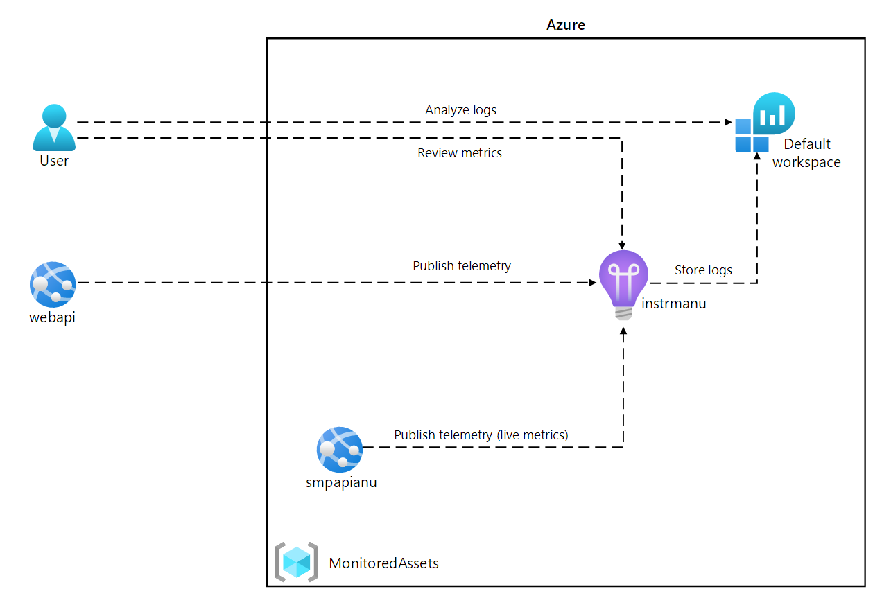

---
lab:
  az204Title: 'Lab 11: Monitor services that are deployed to Azure'
  az204Module: 'Learning Path 11: Troubleshoot solutions by using Application Insights'
---

# 實驗 11：監視部署至 Azure 的服務

## Microsoft Azure 使用者介面

基於 Microsoft 雲端工具的動態性質，您可能會遇到在本訓練內容開發後變更的 Azure UI。 因此，實驗指示可能無法正確對應實驗步驟。

當社群提醒 Microsoft 需要做修改時，我們會更新此訓練課程。 然而，雲端更新經常發生，所以您可能會在此訓練內容更新前遇到 UI 的變更。 **如果發生這種情況，請適應變更，然後視需要在實驗中調整。**

## 指示

### 在您開始使用 Intune 之前

#### 登入實驗室環境

使用下列認證登入您的 Windows 10 虛擬機器 (VM)：

- 使用者名稱：`Admin`
- 密碼：`Pa55w.rd`

> **注意**：您的講師會提供連線至虛擬實驗室環境的指示。

#### 檢閱已安裝的應用程式

尋找 Windows 10 桌面上的工作列。 工作列包含此次實驗中會用到的應用程式圖示，包括：
    
-   Microsoft Edge
-   檔案總管
-   Visual Studio Code
-   Azure PowerShell

## 實驗情境

在本實驗中，您將在 Azure 中建立 Application Insights 資源，以便用於監視和記錄應用程式見解資料以供稍後檢閱。 如果需求增加至特定閾值，API 將會設定為自動調整，而記錄資料將有助於判斷服務的使用方式。

## 架構圖



### 練習 1：建立及設定 Azure 資源

#### 工作 1：開啟 Azure 入口網站

1. 在工作列上，選取 **Microsoft Edge** 圖示。

1. 在瀏覽器視窗中，瀏覽至 Azure 入口網站 (`https://portal.azure.com`)，然後登入您在此實驗要用的帳戶。

    > **注意**：如果這是您第一次登入 Azure 入口網站，系統會提供入口網站的導覽。 選取 [開始使用] 跳過導覽，並開始使用入口網站。

#### 工作 2：建立 Application Insights 資源

1. 在 Azure 入口網站中，使用頁面頂端的 [搜尋資源、服務及文件] 文字輸入框來搜尋 **Application Insights**，然後在結果清單中選取 [Application Insights]。

1. 在 [Application Insights] 窗格上，選取 [+ 建立]。

1. 在 [Application Insights] 窗格的 [基本] 索引標籤上，執行下列動作，然後選取 [檢閱 + 建立]：
    
    | 設定 | 動作 |
    | -- | -- |
    | [訂閱] 下拉式清單 | 保留預設值 |
    | [資源群組] 區段 | 選取 [新建]，輸入 **MonitoredAssets**，然後選取 [確定] |
    | [名稱] 文字輸入框 | **instrm** _[您的名稱]_ |
    | [區域] 下拉式清單 | 選取可以部署 Azure 服務匯流排的任何 Azure 區域 |
    | [資源模式] 區段 | 選取 [工作區型] 選項 |
    | [工作區詳細資料] 區段 | 保留 [訂閱] 及 [Log Analytics 工作區] 下拉式清單的預設值 |
    
    下列螢幕擷取畫面顯示 [Application Insights] 窗格上的設定。

    
     
1. 在 [檢閱 + 建立] 索引標籤上，檢閱您在先前步驟中選取的選項。

1. 選取 [建立]，使用指定的設定建立 **Application Insights** 執行個體。

    > **注意**：等候建立工作完成，再繼續進行實驗。

1. 在 [Microsoft.AppInsights 概觀] **\|** 窗格上，選取 [前往資源] 按鈕，瀏覽至新建立的 [Application Insights 資源] 窗格。

1. 在 [Application Insights] 窗格上的 [設定] 區段中，選取 [屬性] 連結。

1. 在 [屬性] 窗格上的 [檢測金鑰] 項目旁，選取 [複製至剪貼簿] 按鈕，然後記錄複製的值。 您會在稍後的實驗中用到此值。

    > **注意**：用戶端應用程式會使用此金鑰來連線到特定的 **Application Insights** 資源。

### 工作 3：建立 Azure Web API 資源

1. 在 Azure 入口網站中，使用頁面頂端的 [搜尋資源、服務及文件] 文字輸入框來搜尋 **App Services**，然後在結果清單中選取 [App Services]。

1. 在 [App Services] 窗格上，選取 [+ 建立]。
    
1. 在 [建立 Web 應用程式] 刀鋒視窗的 [基本] 索引標籤上，執行下列動作，然後選取 [監視]   索引標籤：

    | 設定 | 動作 |
    | -- | -- |
    | [訂閱] 下拉式清單 | 保留預設值 |
    | [資源群組] 下拉式清單 |選取 **MonitoredAssets** |
    | [名稱] 文字輸入框 | 輸入 **smpapi**[您的名稱] |
    | [發佈] 區段 | 選取 [程式碼] |
    | [執行階段堆疊] 下拉式清單 | 選取 **.NET 6 (LTS)** |
    | [作業系統] 區段 |  選取 [Windows] |
    | [區域]  下拉式清單 |  選取您選作為**應用程式執行個體**資源位置的相同區域 |
    | [Windows 方案 (美國東部)] 區段 | 選取 [新建]，在 [名稱] 文字輸入框中，輸入 **MonitoredPlan**，然後選取 [確定]。 |
    | [定價方案] 區段 |  保留預設值 |

1. 在 [監視] 索引標籤上執行下列動作，然後選取 [檢閱 + 建立]：
    
    | 設定 | 動作 |
    | -- | -- |
    | [啟用 Application Insights] 區段 | 確認已選取 [是] |
    | [Application Insights] 下拉式清單 | 選取您先前在此實驗中建立的 **instrm** _[您的名稱]_ Application Insights 資源 |
    
1. 在 [檢閱 + 建立] 索引標籤上，檢閱您在先前步驟中選取的選項。

1. 選取 [建立]，使用您指定的設定建立 Web API。

    > **注意**：等候建立工作完成，再繼續進行實驗。

1. 在部署的 [概觀] 窗格上選取 [前往資源] 按鈕，即可瀏覽至新建立的 [Azure Web API] 窗格。

1. 在 [App Service] 窗格上的 [設定] 區段中，選取 [設定] 連結。

1. 在 [設定] 區段中，執行下列動作：
    
    a.  在 [應用程式設定] 索引標籤上選取 [顯示值]，即可顯示與您 Web API 相關聯的祕密。

    b.  請注意代表 ** APPLICATIONINSIGHTS_CONNECTION_STRING ** 索引鍵的值。 當您組建 Web API 資源時，此值會自動設定。

1. 在 [App Service] 窗格上的 [設定] 區段中，選取 [屬性] 連結。

1. 在 [屬性] 區段中，記錄 **URL** 連結的值。 您稍後會在實驗中用到此值，將要求提交至 Web API。

#### 工作 4：設定 Web API 自動調整選項

1. 在 [App Service] 窗格上的 [設定] 區段中，選取 [擴增 (App Service 方案)] 連結。

1. 向下捲動直到您看到 ** 相應放大方法 ** 為止。 按一下 [規則型 ** ] 選項，然後選取 [ ** 以規則為基礎的調整 ** ]。 **

1. 在 [擴增] 區段中，執行下列動作並選取 [儲存]：
    
    | 設定 | 動作 |
    | -- | -- |
    | [擴增] 區段 | 選取 [自訂自動調整] |
    | [自動調整設定名稱] 文字輸入框 | 輸入 **ComputeScaler** |
    | [資源群組] 下拉式清單 |選取 **MonitoredAssets** |
    | [縮放模式] 區段 | 選取 [依計量縮放] |
    | [執行個體限制] 區段中的 [最小值] 文字輸入框 | 輸入 **1** |
    | [執行個體限制] 區段中的 [最大值] 文字輸入框 | 輸入 **8** |
    | [執行個體限制] 區段中的 [預設] 文字輸入框 | 輸入 **3** |
   
    下列螢幕擷取畫面顯示 [App Service] 窗格上 [擴增] 區段中的設定。
    
    ![[Azure Web API] 窗格上的預設縮放條件](./media/l11_scale_web_app_default.png)

    | 設定 | 動作 |
    | -- | -- |
    | [規則] 區段 | 選取 [新增規則] |
    | [縮放規則] 窗格 | 保留所有設定的預設值，然後選取 [新增] |

    下列螢幕擷取畫面顯示 [App Service] 窗格上 [擴增] 區段中的其他設定。

   ![[Azure Web API] 窗格上預設縮放條件的 [縮放規則] 窗格](./media/l11_scale_web_app_rule.png)

    > **注意**：等候儲存作業完成，再繼續進行實驗。

#### 檢閱

在本練習中，您建立了將用於實驗其餘部分的 Azure 資源。

### 練習 2：使用 Application Insights 監視本地 Web API

#### 工作 1：組建 .NET Web API 專案

1. 從實驗用的電腦啟動 **Visual Studio Code**。

1. 在 Visual Studio Code 的 [檔案] 功能表中，選取 [開啟資料夾]。

1. 在 [開啟資料夾] 視窗中，瀏覽至 **Allfiles (F):\\Allfiles\\Labs\\11\\Starter\\Api**，然後選取 [選取資料夾]。

1. 在 Visual ** Studio Code ** 視窗中，于功能表列上，選取 ** [終端機 ** ]，然後選取 [新增終端機]。

1. 在終端提示中執行下列命令，在目前目錄中建立名為 **SimpleApi** 的新 .NET Web API 應用程式：

    ```
    dotnet new webapi --output . --name SimpleApi --framework net6.0
    ```

1. 執行下列命令，從 NuGet 將 **Microsoft.ApplicationInsights** 2.20.0 版匯入目前的專案：

    ```
    dotnet add package Microsoft.ApplicationInsights --version 2.20.0
    ```

    > **注意**：**dotnet add package** 命令會從 NuGet 新增 **Microsoft.ApplicationInsights** 套件。 如需詳細資訊，請參閱 [Microsoft.ApplicationInsights](https://www.nuget.org/packages/Microsoft.ApplicationInsights/)。

1. 執行下列命令，從 NuGet 匯入 **Microsoft.ApplicationInsights.AspNetCore** 2.20.0 版：

    ```
    dotnet add package Microsoft.ApplicationInsights.AspNetCore --version 2.20.0
    ```

    > **注意**：**dotnet add package** 命令會從 NuGet 新增 **Microsoft.ApplicationInsights.AspNetCore** 套件。 如需詳細資訊，請參閱 [Microsoft.ApplicationInsights.AspNetCore](https://www.nuget.org/packages/Microsoft.ApplicationInsights.AspNetCore)。

1. 在終端提示中執行下列命令，從 NuGet 將 **Microsoft.ApplicationInsights.PerfCounterCollector** 2.20.0 版匯入目前的專案：

    ```
    dotnet add package Microsoft.ApplicationInsights.PerfCounterCollector --version 2.20.0
    ```

    > **注意**：**dotnet add package** 命令會從 NuGet 新增 **Microsoft.ApplicationInsights.PerfCounterCollector** 套件。 如需詳細資訊，請參閱 [Microsoft.ApplicationInsights.PerfCounterCollector](https://www.nuget.org/packages/Microsoft.ApplicationInsights.PerfCounterCollector/)。

1. 在終端提示中執行下列命令，從 NuGet 將 **Microsoft.ApplicationInsights.Profiler.AspNetCore** 2.4.0 版匯入目前的專案：

    ```
    dotnet add package Microsoft.ApplicationInsights.Profiler.AspNetCore --version 2.4.0
    ```

    > **注意**：**dotnet add package** 命令會從 NuGet 新增 **Microsoft.ApplicationInsights.Profiler.AspNetCore** 套件。 如需詳細資訊，請參閱 [Microsoft.ApplicationInsights.Profiler.AspNetCore](https://www.nuget.org/packages/Microsoft.ApplicationInsights.Profiler.AspNetCore/)。

1. 在終端提示中執行下列命令，組建 .NET Web API：

    ```
    dotnet build
    ```
    
#### 工作 2：更新應用程式程式碼，停用 HTTPS 並使用 Application Insights

1. 在 [Visual Studio Code] 視窗中的 [Explorer] 窗格上，選取 **Program.cs** 檔案以在 [編輯器] 窗格中開啟檔案。

1. 在 [編輯器] 窗格上，尋找並刪除第 19 行的下列程式碼：

    ```csharp
    app.UseHttpsRedirection();
    ```

    > **注意**：這一行程式碼會強制 Web API 使用 HTTPS。 對於此實驗來說，這是沒有必要的。

1. 在 **Program.cs** 檔案中，從第 9 行開始新增下列兩行，藉由向 Service 集合註冊分析工具與 Application Insights 來加以啟用：

    ```csharp
    builder.Services.AddApplicationInsightsTelemetry();
    builder.Services.AddServiceProfiler();
    ```

1. 儲存變更並關閉 **Program.cs** 檔案。

1. 在 [Visual Studio Code] 視窗中的 [Explorer] 窗格上，選取 **appsettings.json** 檔案以在 [編輯器] 窗格中開啟檔案。

1. 將下列元素新增至 **appsettings.json** 檔案中 **Logging** 元素正後方，並將 `instrumentation-key` 預留位置取代為您稍早在此實驗中記錄的 Application Insights 資源檢測金鑰值：

    ```json
       "ApplicationInsights":
       {
          "InstrumentationKey": "instrumentation-key"
       },
    ```

    > **注意**：如果您要新增的區段是檔案最後一個元素，請移除結尾逗號。

1. 儲存對 **appsettings.json** 檔案所做的變更並將其關閉。

1. 在終端提示中執行下列命令，組建 .NET Web API。

    ```
    dotnet build
    ```

#### 工作 3：在本機測試 API 應用程式

1. 在終端提示中執行下列命令，然後選取 [輸入] 來建立憑證。 在提示選項上選取 [是]。

    ```
    dotnet dev-certs https --trust
    ```

1. 在終端提示中執行下列命令，啟動 .NET Web API。

    ```
    dotnet run
    ```

1. 檢閱命令的輸出，並記下網站正在接聽的 HTTPS URL。

1. 從工作列點選 **Microsoft Edge** 圖示來開啟捷徑功能表，然後開啟新的瀏覽器視窗。

1. 在開啟的瀏覽器視窗中，瀏覽至 `https://localhost` URL，並新增 Web API 的 **/weatherforecast** 相對路徑。
    
    > **注意**：完整的 URL 是 `https://localhost:[port-number]/weatherforecast`，其中 `[port-number]` 預留位置可識別 Web 應用程式透過 HTTPS 通訊協定存取的連接埠號碼。

    > **注意**：頁面應該包含下列格式的輸出：

    ```
    [{"date":"2021-09-04T10:15:04.0969996-07:00","temperatureC":54,"temperatureF":129,"summary":"Sweltering"},{"date":"2021-09-05T10:15:04.0972401-07:00","temperatureC":44,"temperatureF":111,"summary":"Balmy"},{"date":"2021-09-06T10:15:04.0976549-07:00","temperatureC":41,"temperatureF":105,"summary":"Scorching"},{"date":"2021-09-07T10:15:04.0976613-07:00","temperatureC":-4,"temperatureF":25,"summary":"Freezing"},{"date":"2021-09-08T10:15:04.0976618-07:00","temperatureC":33,"temperatureF":91,"summary":"Balmy"}]
    ```

1. 關閉顯示由 `https://localhost:[port-number]/weatherforecast` 所產生頁面的瀏覽器視窗。

1. 在 Visual Studio Code 中，選取 [終止終端] \(**資源回收筒**圖示\)，關閉 [終端] 窗格和任何相關的程序。

#### 工作 4：在 Application Insights 中檢閱計量

1. 在您的實驗用電腦上，切換至顯示 Azure 入口網站的 **Microsoft Edge** 瀏覽器視窗。

1. 在 Azure 入口網站中，瀏覽回到您先前在此實驗中建立的 **instrm**[您的名稱] Application Insights 資源窗格。

1. 在 [Application Insights] 窗格上，並在窗格中心的圖格中尋找顯示的計量。 具體而言，是要找出已發生的伺服器要求數量及平均的伺服器回應時間。

    下列螢幕擷取畫面顯示本機 Web 應用程式的 **Application Insights** 計量。

    

    > **注意**：最多可能需要五分鐘才能在 Application Insights 計量圖表中觀察到要求。

#### 檢閱

在此練習中，您使用 ASP.NET 建立了 API 應用程式，並將其設為將應用程式計量串流至 Application Insights。 接著，您使用了 Application Insights 儀表板來檢閱 API 的效能詳細資料。

### 練習 3：使用 Application Insights 監視 Web API

#### 工作 1：將應用程式部署至 Web API

1. 在實驗用的電腦上，切換至 Visual Studio Code。

1. 在 [Visual Studio Code] 視窗的 [Explorer] 窗格中，瀏覽至 **bin\Debug\net6.0** 目錄。

    > **注意**：若要確認您位於 **bin\Debug\net6.0** 目錄中，請在 Visual Studio Code [檔案] 功能表上選取 [開啟資料夾]，瀏覽至 **Allfiles (F):\\Allfiles\\Labs\\11\\Starter\\Api\\bin\\Debug\\net6.0**，然後選取 [選取資料夾]。

1. 將名為 **web.config** 的檔案新增至目錄。

1. 開啟 **web.config** 檔案並新增下列內容：

    ```xml
    <?xml version="1.0" encoding="utf-8"?>
    <configuration>
      <location path="." inheritInChildApplications="false">
       <system.webServer>
        <handlers>
          <add name="aspNetCore" path="*" verb="*" modules="AspNetCoreModuleV2" resourceType="Unspecified" />
        </handlers>
        <aspNetCore processPath="dotnet" arguments=".\SimpleApi.dll" stdoutLogEnabled="false" stdoutLogFile=".\logs\stdout" hostingModel="inprocess" />
       </system.webServer>
      </location>
    </configuration>
    ```

1. 儲存並關閉檔案。

1. 在 [Visual Studio Code] 視窗的 [功能表列] 上選取 [終端]，然後選取 [新增終端]。

1. 在終端提示中執行下列命令，確認目前的目錄設為 **Allfiles (F):\\Allfiles\\Labs\\11\\Starter\\Api\\bin\\Debug\\net6.0**，也就是部署檔案的所在位置：

    ```
    cd F:\Allfiles\Labs\11\Starter\Api\bin\Debug\net6.0
    ```

1. 執行下列命令來建立 ZIP 檔案，該檔案包含您接下來要部署至 Azure Web API 的入門專案：

    ```powershell
    Compress-Archive -Path * -DestinationPath api.zip
    ```

1. 在終端提示中執行下列命令，使用 Azure PowerShell 登入您的 Azure 訂閱：

    ```powershell
    Connect-AzAccount
    ```

1. 切換至顯示 Azure 入口網站的 Microsoft Edge 瀏覽器，依照終端提示顯示的指示在瀏覽器視窗中開啟另一個分頁，瀏覽至 `https://microsoft.com/devicelogin`，接著在出現提示時輸入提供的代碼，然後使用此實驗要使用的帳戶登入。

    > **注意**：等候登入流程完成。

1. 關閉新開啟的瀏覽器分頁，然後切換回 [Visual Studio Code] 視窗中的終端提示。

1. 執行下列命令，顯示 **MonitoredAssets** 資源群組中所有 Web 應用程式的清單：

    ```powershell
    Get-AzWebApp -ResourceGroupName MonitoredAssets
    ```

1. 執行下列命令，顯示 **MonitoredAssets** 資源群組中的 Web 應用程式清單，其名稱開頭為 **smpapi\*** ：

    ```powershell
    Get-AzWebApp -ResourceGroupName MonitoredAssets | Where-Object {$_.Name -like 'smpapi*'}
    ```

1. 執行下列命令，顯示上一個步驟中識別的第一個 Web 應用程式名稱，並將其儲存在名為 **$webAppName** 的變數中：

    ```powershell
    Get-AzWebApp -ResourceGroupName MonitoredAssets | Where-Object {$_.Name -like 'smpapi*'} | Select-Object -ExpandProperty Name
    $webAppName = (Get-AzWebApp -ResourceGroupName MonitoredAssets | Where-Object {$_.Name -like 'smpapi*'})[0] | Select-Object -ExpandProperty Name
    ```

1. 執行下列命令，將您先前在此工作中建立的 **api.zip** 檔案部署到上一個步驟中識別其名稱的 Web API，並在出現命令提示時選取 [Y]：

    ```powershell
    Publish-AzWebApp -ResourceGroupName MonitoredAssets -Name $webAppName -ArchivePath "F:\Allfiles\Labs\11\Starter\Api\bin\Debug\net6.0\api.zip"
    ```

    > **注意**：等候部署完成，再繼續進行實驗。

1. 在實驗用的電腦上，啟動另一個 Microsoft Edge 瀏覽器視窗。

1. 在瀏覽器視窗中，瀏覽至您先前在此工作中部署 API 應用程式的 Azure Web API 應用程式，方法是將尾碼 **/weatherforecast** 附加至其 URL (先前在此實驗中所記錄)。

    > **注意**：例如，如果您的 URL 是 `https://smpapianu.azurewebsites.net`，則新的 URL 會是 `https://smpapianu.azurewebsites.net/weatherforecast`。

1. 驗證該輸出是否與本地執行 API 應用程式時產生的輸出相似。

    > **注意**：輸出會包含不同的值，但其格式應該會相同。

    > **注意**：如果您收到例外狀況，請確定 **web.config** 檔案的內容符合此工作稍早所示的範例。 如果不相符，請進行任何必要的變更，然後重新產生 **api.zip** 檔案並重新部署。

#### 工作 2：深入設定 Web Apps 的計量集合

1. 在您的實驗用電腦上，切換至顯示 Azure 入口網站的 **Microsoft Edge** 瀏覽器視窗。

1. 在 Azure 入口網站中，瀏覽回到您先前在此實驗中建立的 **smpapi**[您的名稱] Web 應用程式資源窗格。

1. 在 [App Service] 窗格上，選取 [Application Insights]。

1. 在 [Application Insights] 窗格上執行下列動作，選取 [套用]，然後在確認對話方塊中選取 [是]：

    | 設定 | 動作 |
    | -- | -- |
    | [Application Insights] 滑桿 | 確認其已設為 [啟用] |
    | [檢測應用程式] 區段 | 選取 [.NET] 索引標籤 |
    | [集合層級] 區段 | 選取 [建議] |
    | [分析工具] 區段 | 選取 [開啟] |
    | [快照偵錯工具] 區段 | 選取 [關閉] |
    | [SQL 命令] 區段 | 選取 [關閉] |

    
    下列螢幕擷取畫面顯示 Azure Web API 的 **Application Insights** 設定。
    
    

1. 切換至您在先前工作中開啟的瀏覽器分頁，以顯示將 API 應用程式部署至目標 Azure API 應用程式的結果 (包括目標 URL 中的 **/weatherforecast** 相對路徑)，並重新整理瀏覽器頁面幾次。

1. 檢閱 API 所產生的 JSON 格式輸出。

1. 記錄您用來存取 JSON 格式輸出的 URL。

    > **注意**：如果 **smpapianu** 是您稍早建立的網站名稱，則 URL 的格式應為 `https://smpapianu.azurewebsites.net/weatherforecast`。

#### 工作 3：在 Application Insights 取得更新的計量

1. 返回顯示 Azure 入口網站中 Azure Web 應用程式的瀏覽器視窗。

1. 在 Web 應用程式的 [Application Insights] 窗格上，選取 [檢視 Application Insights 資料] 連結。

1. 在 [Application Insights] 窗格上，檢閱圖格 (位於窗格中心) 中的已收集計量，包含已發生的伺服器要求數量及平均伺服器回應時間。
 
    下列螢幕擷取畫面顯示 Azure 入口網站中 Azure Web 應用程式的 **Application Insights** 計量。
     
    

    > **注意**：更新的計量最多可能需要五分鐘才會出現在 Application Insights 計量圖表中。

#### 工作 4：在 Application Insights 中檢視即時計量

1. 在 [Application Insights] 窗格中的 [調查] 區段中，選取 [即時計量]。

1. 切換回瀏覽器視窗，視窗中顯示在目標 Azure Web 應用程式中執行的目標 API 應用程式 (其目標為目標 URL 中的 **/weatherforecast** 相對路徑)，然後重新整理瀏覽器頁面數次。

1. 切換至顯示 [即時計量] 窗格的瀏覽器視窗並檢閱其內容。

    > **注意**：[傳入要求] 區段應該會在幾秒內更新，顯示您對 Web API 所做的要求。

### 練習 4：Application Insights 的 .NET 記錄

#### 工作 1：設定 .NET API 應用程式的記錄

1. 切換至 [Visual Studio Code] 視窗。

1. 在終端提示中執行下列命令，將目前的目錄設定為 **Allfiles (F):\\Allfiles\\Labs\\11\\Starter\\Api**，也就是部署檔案的所在位置：

    ```
    cd F:\Allfiles\Labs\11\Starter\Api
    ```

1. 執行下列命令，從 NuGet 將 **Microsoft.Extensions.Logging.ApplicationInsights** 2.20.0 版匯入目前的專案：

    ```
    dotnet add package Microsoft.Extensions.Logging.ApplicationInsights --version 2.20.0
    ```

    > **注意**：**dotnet add package** 命令會從 NuGet 新增 **Microsoft.ApplicationInsights** 套件。 如需詳細資訊，請參閱 [Microsoft.Extensions.Logging.ApplicationInsights](https://www.nuget.org/packages/Microsoft.Extensions.Logging.ApplicationInsights)。

1. 在 [Visual Studio Code] 視窗的 [Explorer] 窗格中，瀏覽至 [控制器] 資料夾，然後開啟 **WeatherForecastController.cs** 檔案。

1. 檢閱檔案的內容，並注意其包含了泛型 `ILogger<WeatherForecastController>` 介面的建構函式插入。

    ```csharp
    using Microsoft.AspNetCore.Mvc;
    namespace SimpleApi.Controllers;
    [ApiController]
    [Route("[controller]")]
    public class WeatherForecastController : ControllerBase
    {
        private static readonly string[] Summaries = new[]
        {
            "Freezing", "Bracing", "Chilly", "Cool", "Mild", "Warm", "Balmy", "Hot", "Sweltering", "Scorching"
        };
        private readonly ILogger<WeatherForecastController> _logger;
        public WeatherForecastController(ILogger<WeatherForecastController> logger)
        {
            _logger = logger;
        }
        [HttpGet(Name = "GetWeatherForecast")]
        public IEnumerable<WeatherForecast> Get()
        {
            return Enumerable.Range(1, 5).Select(index => new WeatherForecast
            {
                Date = DateTime.Now.AddDays(index),
                TemperatureC = Random.Shared.Next(-20, 55),
                Summary = Summaries[Random.Shared.Next(Summaries.Length)]
            })
            .ToArray();
        }
    }
    ```

    > **注意**：您將利用此設定來實作自訂記錄。 目前，建構函式會顯示一組隨機產生的五個天氣預報。 您將修改控制器為一次顯示一個預報。 針對每個預報，您會產生資訊、警告或錯誤記錄項目，指出天氣類型 (溫和、劇烈及極端)。 在 Application Insights 將這些記錄項目記錄在對應的 Log Analytics 工作區後，每個項目都會有一個自動指派的嚴重性層級 1、2 或 3。 

1. 將 **WeatherForecastController.cs** 檔案中 `public IEnumerable<WeatherForecast> Get()` 方法的定義取代為下列內容：

    ```csharp
        {
            var rng = new Random();            
            int temperatureC = rng.Next(-20, 55);
            var summaryId = rng.Next(Summaries.Length);
            switch (summaryId)
            {
                case 0: case 9:
                _logger.LogError("WeatherForecast: extreme weather");
                break;
                case 1: case 2: case 7: case 8:
                _logger.LogWarning("WeatherForecast: severe weather");
                break;
                default:
                _logger.LogInformation("WeatherForecast: mild weather");
                break;
            }
            return Enumerable.Range(1, 1).Select(index => new WeatherForecast
            {
                Date = DateTime.Now.AddDays(index),
                TemperatureC = temperatureC,
                Summary = Summaries[summaryId]
            })
            .ToArray();
        }
    ```

1. 儲存並關閉檔案。

1. 在終端提示中執行下列命令，組建 .NET Web API：

    ```
    dotnet build
    ```

#### 工作 2：測試.NET Core API 應用程式的記錄

1. 執行下列命令，啟動 .NET Web API。

    ```
    dotnet run
    ```

    > **注意**：當您執行這項工作中的後續步驟時，讓 Web API 保持執行並監視 Visual Studio Code [終端] 窗格的輸出。

1. 檢閱命令的輸出，並記下網站正在接聽的 HTTPS URL。

1. 從工作列點選 **Microsoft Edge** 圖示來開啟捷徑功能表，然後開啟新的瀏覽器視窗。

    > **注意**：調整瀏覽器視窗的位置，使其不會擋住 Visual Studio Code 的 [終端] 窗格。

1. 在開啟的瀏覽器視窗中，瀏覽至您識別的 URL，並新增 Web API 的 **/weatherforecast**  相對路徑，然後重新整理頁面幾次。
    
    > **注意**：完整的 URL 是 `https://localhost:[port-number]/weatherforecast`，其中 `[port-number]` 預留位置可識別 Web 應用程式透過 HTTPS 通訊協定存取的連接埠號碼。

    > **注意**：每次重新整理頁面時，都應該會以下列格式顯示不同的天氣預報。

    ```
    [{"date":"2021-09-04T14:35:29.0789168-07:00","temperatureC":2,"temperatureF":35,"summary":"Sweltering"}]
    ```

    > **注意**：每次重新整理頁面時，都應該會在終端提示中顯示資訊、警告或錯誤訊息，格式如下：

    ```
    warn: SimpleApi.Controllers.WeatherForecastController[0]
      WeatherForecast: severe weather
    ```

    > **注意**：重新整理頁面幾次，確保每種類型 (**資訊**、**警告**和**失敗**) 至少產生一則訊息。

1. 保持 API 應用程式執行。

#### 工作 3：檢閱 Application Insights 記錄

1. 在您的實驗用電腦上，切換至顯示 Azure 入口網站的 **Microsoft Edge** 瀏覽器視窗。

1. 在 Azure 入口網站中，瀏覽回到您先前在此實驗中建立的 **instrm**[您的名稱] Application Insights 資源窗格。

1. 在 [Application Insights] 窗格上的 [監視] 區段中，選取 [記錄]。

1. 如有需要，請關閉 [歡迎使用 Log Analytics] 窗格和 [查詢] 窗格。

1. 在 [新增查詢] 窗格中輸入下列查詢，然後選取 [執行]：

    ```
    traces
    | order by timestamp desc
    ```

1. 檢閱查詢的結果。

    > **注意**：結果應該包含對應至 .NET Core API 應用程式所產生警告和錯誤訊息的記錄項目，及其各自的嚴重性層級 (2 和 3)。

    > **注意**：最多可能需要五分鐘才能在 Application Insights 計量圖表中觀察到要求。

    下列螢幕擷取畫面顯示 [Application Insights 記錄] 窗格上的記錄查詢結果。

    ![[Application Insights 記錄] 窗格上的記錄查詢結果](./media/l11_web_api_insights_logs.png)

    > **注意**：您可以將更新的 API 應用程式部署至 Azure Web 應用程式，以相同的方式使用 Application Insights 收集其記錄。

    > **注意**：您可以擴充 Application Insights 記錄層級，藉由修改 **appsettings.Development.json** (或 **appsettings.json**) 檔案來納入資訊事件，如下列程式碼所列。 不過，您應該記住，這會大幅增加記錄量，帶來潛在的網路效能和價格影響：

    ```
    {
      "Logging": {
        "LogLevel": {
          "Default": "Information",
          "Microsoft": "Warning",
          "Microsoft.Hosting.Lifetime": "Information"
        },
        "ApplicationInsights": {
          "LogLevel": {
            "Microsoft": "Information"
          }
        }
      }
    }
    ```

1. 關閉顯示 API 應用程式輸出的瀏覽器視窗。

1. 切換至 [Visual Studio Code] 視窗，然後選取 [終止終端] \(**資源回收筒**圖示\)，關閉 [終端] 窗格和任何相關的程序。

#### 檢閱

在本練習中，您設定及測試了 Web API 應用程式的 Application Insights 記錄。
